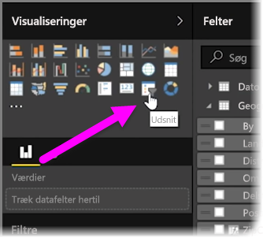
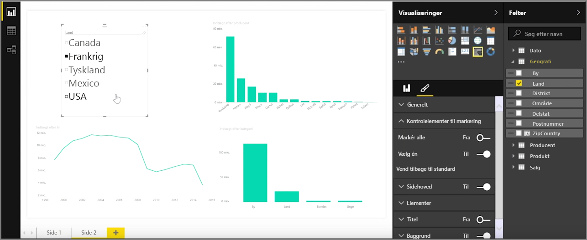
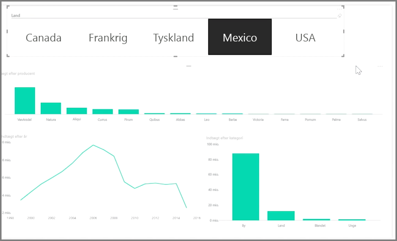

Udsnit er en af de mest effektive visualiseringstyper, især som en del af en optaget rapport. Et **udsnit** er et visuelt filter på lærredet i **Power BI Desktop**, som lader alle, der ser på en rapport, opdele dataene efter en bestemt værdi, f.eks. efter år eller efter geografisk placering.

Markér **Udsnitsværktøj** fra ruden **Visualiseringer** for at føje et udsnitsværktøj til din rapport.

Træk det felt, som du vil foretage udsnit af, og slip det øverst på udsnitspladsholderen. Visualiseringen forvandles til en liste over elementer med afkrydsningsfelter. Disse elementer er dine filtre – markér afkrydsningsfeltet ud for en af målgrupperne, og alle andre visualiseringer på samme rapportside filtreres eller *opdeles* efter din markering.

Der er nogle forskellige indstillinger til at formatere udsnittet. Du kan konfigurere det til at acceptere flere input på én gang eller slå tilstanden **Vælg én** til for at bruge én ad gangen. Du kan også tilføje indstillingen **Markér alt** til dine elementer i udsnitsværktøjet, hvilket er nyttigt, når du har en meget lang liste. Rediger retningen af udsnittet fra den lodrette standard til vandret. Herved bliver det en valglinje i stedet for en tjekliste.

