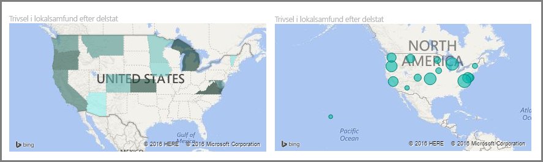
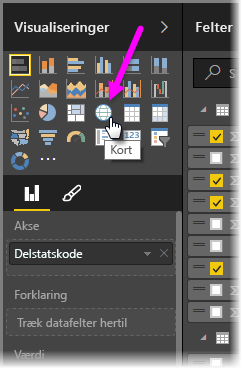
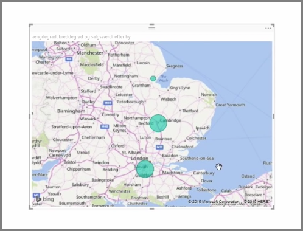
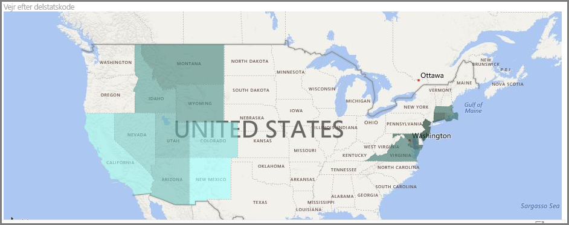
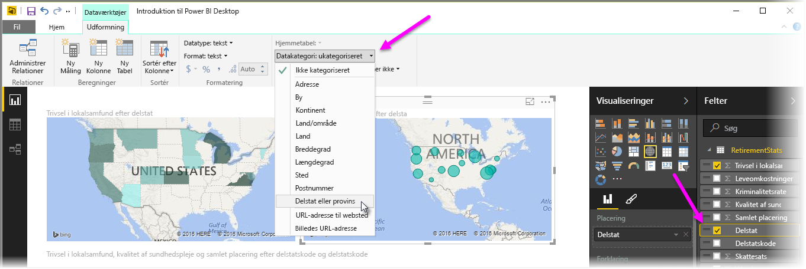

Power BI har to forskellige typer kortvisualiseringer: et boblekort, som indsætter en boble over et geografisk punkt, og et figurkort, som rent faktisk viser konturen af det område, som skal visualiseres.

> [!NOTE]
> Når du arbejder med lande eller områder, kan du bruge forkortelsen på tre bogstaver til at sikre, at geokodning fungerer korrekt i kortvisualiseringer. Benyt *ikke* forkortelser på to bogstaver, da nogle lande eller områder muligvis ikke genkendes korrekt.
> Hvis du kun har forkortelser på to bogstaver, kan du tjekke [dette eksterne blogindlæg](https://blog.ailon.org/how-to-display-2-letter-country-data-on-a-power-bi-map-85fc738497d6#.yudauacxp) for at få fremgangsmåden til, hvordan forkortelser på to bogstaver for land/område knyttes til forkortelser på tre bogstaver for land/område.
> 
> 

## Opret boblekort
Vælg indstillingen **Kort** i ruden **Visualisering** for at oprette et boblekort. Du skal føje en værdi til bucket‹en *Placering* i indstillingerne for **Visualiseringer** for at bruge en kortvisualisering.

Power BI er fleksibel med hensyn til, hvilken type placeringsværdi den accepterer, fra mere generelle oplysninger som bynavn eller lufthavnskode og ned til meget specifikke data for breddegrad og længdegrad. Føj et felt til bucket‹en **Størrelse** for at ændre boblens størrelse i henhold til hver kortplacering.

## Opret figurkort
Vælg indstillingen **Kartogram** i ruden Visualisering for at oprette et figurkort. Som med boblekort skal du føje en slags værdi til bucket‹en Placering for at bruge dette visuelle element. Føj et felt til bucket‹en Størrelse for at ændre fyldfarvens intensitet i overensstemmelse hermed.

Et advarselsikon i det øverste venstre hjørne af det visuelle element angiver, at kortet har brug for flere placeringsdata for præcist at afbilde værdier. Det er et meget almindeligt problem, når dataene i placeringsfeltet er tvetydige, f.eks. brug af et områdenavn som *Washington*, der kan angive en delstat eller et distrikt. En måde af løse dette problem på er ved at omdøbe din kolonne, så den er mere specifik, såsom *Delstat*. En anden måde er at nulstille datakategorien manuelt ved at vælge **Datakategori** under fanen Modellering. Du kan herfra tildele en kategori til dine data, f.eks. "Delstat" eller "By".

