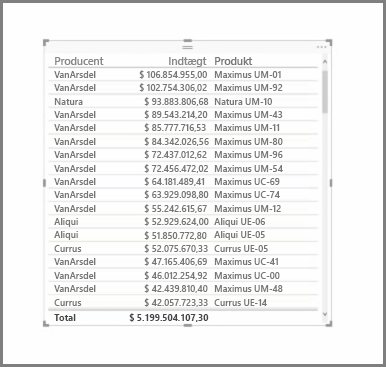
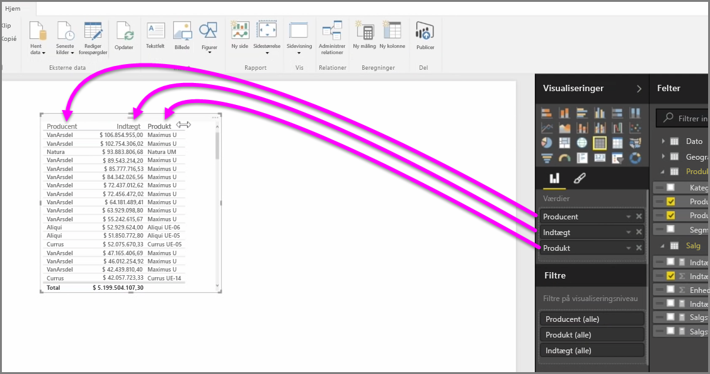
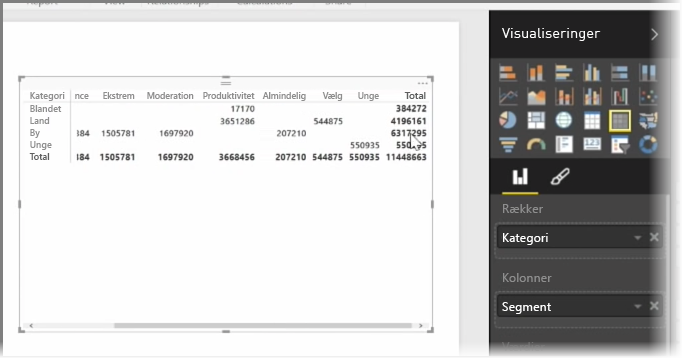

Udover et væld af diagrammer understøtter Power BI Desktop også flere tabelvisualiseringer. Når du vælger et kategorifelt eller et tekstfelt og trækker det til rapportcanvasset, får du faktisk en tabel med resultater som standard. Du kan rulle op og ned gennem tabellen, og som udgangspunkt sorteres den alfabetisk.

Hvis du har numeriske oplysninger i en tabel, f.eks. indtægter, vises den samlede sum nederst. Du kan manuelt sortere hver kolonne ved at klikke på dens overskrift for at skifte mellem stigende eller faldende rækkefølge. Hvis en kolonne ikke er bred nok til at vise hele indholdet, kan du klikke på overskriften og trække den sidelæns for at udvide den.

Rækkefølgen af felterne i feltbeholderen *Værdier* i ruden **Visualiseringer** bestemmer deres rækkefølge i din tabel.

En **matrix** svarer til en tabel, men den har andre kategorioverskrifter på kolonner og rækker. Ligesom i tabeller lægges numeriske oplysninger automatisk sammen langs den nederste og højre side af matrixen.

Der findes mange kosmetiske indstillinger til matrixer, såsom kolonner med automatisk tilpasning, rækker og kolonner med totaler, farveindstillinger m.m. Når du opretter en matrix, skal du sørge for, at dine kategoriske data (ikke-numeriske data) er placeret på venstre side af matrixen, og at de numeriske filer er til højre. Så er du sikker på, at det vandrette rullepanel vises, og at rullefunktionen fungerer korrekt.

