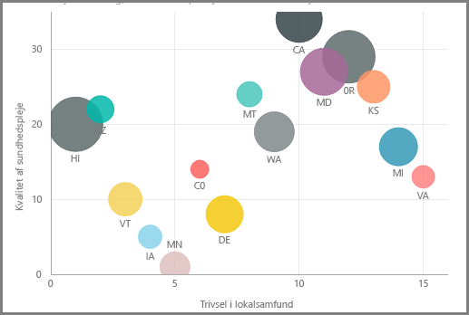
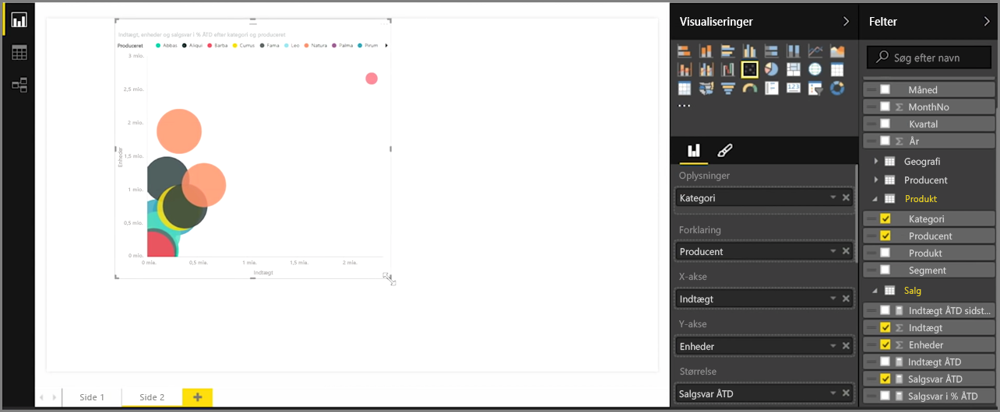
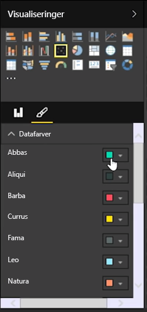
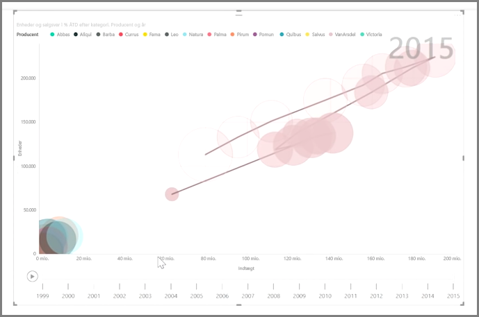

Hvis du vil sammenligne to forskellige målinger, f.eks. enhedssalg versus omsætning, er et punktdiagram en fælles visualisering, der kan bruges.

Du kan oprette et tomt diagram ved at markere **Punktdiagram** i ruden **Visualiseringer**. Træk og slip de to felter, som du vil sammenligne, fra ruden **Felter** til feltbeholderne *X-akse* og *Y-akse*. Herefter har dit punktdiagram formentlig kun en lille boble i midten af det visuelle element. Du skal føje en måling til feltbeholderen *Detaljer* for at angive, hvordan du vil opdele dataene. Hvis du f.eks. sammenligner varesalg og omsætning, ønsker du måske at opdele data efter kategori, producent og/eller salgsmåned.

Når du føjer et ekstra felt til feltbeholderen *Forklaring*, farvelægges boblerne ifølge feltets værdi. Du kan også føje et felt til feltbeholderen *Størrelse* for at ændre boblestørrelsen i henhold til denne værdi.

Punktdiagrammer har også mange visuelle formateringsindstillinger, f.eks. aktivering af en kontur for hver farvet boble og skifte enkelte etiketter. Du kan også ændre datafarverne for andre diagramtyper.

Du kan oprette en animation af dit boblediagrams ændringer over tid ved at føje et tidsbaseret felt til feltbeholderen *Afspilningsakse*. Klik på en boble under en animation for at få vist et spor af stien.

>[!NOTE]
>Husk, at hvis du kun ser én boble i dit punktdiagram, skyldes det, at Power BI indsamler dine data, hvilket er standardfunktionen. Føj en kategori til feltbeholderen *Detaljer* i ruden **Visualiseringer** for at få flere bobler.
> 
> 

