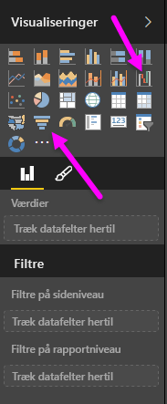
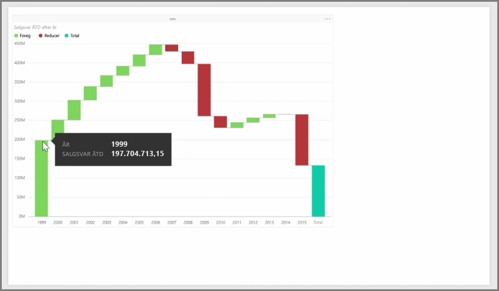
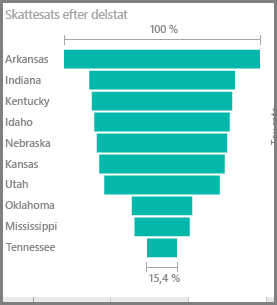

Vandfalds- og tragtdiagrammer er to af de mere interessante (og måske usædvanlige) standardvisualiseringer, der er medtaget i Power BI. Hvis du vil oprette et tomt diagram af enten vandfalds- eller tragttypen, skal du vælge dens ikon fra ruden **Visualiseringer**.

**Vandfaldsdiagrammer** bruges typisk til at vise ændringer i en bestemt værdi over tid.

Vandfaldsdiagrammer har kun to indstillinger for filsæt: *Kategori* og *Y-akse*. Træk et tidsbaseret felt, f.eks. *År* til filsættet *Kategori*, og den værdi, du vil spore til filsættet *Y-akse*. Tidsperioder, hvor der opstod en værdiforøgelse, vises som standard med grønt, mens perioder med en værdiformindskelse vises med rødt.

**Tragtformede diagrammer** bruges typisk til at vise ændringer i forhold til en bestemt proces, f.eks. en salgspipeline eller webstedsvedligeholdelse.

Både **Vandfald**- og **Tragtformede** diagrammer kan opdeles og tilpasses visuelt.

