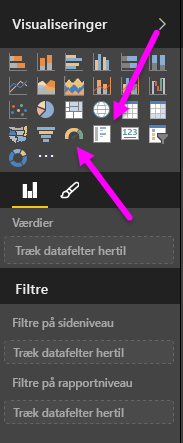
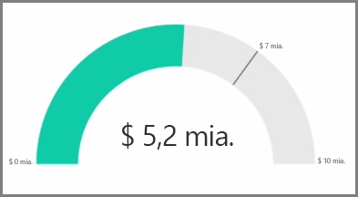
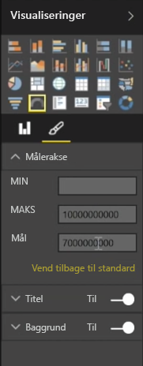
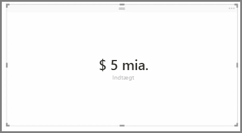
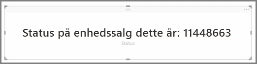

Generelt bruges visualiseringer til at sammenligne to eller flere forskellige værdier. Men nogle gange når du bygger rapporter, kan du have brug for at spore kun ét nøgletal eller én metrisk værdi over tid. I Power BI Desktop gør du det med en **måler** eller kortvisualisering med **et enkelt tal**. Hvis du vil oprette et tomt diagram af en af typerne, skal du vælge dets ikon i ruden **Visualiseringer**.

Målere er især nyttige, når du er ved at opbygge dashboards og vil have vist fremskridt mod et bestemt mål. Du opretter en måler ved at vælge dets ikon i ruden **Visualiseringer** og trække det ønskede felt til bucket‹en *Værdi*.

Målere vises som standard ved 50 % eller det dobbelte af *værdien*, og der er to måder at ændre indstillingen på. Hvis værdierne skal indstilles dynamisk, skal du trække felterne til bucket‹erne for værdierne *Minimum*, *Maksimum* og *Mål*. Du kan også bruge de visuelle formateringsindstillinger til manuelt at tilpasse målerens område.

Kortvisualiseringer viser blot en numerisk repræsentation af et felt. Som standard bruger kortvisualiseringer visningsenheder for at holde tallet kort og viser for eksempel "$5bn" i stedet for "$5.000.000.000". Brug de visuelle formateringsindstillinger til at ændre den enhed, der bruges, eller deaktiver det fuldstændigt.

En interessant kortanvendelse er at få dem til at vise en brugerdefineret måling, du har kædet sammen med tekst. For at bruge det tidligere eksempel: Med en brugerdefineret måling kan dit kort indeholde avancerede DAX-funktioner og vise noget i retning af "Samlet omsætning dette år: $5bn" eller "Fremskridt på enhedssalg dette år:" og derefter tilføje det tal, der repræsenterer fremskridtet.

