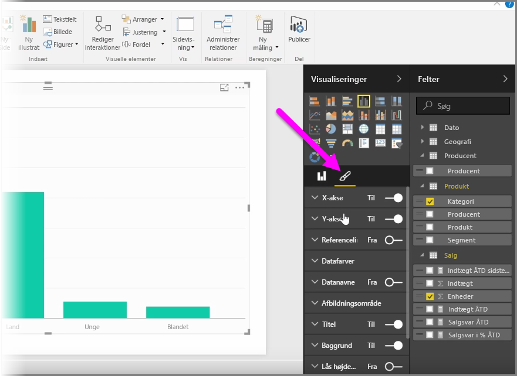
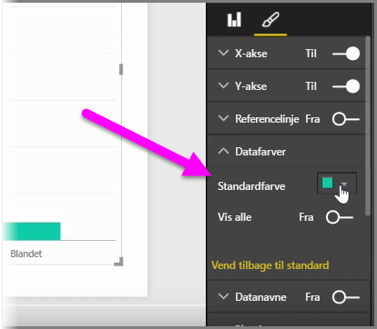
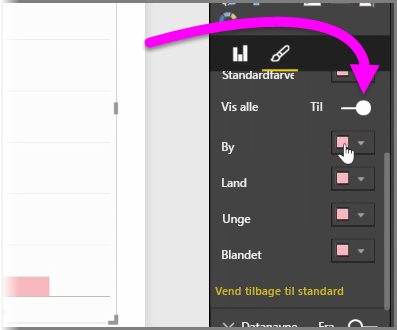
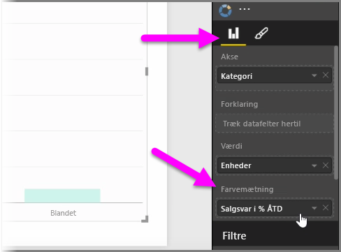
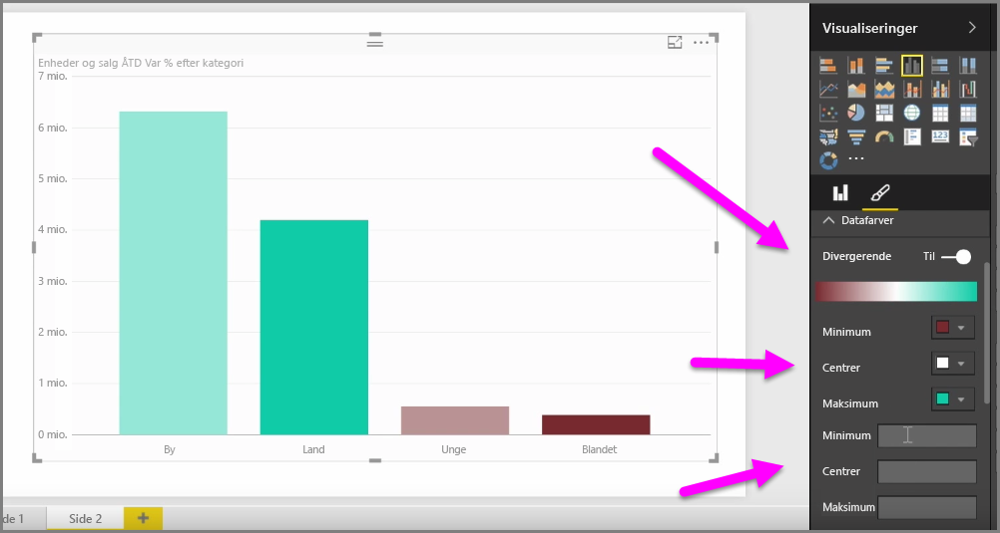
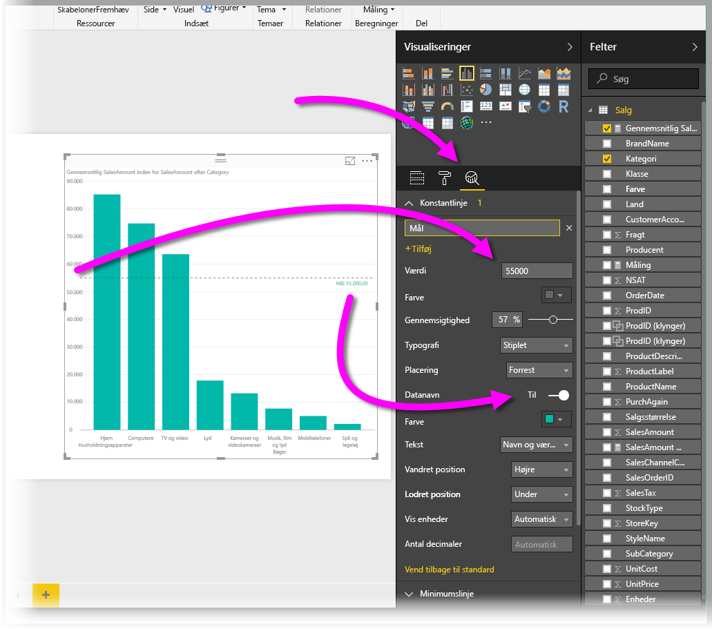
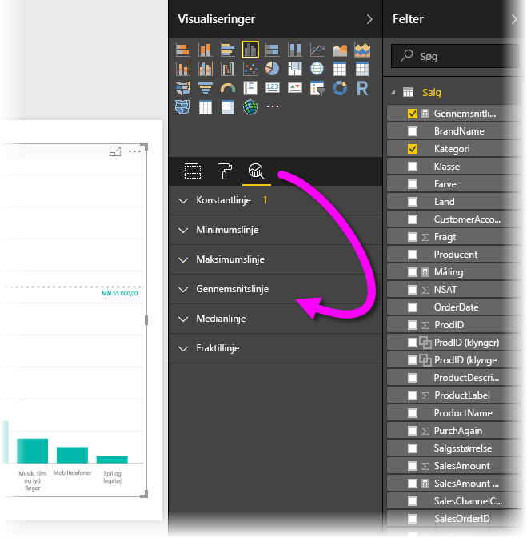

Der er sikkert mange gange, hvor du gerne vil ændre de farver, der bruges i diagrammer eller visuelle elementer. Med Power BI har du meget kontrol over, hvordan farverne vises. For at komme i gang skal du markere et visuelt element og derefter klikke på **penselikonet** i ruden **Visualiseringer**.

Der er mange muligheder for at ændre farverne eller formatere det visuelle element. Du kan ændre farven på alle søjlerne i et visuelt element ved at markere farvevælgeren ud for **Standardfarve** og derefter markere din ønskede farve.

Du kan også ændre farven på hver søjle (eller et andet element, afhængigt af typen af det valgte visuelle element) ved slå skyderen **Vis alle** til. Når du gør dette, vises en farvevælger for hvert element.

Du kan også ændre farven baseret på en værdi eller en måling. Du kan gøre dette ved at trække et felt til feltbeholderen **Farvemætning** i ruden Visualiseringer (bemærk, at dette er tilgængeligt i sektionen **felt**, ikke sektionen **pensel**).

Derudover kan du ændre skalaen og de farver, der anvendes, ved udfyldning af dataelement. Du kan også vælge en divergerende skala ved at slå skyderen Divergerende til, hvilket lader farven skalere mellem tre farver. Og du kan også angive værdierne *Minimum*, *Centreret* og *Maksimum*, der vises i diagrammet.

Du kan også bruge disse værdier til at oprette regler, så f.eks. værdier over nul får en bestemt farve, og værdier under nul en anden farve.

Et andet praktisk værktøj til brug af farver er at angive en *konstantlinje*, der også nogle gange refereres til som en *referencelinje*. Du kan angive værdien af konstantlinjen, indstille dens farve, og referencelinjen kan endda indeholde en etiket. For at oprette en konstantlinje (og andre interessante linjer) skal du markere **ruden Analyse** (det ligner et forstørrelsesglas) og derefter udvide sektionen **Referencelinje**.

Du kan oprette mange andre linjer til et visuelt element. Du kan finde disse linjer i **ruden Analyse**, f.eks. Min, Maks, Gennemsnit, Median og Fraktillinjer.

Endelig kan du oprette en kant omkring et individuelt visuelt element, og som med andre kontrolelementer kan du også angive farven på rammen.

