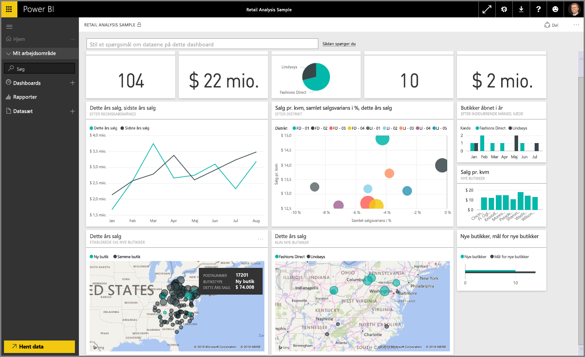
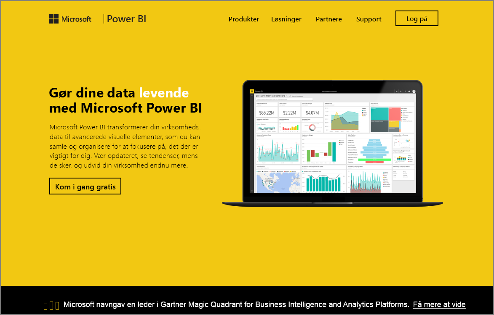

Velkommen til afsnittet **Udforsk data** i kurset **Automatiseret læring** til Power BI. Nu, hvor du er bekendt med Power BI Desktop, og hvordan du henter og visualiserer data, er du klar til at udforske data i Power BI-tjenesten.

Du kan lære en masse forskellige ting i dette afsnit, og Power BIs fremragende interaktivitet og delingsfunktioner kommer virkelig til sin ret her. Så gør dig klar til et spændende og interessant afsnit.

## Introduktion til Power BI-tjenesten
*Se, hvad Power BI-tjenesten kan gøre for din organisation*

Power BI-tjenesten er den naturlige forlængelse af **Power BI Desktop**, og dens funktioner omfatter overførsel af rapporter, oprettelse af dashboards og spørgsmål om dine data ved hjælp af naturligt sprog. Du kan bruge tjenesten til at angive tidspunkter for opdatering af data, dele data i din organisation og oprette brugerdefinerede servicepakker.

I de følgende emner vil vi udforske Power BI-tjenesten og vise dig, hvordan den kan forvandle dine Business Intelligence-data til dataindsigt og et fælles beslutningsdrevet, samarbejdende miljø.

