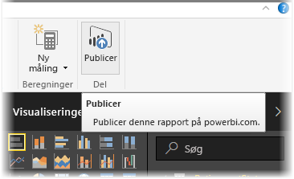
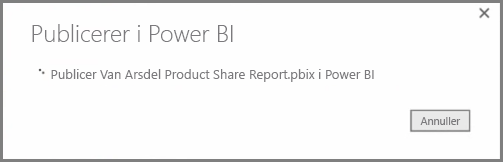
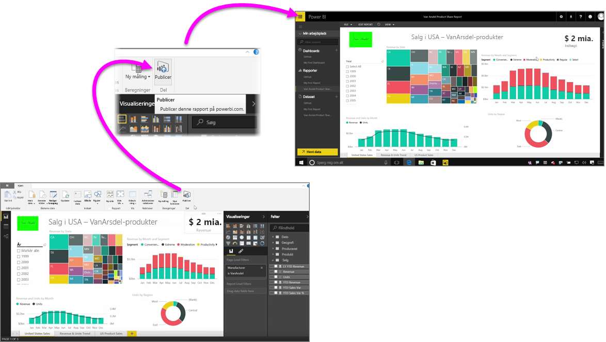

Det er hurtigt og nemt at publicere dine egne rapporter i Power BI-tjenesten.

Når du er færdig med at oprette din rapport i **Power BI Desktop**, skal du blot vælge knappen **Udgiv** på fanen **Hjem** i Power BI Desktop, så starter processen.

Rapporten og data, herunder visualiseringer, forespørgsler og brugerdefinerede mål, er samlet og overført til Power BI-tjenesten.

> [!NOTE]
> Det er almindeligt at referere til Power BI Desktop-rapporter som **.pbix**-filer, som er det filtypenavn, de får i Windows.
> 

Når overførslen er fuldført, fortæller en dialogboks dig, at publiceringsprocessen er fuldført, og der er angivet et link i denne dialogboks, der fører direkte til din rapport i Power BI-tjenesten i en webbrowser.

Og det er det – det er nemt at publicere rapporter fra Power BI Desktop til Power BI-tjenesten.

