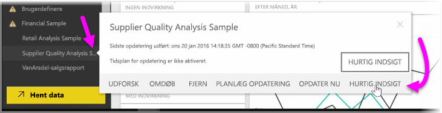
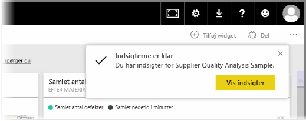
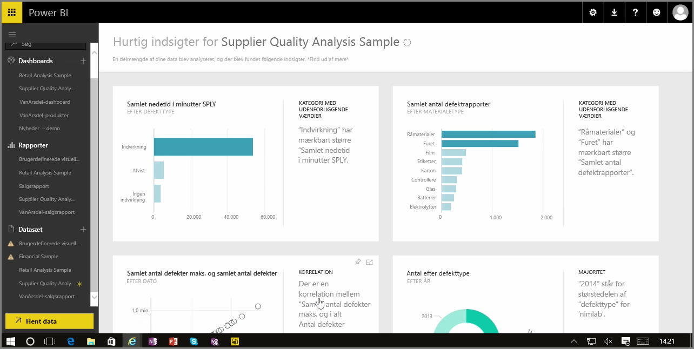

Når du arbejder med et dashboard, en rapport eller et datasæt i Power BI-tjenesten, kan Power BI søge efter hurtig indsigt i dataene. I Power BI skal du fra sektionen **Datasæt** i venstre rude vælge *ellipserne* (de tre prikker) ud for det datasæt, du er interesseret i. Der vises en menu med indstillinger, og yderst til højre får du vist en indstilling, der hedder **Hurtig indsigt**.

Når du vælger Hurtig indsigt, udfører Power BI maskinel indlæring og søger i dataene samt analyserer dem for at få hurtig indsigt. Du får vist en meddelelse i øverste højre hjørne af tjenesten, der angav, at Power BI arbejder på at søge efter indsigter.

Efter ca. 15 sekunder giver ændringerne dig besked om, at Power BI har fundet nogle indsigter.

Når du vælger knappen **Vis indsigter** på beskeden, får du vist en side med visuelle elementer, der viser de pågældende indsigter, som Power BI fandt, tilsvarende det, du ser på billedet nedenfor. Der er en masse indsigter, som du kan rulle ned på siden for at få vist og overveje.

Som med ethvert andet visuelt element kan du interagere med de visuelle elementer på siden Hurtig indsigt, og du kan også fastgøre et af dem til et eventuelt dashboard eller yderligere filtrere et eller flere af dem (så mange, som du ønsker) for at søge efter yderligere indsigt, der bare venter på, at du er nysgerrig nok til at finde dem.

Med **Hurtigt indsigt** kan du lade Power BI gøre arbejdet med at spotte afvigelser og tendenser i dine data og derefter bruge resultaterne i dine dashboards eller yderligere begrænse og filtrere dem for at få adgang til de indsigter, der er vigtigst for dig.

