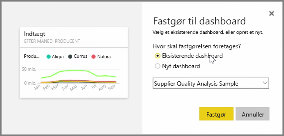
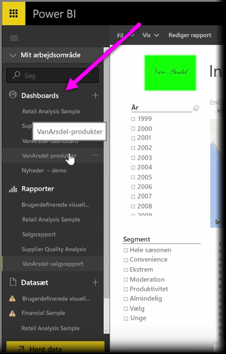
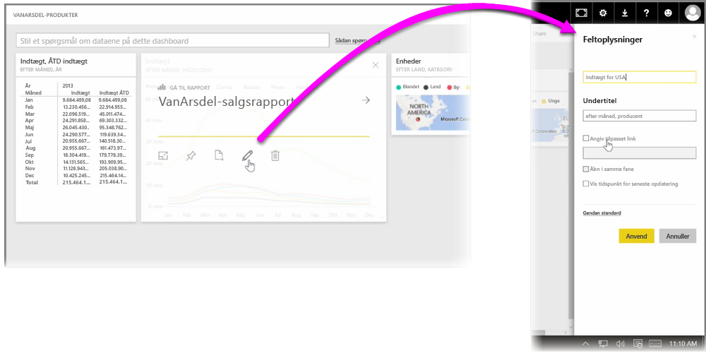

**Dashboards** i Power BI er én-sides samlinger af visualiseringer, der er oprettet indefra Power BI-tjenesten. Du kan oprette dashboards ved at **fastgøre** visualiseringer fra rapporter, du har skrevet og publiceret ved hjælp af Power BI Desktop, eller visualiseringer, du har oprettet i selve Power BI-tjenesten. **Fastgørelse af** et visuelt element til et dashboard er i store træk som at fastgøre et billede på en opslagstavle på en væg – det visuelle element sættes fast på et bestemt sted, så andre kan se den. Du fastgør et visuelt element ved at åbne dens rapport i Power BI-tjenesten. Peg på det visuelle element, du vil fastgøre, og vælg derefter **fastgørelsesikonet**.

Der vises en dialogboks, hvor du vælger et destinationsdashboard for det visuelle element i rullemenuen, eller du kan oprette et nyt dashboard. Du får også vist, hvordan det fastgjorte visuelle element vil komme til at se ud i dashboardet. Du kan fastgøre visualiseringer fra flere rapporter og sider i et enkelt dashboard, så du kan kombinere forskellige datasæt og -kilder til en enkelt side med indsigt.

På **Dashboards** kan du tilføje enhver type visualisering, herunder diagrammer, kort, billeder og figurer, ved at "fastgøre" dem. Når en visualisering er fastgjort til et dashboard, kaldes den et **felt**.

Dine dashboards, herunder eventuelle nye, vises i afsnittet Dashboards i venstre side af Power BI-tjenesten. Vælg et dashboard på listen for at se det.

Du kan ændre de visuelle elementers layout på et dashboard, som du ønsker. Hvis du vil tilpasse størrelsen på et felt, skal du trække håndtagene ind eller ud. Hvis du vil flytte et felt, skal du blot klikke og trække det til en anden placering på dashboardet. Peg på et felt, og klik på **blyantsikonet** for at åbne **Feltoplysninger**, hvor du kan ændre **titlen** eller **undertitlen**.

Klik på et dashboardfelt for at få vist den rapport, som det stammer fra. Derved kan du hurtigt få vist de underliggende data under et visuelt element. Du kan også ændre dette link ved hjælp af feltet **Angiv tilpasset link** i **Feltoplysninger**.

Du kan fastgøre felter fra ét dashboard til et andet, hvis du for eksempel har en samling af dashboards og vil oprette én samlet tavle. Processen er den samme: Hold musen over feltet, og vælg **fastgørelsesikonet**. Det er let at oprette og ændre dashboards. Og du kan tilpasse dem, så dit et-sides dashboard viser præcist det, det skal.

