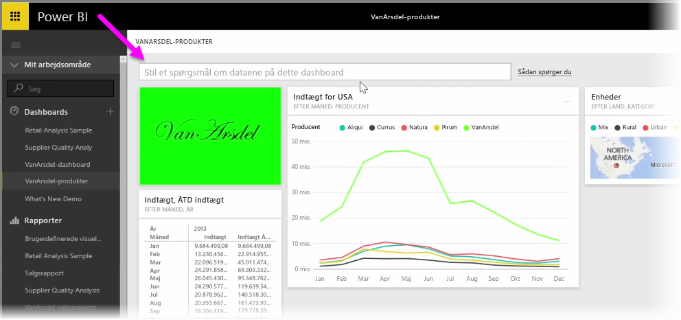
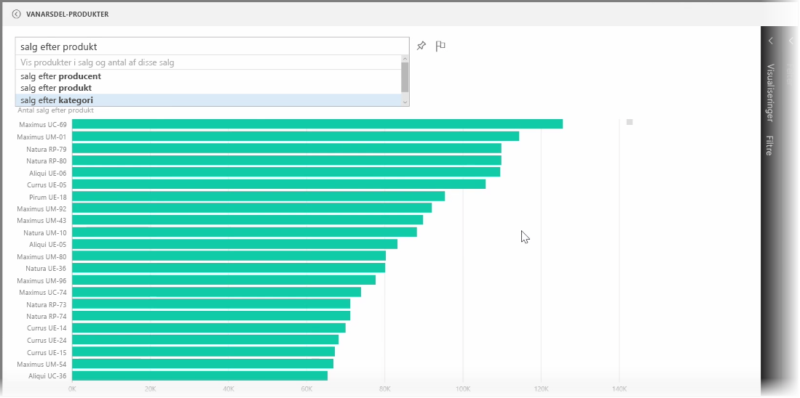
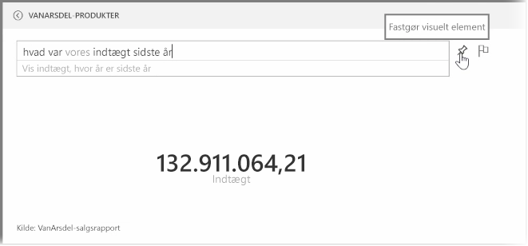
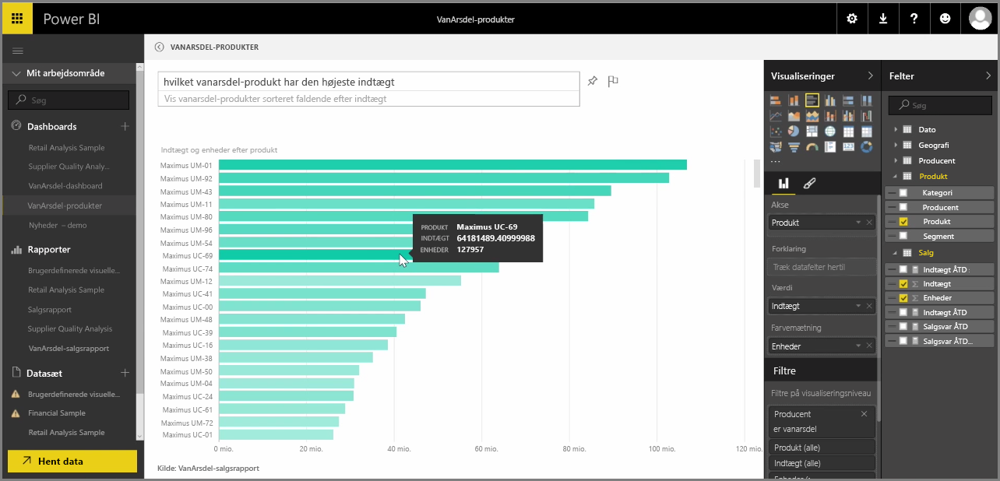

Power Bi har en kraftfuld motor til sproggenkendelse, som lader dig stille spørgsmål til dine data med vendinger og spørgsmål i talesprog. Så udover at lave rapporter og visualiseringer med Power BI kan du skabe diagrammer og grafer ved blot at stille simple spørgsmål.

Stil et spørgsmål til dine data ved at åbne et dashboard i Power BI. Øverst på skærmen ser du et felt, hvor du kan stille spørgsmål om de viste data. Denne funktion hedder *Spørgsmål og svar*, men som oftest henvises der til den som **Q&A**.

Når du klikker på feltet, viser Power BI prompter med forslag til ord baseret på dine data, f.eks. "ÅTD-omsætning". Du kan klikke på et forslag for at se resultatet, som ofte vises som en simpel tabel eller et kort. Når du vælger et af sætningsforslagene, skaber Power BI automatisk et visuelt element i realtid baseret på dit valg.

Du kan også stille spørgsmål med helt almindeligt sprog, f.eks. "Hvad var vores indtægt sidste år?" eller "Hvilket produkt solgte mest i marts 2014?". Power BI viser sin fortolkning af dit spørgsmål og vælger det bedste visuelle element til at repræsentere svaret. Og ligesom alle andre visuelle elementer i Power BI kan du **fastgøre** det til dit foretrukne dashboard ved at vælge ikonet med **knappenålen**.

Du kan til enhver tid redigere det visuelle element, som blev skabt af din sætning eller dit spørgsmål i naturligt sprog. Bare brug ruderne **Visualiseringer** og **Felter** i højre side af skærmen. Som med alle andre visuelle elementer i Power BI kan du ændre layout, justere filtrene og ændre felternes input.

Hvis du vil gemme visualiseringen til et dashboard, når du har skabt det perfekte visuelle element, skal du bare vælge ikonet med **knappenålen** ved siden af feltet med input til spørgsmål.

