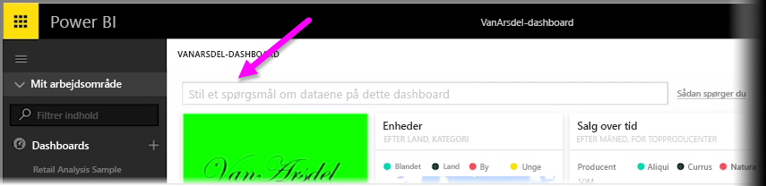
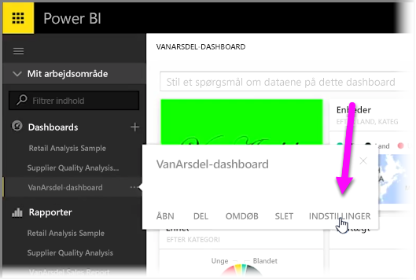
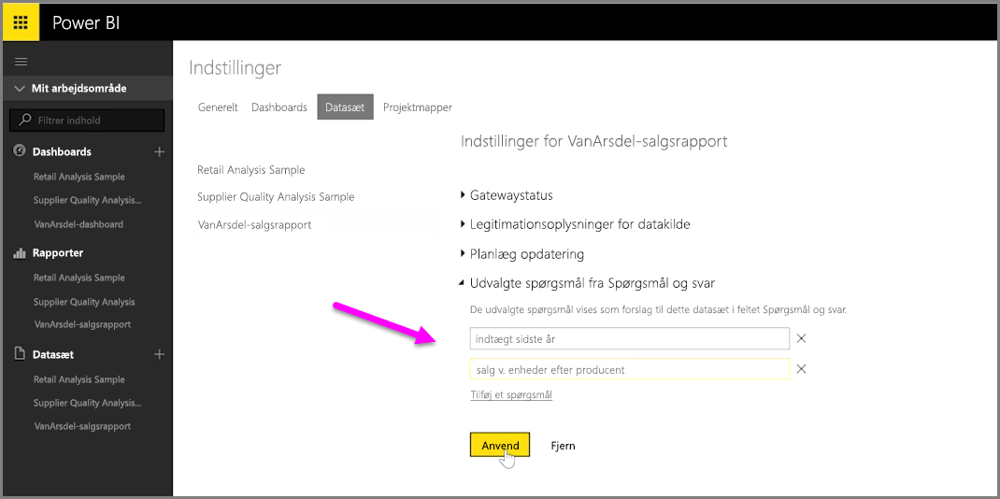

Med Power BI kan du kan tilføje dine egne forslag til spørgsmål for andre brugere, der benytter forespørgselsfeltet på et naturligt sprog til et dashboard, der ofte henvises til som **spørgsmål og svar**-feltet. Disse forslag til spørgsmål er, hvad brugere vil se, når de klikker på tekstfeltet øverst i et dashboard.

Hvis du vil tilføje dine egne spørgsmål, skal du vælge ellipsen (de tre prikker ...) ud for navnet på det dashboard, du vil bruge, og vælge **Indstillinger** i menuen.

 **Indstillingssiden** åbnes for dashboardet og de underliggende datasæt og projektmapper. Du kan deaktivere tekstfeltet til søgning efter spørgsmål og svar fra afsnittet **Dashboards** på siden **Indstillinger**, men vi ønsker tilføje spørgsmål, så vi vælger afsnittet **Datasæt**.

I afsnittet **Datasæt** vises alle datasæt, der er knyttet til dashboardet. Vælg det datasæt, der er knyttet til dit dashboard, på listen, vælg **Udvalgte spørgsmål**, og vælg derefter linket **Tilføj et spørgsmål**. Skriv dit spørgsmål, eller vælg tekstfeltet, og vælg **Anvend**.

Når nogen nu klikker på søgefeltet på det valgte dashboard, vil de se dine forslag til poster øverst på promptlisten, og når de vælger det pågældende spørgsmål, føres de direkte til svaret. Det er en værdifuld metode til at få dashboardbrugere til at tænke over den tilgængelige type data, og hvordan de bedst kan bruge den.

