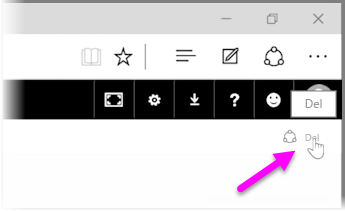
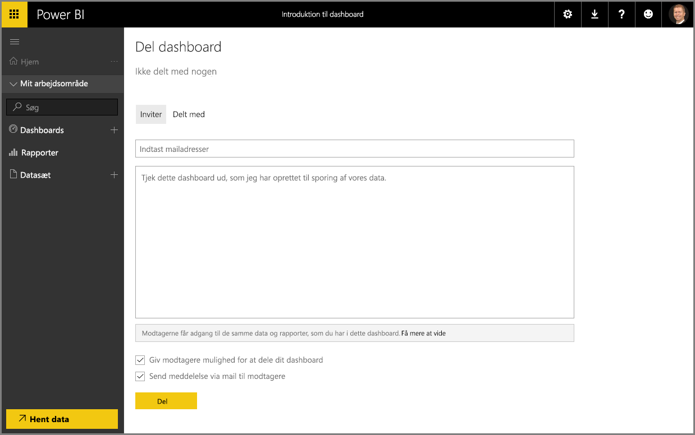

Vi har allerede set, hvordan Power BI kan hjælpe med at finde data, indsamle dem i en datamodel og oprette rapporter og visualiseringer vedr. brugen af de pågældende data. Vi har også set, hvordan du kan publicere disse rapporter i Power BI-tjenesten og oprette dashboards, der hjælper med at overvåge oplysningerne over tid. Alle disse funktioner er endnu mere effektive, når du deler dine indsigter med andre i organisationen. Det er heldigvis nemt at dele dine dashboards.

For at dele et dashboard skal du åbne det i Power BI-tjenesten og vælge **Del**-linket i øverste højre hjørne.

Siden **Del dashboard** vises, hvor du kan vælge afsnittet **Inviter** – derefter skal du udfylde tekstfeltet **Mailadresse** med personer, du vil give adgang til dashboardet. Power BI kontrollerer mailadresserne, idet du indtaster dem, med konti i dit domæne og Office 365-domænet, og udfylder automatisk, når det er muligt. Du kan også kopiere og indsætte mailadresser i dette felt, eller du kan bruge en distributionsliste, en sikkerhedsgruppe eller en Office 365-gruppe for at kontakte flere personer på én gang.

Hvis du har valgt afkrydsningsfeltet (nær bunden) til at *sende mailmeddelelser til modtagere*, så får modtagerne en orienterende mail om, at du har delt et dashboard med dem, herunder et link med dashboardet. Du kan føje en note til mailen, som de modtager, eller sende noten, som Power BI har oprettet for dig (den findes i feltet lige nedenunder stedet, hvor du indtaster deres mailadresse).

>[!NOTE]
>Modtagere uden en eksisterende Power BI-konto, føres gennem tilmeldingsprocessen, før de får vist dit dashboard.
> 
> 

Alle, du deler et dashboard med, kan se og interagere med det på nøjagtigt samme måde, som du kan. De har dog kun *læse*adgang til de underliggende rapporter, og de har *ingen adgang* til de underliggende datasæt.

Du kan også vælge fanen **Delt med** på siden Del dashboard for at se de personer, du før har delt dette dashboard med.

