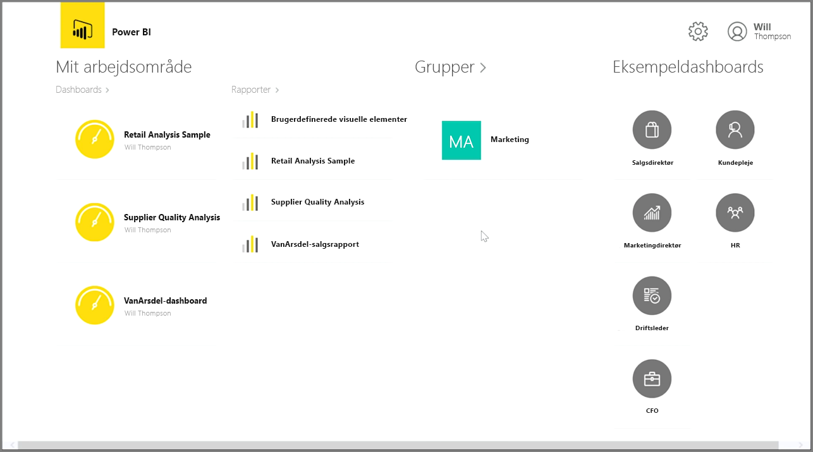
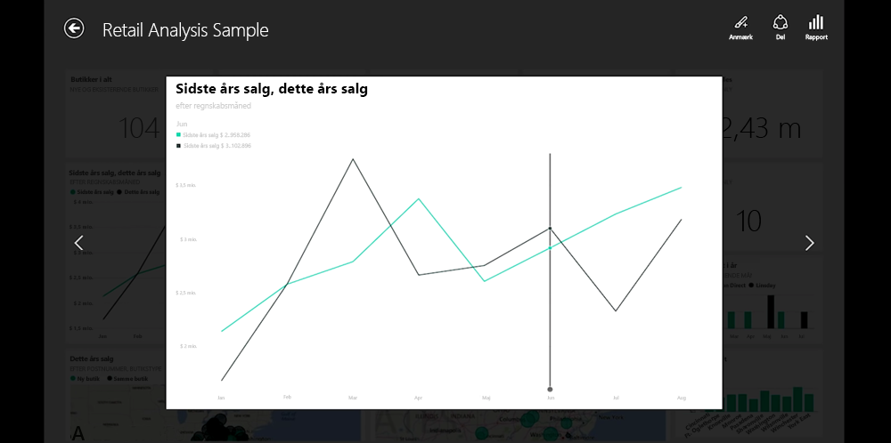
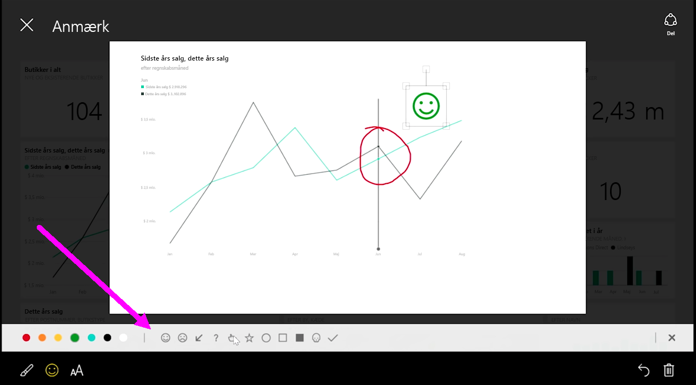

Hvis du vil holde styr på dine data, mens du er på farten, kan du bruge et af Power BI's mobile programmer til iOS-, Android- og Windows-enheder.

Når du bruger Power BI-appen, skal du først logge på din konto med dine kontooplysninger i Power BI-tjenesten. På en Windows-mobilenhed (i dette tilfælde en tablet) ser logon-processen således ud:

Du får først vist en skærm med alt det indhold, som du har adgang til, herunder rapporter, dashboards og grupper. Der er også eksempeldashboards, som du kan bruge til at hente inspiration eller blot til at få vist funktioner i Power BI. Appen er udviklet til at være berøringsvenlig: Tryk på et dashboard eller en rapport for at få den vist i fuld skærm og rul gennem dem med fingeren.

Du kan åbne ethvert givent dashboard ved at trykke på det. I et dashboard kan du trykke på et dashboardfelt for at fokusere på det i en større visning.

Du kan også anmærke enhver given indsigt, som du opdager, ved at trykke på knappen **Anmærk** i øverste højre hjørne. Dette giver dig mulighed for at trække i et fokuseret felt for at fremhæve bestemte interesseområder. Anmærkningsværktøjerne er placeret langs bunden af skærmen.

Del det anmærkede felt ved at trykke på linket **Del** i øverste højre hjørne.

Tryk på linket **Rapport** i det øverste højre hjørne for at få vist den underliggende rapport til et felt. Herved vises nøjagtig de samme visualiseringer, som du vil se i en webbrowser eller i Power BI Desktop, og de omfatter desuden muligheden for at interagere med rapporten ved at trykke på linjer, benytte detailudledning eller udsnitsværktøj.

