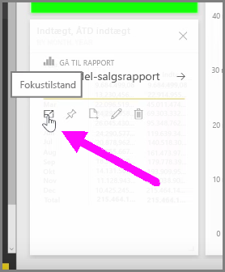
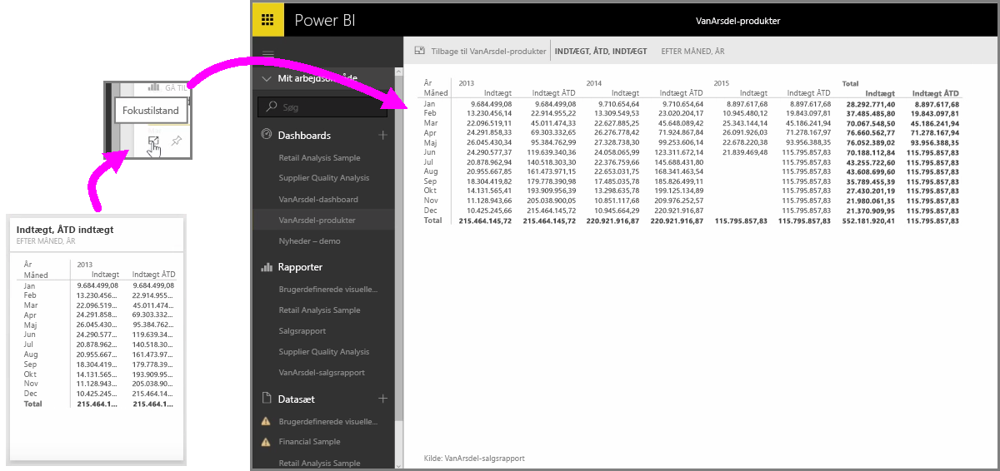

Når du kigger på Power BI-dashboards eller rapporter i tjenesten, kan det sommetider være en fordel at fokusere på et enkelt diagram eller en enkelt visualisering. Du kan gøre dette på to forskellige måder.

Når du er på et dashboard, skal du pege på et felt for at se et par forskellige ikonindstillinger i øverste højre hjørne. Når du vælger ellipserne (de tre punkter), vises en samling af ikoner, der repræsenterer handlinger, du kan foretage på feltet.

Ikonet længst til venstre hedder **Fokustilstand**. Vælg ikonet for at udvide feltet, så det dækker hele dashboardets område.

**Fokustilstand** giver dig mulighed for at se mange flere detaljer på visuelle elementer og forklaringer. Når du f.eks. tilpasser størrelsen på et felt i Power BI, vises nogle af kolonnerne måske ikke, fordi der ikke er nok tilgængelig plads i feltet.

I **Fokustilstand** kan du se alle dataene. Du kan også fastgøre det visuelle element direkte fra Fokustilstand til et andet dashboard ved at vælge **Tegnestift**-ikonet. For at afslutte **Fokustilstand** skal du vælge ikonet **Tilbage til...** i det øverste venstre hjørne i **Fokustilstand**.

Processen er tilsvarende ved visning af en rapport. Peg på et visuelt element for at se de tre ikoner i øverste højre hjørne, og vælg ikonet **Fokustilstand**. Når du vælger dette, så udvides din visualisering til at omfatte hele rapportlærredet. Det visuelle element er stadig interaktivt i denne tilstand, selvom du midlertidigt mister enhver tværgående filtereffekt mellem visualiseringer.

Peg på et udvidet felt eller rapport og vælg ikonet **Tilbage til...** (indsætningspunkt til venstre) i det øverste venstre hjørne for at returnere til den forrige visning.

