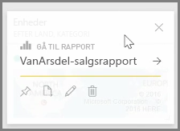
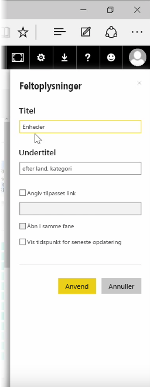
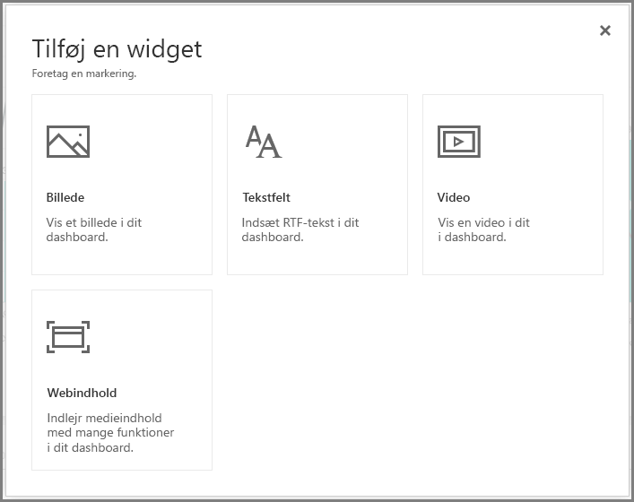
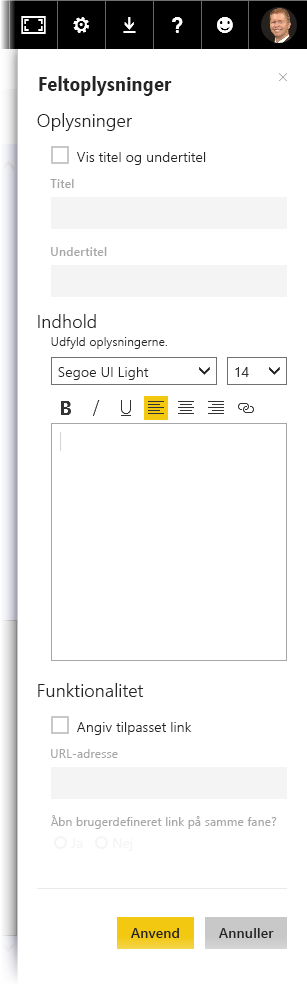

Når du har bygget et dashboard, kan du redigere **felterne* i Power BI-tjenesten for at foretage nogle få formateringsændringer.

Hvis du vil foretage ændringer af et felt, skal du pege på feltet og vælge ellipsen (tre prikker) for at vise en samling af ikoner, der gør det muligt at foretage ændringer af feltet.

Vælg **penneikonet** for at åbne ruden **Feltoplysninger**. Her kan du ændre feltets **titel**, **undertitel**, medtage klokkeslættet og datoen for seneste opdatering og andre oplysninger som f.eks. at oprette et brugerdefineret link.

Når du klikker på et dashboardfelt, føres du som standard til rapporten, som det stammer fra. Du kan ændre denne funktionsmåde ved at bruge feltet **Angiv tilpasset link** i ruden **Feltoplysninger**. En populær anvendelse af denne funktion er at føre brugere til startsiden for organisationen, når der klikkes på et logobillede.

## Føj widgets til dit dashboard
Du kan også føje widgets til dit dashboard. En **widget** er et særligt dashboardfelt, der indeholder andre elementer, f.eks. et billede, en onlinevideo, et tekstfelt eller formateret webindhold, i stedet for en visualisering.

Når du vælger linket Tilføj widget i øverste højre hjørne af et dashboard, åbnes dialogboksen **Tilføj en widget**.

Når du f.eks. tilføjer et tekstfelt, vises ruden **Feltoplysninger** i højre side, hvor du kan redigere oplysninger svarende til, hvad er tilgængeligt, når oplysningerne om et felt redigeres. Men med widgets er der også et afsnit til at definere eller redigere widgetindhold, f.eks. en RTF-editor for et tekstfelt.

Med widgets og muligheden for at redigere feltoplysninger kan du tilpasse dit dashboard og få det til at se ud, som du ønsker.

