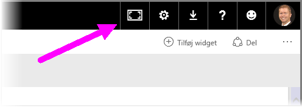
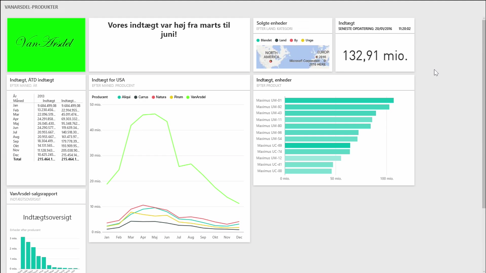
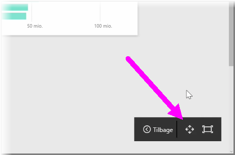
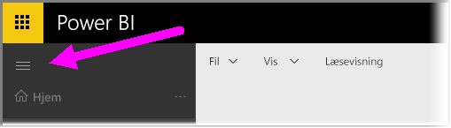

Du kan komme ud for, at du af og til har mere indhold, end der kan være på lærredet, når du opretter dine dashboards. Der er et par løsninger, der kan hjælpe dig med at administrere visningen af pladsen til dashboardet, så du kan få en fuld visning af indhold i dit dashboard.

Den nemmeste metode til at vise hele dashboardet i ét skærmbillede er at vælge knappen **Fuld skærm** i øverste højre hjørne af dashboardet.

Når du vælger knappen **Fuld skærm**, sættes browseren i fuldskærmstilstand, alle chrome-elementer fjernes fra omkring dashboardet, og mængden af plads, der kan ses, forøges dermed.

Du kan fra **fuldskærmstilstanden** vælge indstillingen **Tilpas til skærm** for at formindske alle dine felter, så de passer på et enkelt skærmbillede, uden behov for rullepaneler. Dette kaldes ofte *tv-tilstand* og er praktisk ved præsentationer med dashboards eller til visning af et dashboard på skærme på gangen.

Du kan også administrere pladsen til dashboardet ved at skjule navigationsruden til venstre på siden ved at vælge hamburgerikonet. Klik på ikonet igen for at udvide navigationsruden.

Du kan sikre dig, at et dashboard altid har en skjult navigationslinje, ved at føje følgende til slutningen af URL-adressen:

> ?collapseNavigation=true
> 
> 

Brugere, der følger linket, åbner dashboardet med en skjult navigationslinje.

