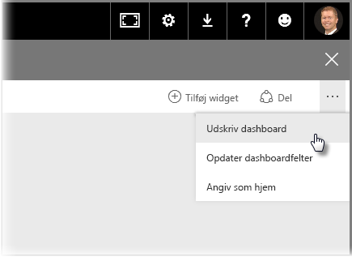
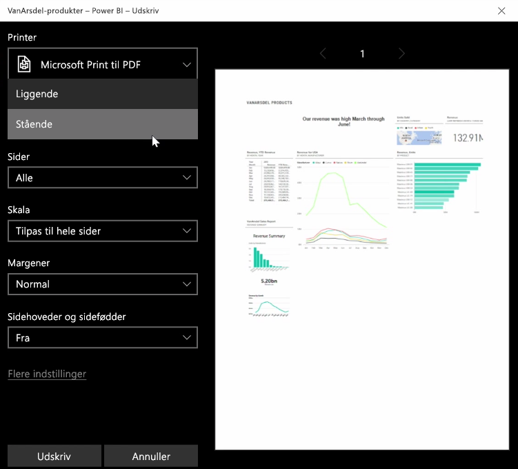
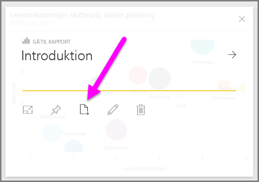
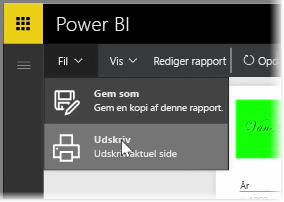

Du kan nogle gange have behov for at tage en udskreven rapport eller dashboard med til et møde, eller for at du kan dele det med andre. Med Power BI kan du lave udskrifter af dine visualiseringer på et par forskellige måder.

Vælg ellipsen (tre prikker) i øverste højre side af Power BI-tjenesten, og vælg **Udskriv dashboard**.

Der åbnes en **udskriftsdialogboks**, hvor du kan vælge den printer, som du vil sende dashboardet til, samt standardudskriftsindstillinger som *stående* eller *liggende* retning.

## Eksportér data fra et visuelt element
Du kan også eksportere dataene fra et visuelt element i Power BI-tjenesten. Du skal blot vælge ellipsen på et visuelt element og derefter vælge knappen **Eksportér data** (den midterste knap). Når du gør dette, oprettes der en .CSV-fil, som downloades til din lokale computer, og der vises en meddelelse i din browser (ligesom andre downloads startet af browseren), der giver dig besked om, at download er fuldført.

Du kan også udskrive eller eksportere direkte fra en rapport. Når du får vist en rapport i Power BI-tjenesten, skal du vælge **Filer > Udskriv** for at åbne dialogboksen Udskriv.

Og på samme måde som med et dashboard kan du eksportere data fra et visuelt element i en rapport ved at vælge knappen Eksportér på et visuelt element.

