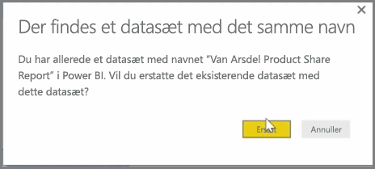
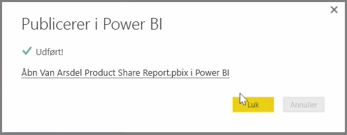

Du kan opdatere rapporter og datasæt, som du allerede har udgivet, fra Power BI Desktop til Power BI-tjenesten. Dette kan du gøre ved at markere **Udgiv** fra fanen **Hjem** på båndet.

Når du publicerer en rapport, der allerede findes i Power BI-tjenesten, bliver du bedt om at bekræfte, at du vil erstatte det forrige datasæt og de forrige rapporter med den redigerede version, du lige har valgt at opdatere.

Når du vælger **Erstat**, overskrives datasættene og rapporterne i Power BI-tjenesten med datasættene og rapporterne i den seneste Power BI Desktop-version af filen.

Og på samme måde som alle andre **Udgiv**-hændelser fra Power BI Desktop, vises der en dialogboks, der fortæller dig, at udgivelsen blev fuldført, og du får et link til rapporten i Power BI-tjenesten.

Det er muligt at opdatere dine data manuelt. Du kan også automatisk opdatere datasæt og rapporter. Denne proces dækkes i et anden emne.

