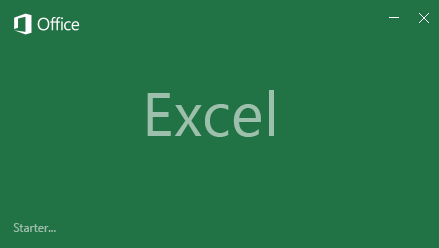

Velkommen til afsnittet **Power BI og Excel** i **undervisningskurset** til Power BI.

Du har sandsynligvis brugt **Excel** før. Måske brugte du Excel til at oprette eller få vist rapporter eller til at bygge cirkeldiagrammer eller andre visuelle elementer. Eller måske brugte du **Power Pivot** eller **Power Query** til bygge løsninger, der var lidt mere tekniske. Hvis det er tilfældet, vil du føle dig hjemme i Power BI, og det gælder også dine projektmapper.

Dette afsnit viser, hvor let det er at overføre Excel-projektmapper til Power BI, og det demonstrerer, at Power BI og Excel udgør et fantastisk partnerskab.

## Introduktion til brug af Excel-data i Power BI
*Se en introduktion af, hvordan Excel og Power BI-tjenesten arbejder sammen*

Med Power BI er det nemt at få dine Excel-data ind i Power BI.

Følgende emner fører dig gennem upload af en Excel-projektmappe med en enkel tabel til Power BI. Du vil derefter få vist, hvordan du kan uploade projektmapper, der er oprettet med Excels mere avancerede BI-datamodellerings- og rapporteringsfunktioner, f.eks. Power Pivot og Power View.

Du skal også lære nogle af fordelene ved at gemme dine Excel-projektmappefiler i OneDrive for Business. Når du opretter forbindelse til Excel-filer på OneDrive fra Power BI, opdateres dine rapporter og dashboards i Power BI automatisk, når du foretager ændringer og gemmer dit arbejde.

