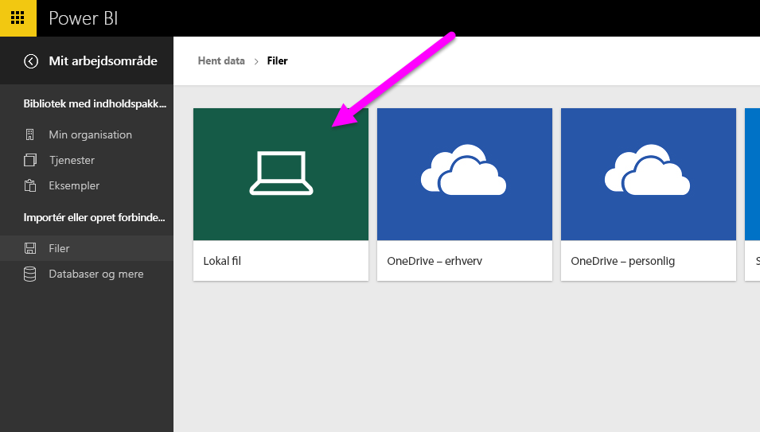
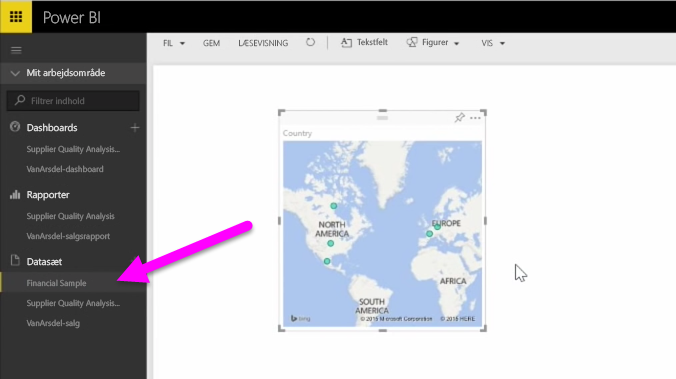

I dette emne vil vi først kigge nærmere på, hvordan du kan importere en Excel-projektmappefil, der indeholder en enkel **tabel** fra et lokalt drev, til Power BI. Du skal derefter lære, hvordan du kan begynde at udforske tabellens data i Power BI ved at oprette en rapport.

## Sørg for, at dataene er formateret som en tabel
Hvis Power BI skal importere data fra din projektmappe, skal disse data være **formateret som en tabel**. Det er nemt. I Excel kan du fremhæve et celleområde. Klik derefter på **Tabel** på fanen **Indsæt** på Excel-båndet.

Du skal sikre dig, at alle kolonner har et godt navn. Det gør det lettere at finde de data, du ønsker, når du opretter dine rapporter i Power BI.

## Importér fra et lokalt drev
Uanset hvor du bevarer dine filer, gør Power BI det nemt at importere dem. I Power BI kan du bruge **Hent data** > **Filer** > **Lokal fil** til at søge efter og vælge den ønskede Excel-fil.

Når den er importeret til Power BI, kan du begynde at oprette rapporter.

Dine filer behøver naturligvis ikke at være på et lokalt drev. Det er endnu bedre, hvis du gemmer dine filer på OneDrive eller SharePoint-teamwebsted. Vi går mere i detaljer om dette i et senere emne.

## Start med at oprette rapporter
Når din projektmappes data er blevet importeret, oprettes der et datasæt i Power BI. Det vises under **Datasæt**. Nu kan du begynde at udforske dine data ved at oprette rapporter og dashboards. Du skal blot klikke på ikonet **Åbn menuen** ud for datasættet og derefter klikke på **Udforsk**. Der vises et nyt, tomt rapportcanvas. I højre side kan du under **Felter** se dine tabeller og kolonner. Vælg kun de felter, hvor du vil oprette en ny visualisering på lærredet.

Du kan ændre visualiseringstypen og anvende **filtre** og andre egenskaber under **Visualiseringer**.

