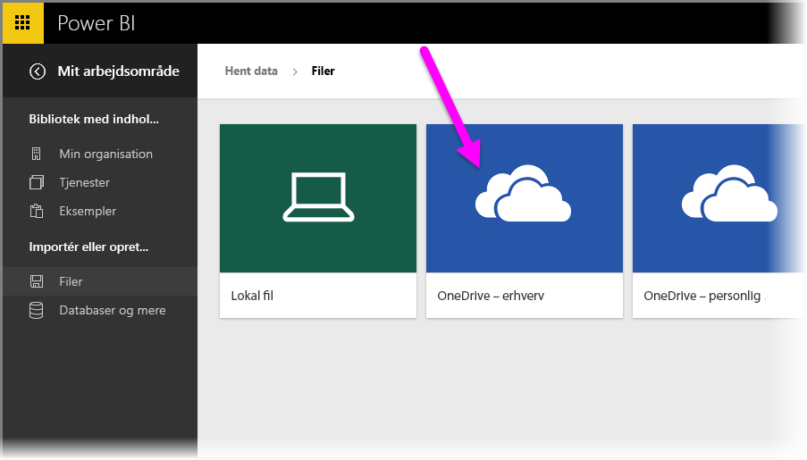
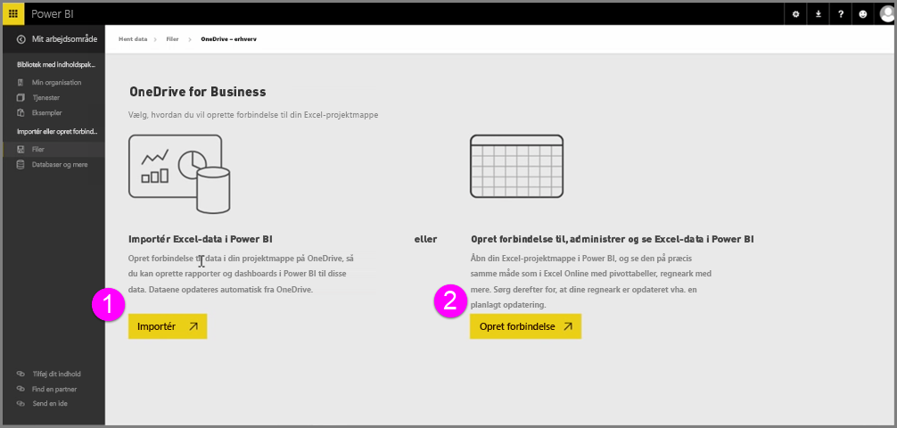
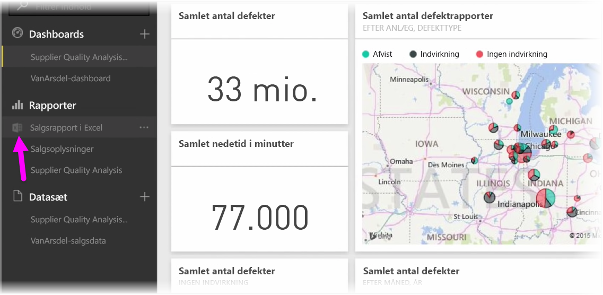

Få problemfri integration mellem Power BI og Excel, når du gemmer dine Excel-projektmapper på OneDrive.

Da OneDrive er i skyen, ligesom Power BI, oprettes der en direkte forbindelse mellem Power BI og OneDrive. Hvis du foretager ændringer til din projektmappe på OneDrive, *synkroniseres disse ændringer automatisk* med Power BI. Din visualiseringer i rapporter og dashboards holdes opdateret. Hvis din projektmappe har forbindelse til eksterne datakilder som en database eller et OData-feed, kan du bruge Power BIs funktioner **Planlæg opdatering** til at kontrollere for opdateringer. Har du brug for at stille spørgsmål om data i projektmappen? Intet problem. Du kan bruge Power BIs funktion **Spørgsmål og svar** til at gøre dette.

Du kan oprette forbindelse til dine Excel-filer på OneDrive for Business på to måder:

1. Importér Excel-data i Power BI
2. Opret forbindelse, administrer og få vist Excel i Power BI

### Importér Excel-data i Power BI
Når du vælger at importere Excel-data i Power BI, indlæses tabeldata fra din projektmappe i et nyt datasæt i Power BI. Hvis du har nogen **Power View**-ark i projektmappen, importeres de også, og nye rapporter oprettes automatisk i Power BI.

Power BI bevarer forbindelsen mellem den og projektmappefilen på din OneDrive for Business. Hvis du foretager ændringer til din projektmappe, *synkroniseres disse ændringer automatisk** med Power BI, når du gemmer, normalt inden for en time. Hvis din projektmappe har forbindelse til eksterne datakilder, kan du konfigurere den planlagte opdatering, så datasættet i Power BI holder sig opdateret. Da visualiseringer i rapporter og dashboard i Power BI skal bruge dataene fra datasættet, når du udforsker, sker dine forespørgsler lynhurtigt.

### Opret forbindelse, administrer og få vist Excel i Power BI
Når du vælger at oprette forbindelse til Excel-projektmappen, får du en problemfri oplevelse ved at arbejde med projektmappen i Excel og Power BI. Når du opretter forbindelse på denne måde, har projektmapperapporten et lille Excel-ikon ud for den.

I rapporten kan du se din Excel-projektmappe i Power BI på samme måde som i **Excel Online**. Du kan udforske og redigere dine regneark i Excel Online ved at vælge Rediger i ellipsemenuen. Når du foretager ændringer, opdateres eventuelle visuelle effekter, du har fastgjort til dashboards, automatisk.

Der oprettes ingen datasæt i Power BI. Alle data forbliver i projektmappen på OneDrive. En af de mange fordele med denne metode er, at du kan konfigurere **planlagt opdatering**, hvis din projektmappe har forbindelse til eksterne datakilder. Du kan vælge elementer som f.eks. pivottabeller og diagrammer og **fastgøre** dem til dashboards i Power BI. Hvis du har foretaget ændringer, afspejles de automatisk i Power BI. Og du kan bruge Power BIs fantastiske **Spørgsmål og svar**-funktioner til at stille spørgsmål om data i projektmappen.  

