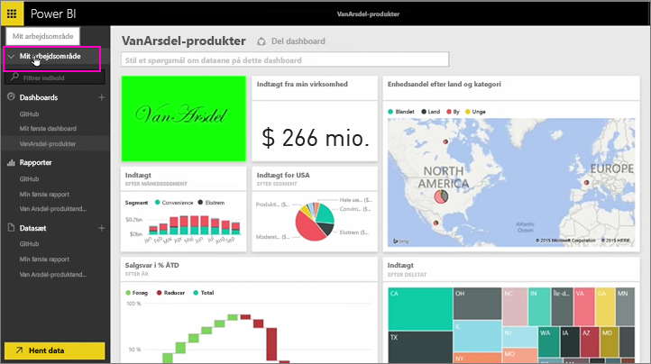
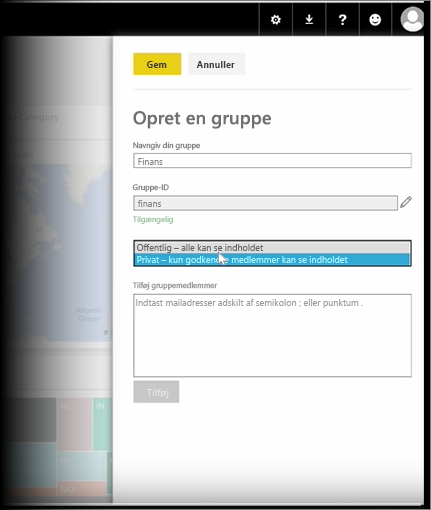
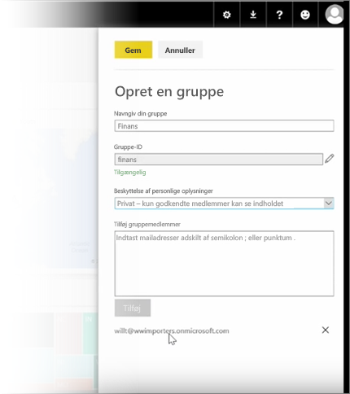

I denne lektion starter vi med at oprette en *gruppe*. En **gruppe** definerer en gruppe brugere, der har adgang til bestemte dashboards, rapporter og data.

Grupper i Power BI er baseret på grupper i Office 365, så hvis du har brugt Office 365-grupper til at administrere din gruppes mail, kalender og dokumenter, vil du opdage, at Power BI har de samme funktioner og mere. Når du opretter en gruppe i Power BI, opretter du rent faktisk en Office 365-gruppe.

Dette modul bruger scenariet med at oprette en ny økonomigruppe. Vi viser dig, hvordan du kan konfigurere gruppen, dele dashboards, rapporter og datasæt med gruppen og tilføje medlemmer, der vil få adgang til elementerne i gruppen.

Jeg starter her i Mit arbejdsområde. Det er de dashboards, rapporter og datasæt, som jeg har oprettet, eller som en person har delt med mig.

Hvis jeg udvider Mit arbejdsområde, kan jeg vælge **Opret en gruppe**.

Her kan jeg give det et navn. Vi bruger scenariet eller en økonomigruppe, så jeg vil kalde den Finance. Power BI sørger for, at navnet ikke findes på domænet.

Jeg kan angive niveauet for beskyttelse af personlige oplysninger ved at bestemme, om nogen i min organisation kan se indholdet af gruppen, eller det kun er medlemmerne.

Jeg skriver mailadresser, sikkerhedsgrupper og distributionslister her. Jeg vælger **Tilføj** for at gøre dem til medlemmer af gruppen og gemmer gruppen.

Videre til næste lektion!

