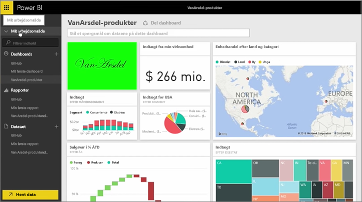
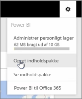
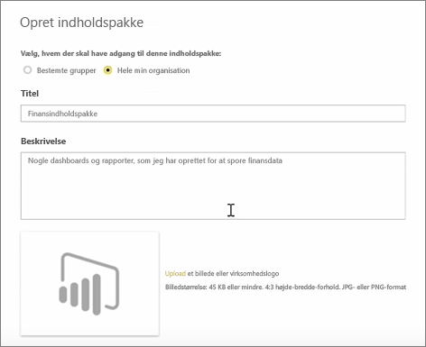
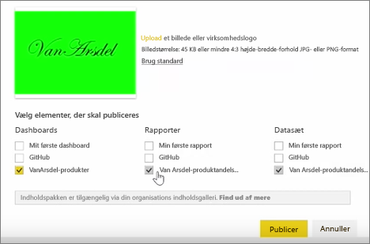
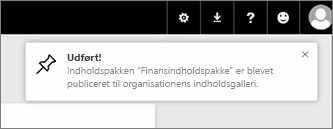

I denne lektion opretter vi en *indholdspakke* med eksisterende artefakter, som vi allerede har i Power BI, og deler dem med kolleger. 

I **Mit arbejdsområde** har jeg et dashboard, rapporten nedenunder og datasættet. Jeg vil dele dem som en pakke med personer i min organisation, så de kan genbruge dem.

Når jeg vælger ikonet **Indstillinger** (tandhjulet øverst til højre i tjenesten), kan jeg se, hvor meget lagerplads jeg har brugt, og jeg kan oprette en indholdspakke.

I dialogboksen, der vises, kan jeg vælge enten at distribuere den til bestemte personer eller grupper – jeg kan også give den en titel. Det er også en god ide at tilføje en detaljeret beskrivelse i feltet **Beskrivelse**, så brugere, der søger efter en indholdspakke, ved hvad den indeholder eller angiver.

Nederst i dialogboksen har jeg mulighed for at overføre et billede til indholdspakken og derefter udføre det vigtigste trin – jeg vælger det dashboard, som jeg vil inkludere i indholdspakken, og når jeg gør det, vælger Power BI automatisk rapporten og datasættet, som bruges i dashboardet. Jeg kan ikke fravælge rapporten eller datasættet, fordi dashboardet, jeg vil inkludere i indholdspakken, skal bruge dem.

Jeg kan også vælge andre dashboards, rapporter og datasæt, men det vil jeg ikke gøre nu.

Når jeg publicerer, så føjes indholdspakken til organisationens indholdsgalleri.

Videre til næste lektion!

