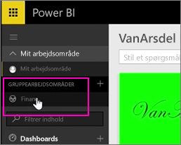
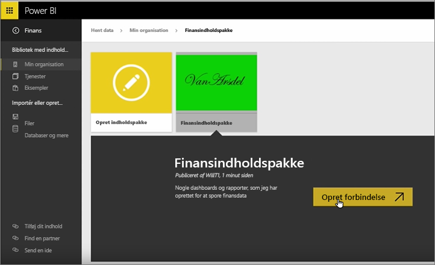
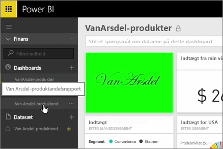
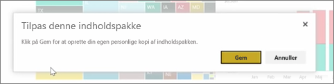
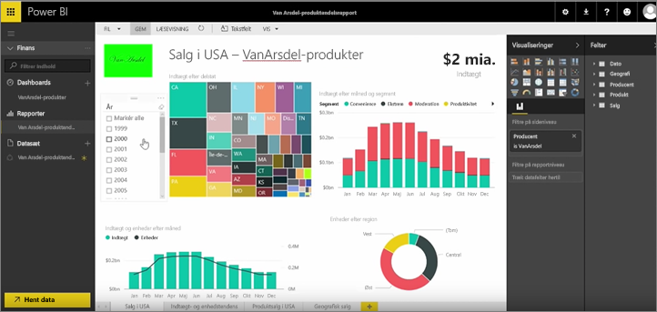

Vi har allerede oprettet en indholdspakke og en gruppe i tidligere lektioner. I denne lektion vil vi oprette en forekomst af indholdspakken til alle i gruppen.

Jeg starter i Mit arbejdsområde ...

... og går tilbage til den økonomigruppe, jeg oprettede i den tidligere lektion.

Gruppen har endnu ikke nogen dashboards, rapporter eller datasæt. Jeg vil bruge den app, jeg har oprettet. Jeg gennemser apps fra min organisation i stedet for dem fra tredjepartstjenester.

Jeg finder den app, jeg har oprettet et minut siden. Jeg kan se, hvorfor det er vigtigt at give den en god titel, beskrivelse og et godt billede, så folk kan finde den. Jeg opretter forbindelse til den.

Powerbi importerer de dashboards, rapporter og datasæt, der er i appen.

Når jeg vælger datasættet, spørger Power BI, hvis jeg vil tilpasse appen.

Jeg er opretter en kopi af den app, jeg kan foretage ændringer, og du kan afbryde forbindelsen den udgivne version af appen. Hvis forfatteren af appen foretager ændringer til den udgivne version, får jeg ikke automatisk disse opdateringer.

Men jeg kan redigere dashboardet, rapporten og selv datasættene, hvis jeg vil.

Så app er en nem måde at genbruge indhold, der er oprettet af andre personer i din organisation.

Videre til næste lektion!

