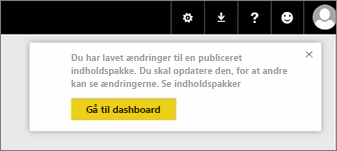
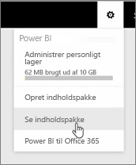
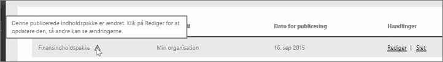

I denne lektion redigerer vi den oprindelige indholdspakke, som vi oprettede tidligere, og ser, hvordan det opdaterer de andre personer, der har forbindelse til den.

Jeg er tilbage i Mit arbejdsområde, hvor jeg redigerer mit oprindelige dashboard.

Når jeg foretager ændringer til dashboardet, får jeg denne påmindelse om, at jeg har ændret noget, som jeg har delt med andre i en indholdspakke, og bliver bedt om at opdatere den delte version.

Jeg går tilbage til ikonet for indstillinger og vælger **Se indholdspakke** for at se de indholdspakker, som jeg allerede har publiceret.

Jeg kan se den indholdspakke, jeg har lavet. Dette lille ikon viser, at jeg har ændret noget i indholdspakken, og jeg skal redigere indholdspakken, så andre kan se ændringerne.

Når jeg vælger **Rediger**, kommer jeg tilbage til skærmen, hvor jeg kan redigere titel og beskrivelse, men denne gang er der en **Opdateringsknap**, så jeg vælger den.

Power BI tager disse ændringer og udgiver den opdaterede indholdspakke til galleriet med indholdspakken.

Alle, der har oprettet forbindelse til min indholdspakke, får en meddelelse om, at indholdspakken er blevet ændret, og bliver spurgt, om de ønsker at acceptere ændringerne eller beholde den ældre version.

Så som ejer af indholdspakken kan du administrere de versioner, dine kollegaer bruger.

