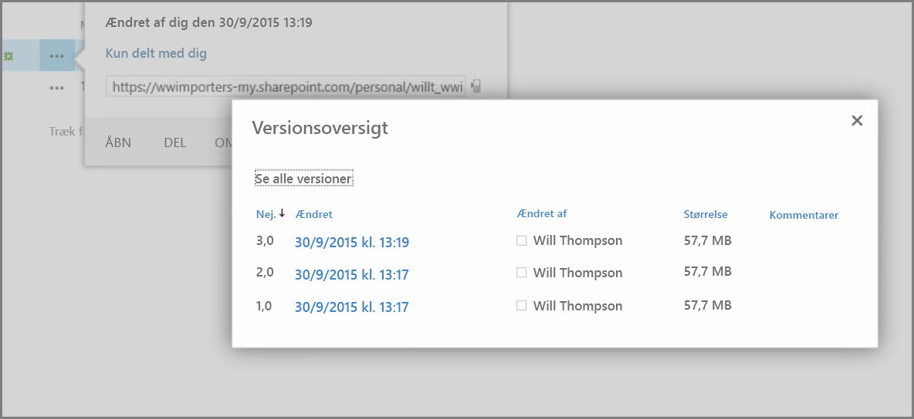
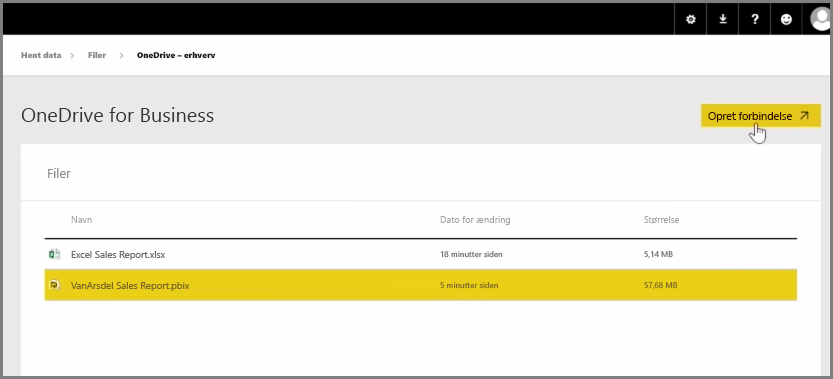
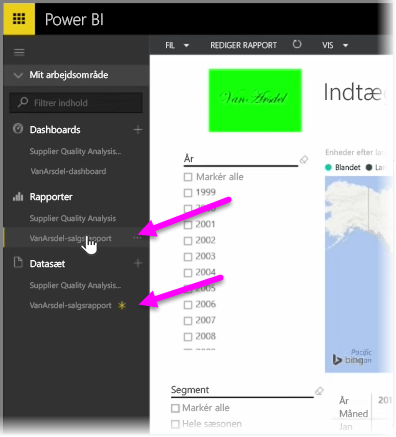

I en tidligere artikel gennemgik vi oprettelse af grupper for at hjælpe din organisation med at administrere og samarbejde om indhold, der er i Power BI. Du kan også bruge dine Power BI-/Office365-grupper til at samarbejde og dele ved hjælp af **OneDrive for Business**.

Med OneDrive for Business som en kilde til din Power BI får du adgang til en række nyttige værktøjer, f.eks. versionshistorik. Du kan også dele dine filer med en Office 365-gruppe fra OneDrive for Business for at give adgang og tillade, at mange personer arbejder på samme Power BI- eller Excel-filer.

Hvis du vil oprette forbindelse til en PBIX-fil (Power BI Desktop) på OneDrive for Business, skal du logge på Power BI-tjenesten og vælge **Hent data**. Vælg **Filer** under Importér eller Opret forbindelse til data, og vælg derefter **OneDrive – Business**. Markér den ønskede fil, og vælg **Opret forbindelse**.

Dit indhold vises i navigationslinjen i venstre side.

Nu vil eventuelle ændringer, der er foretaget i filen på **OneDrive for Business**, automatisk blive afspejlet i Power BI-miljøet og registreret i versionshistorikken.

