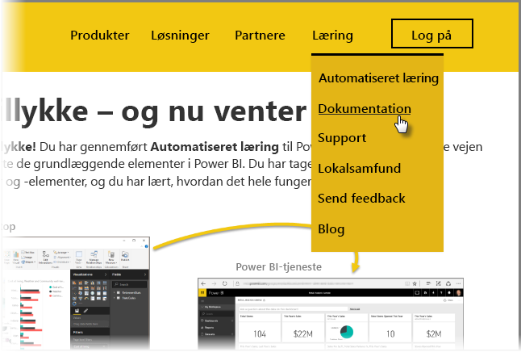

Du gjorde det! **Tillykke!** Du har gennemført kurset**Automatiseret læring** til Power BI. Du har været hele vejen rundt, siden du lærte de grundlæggende elementer i Power BI. Du har taget turen gennem softwarefunktioner og -elementer, og du har lært, hvordan det hele fungerer sammen.

Dette er det sidste afsnit (og det sidste emne, medmindre du vil lære DAX) på kurset, så hvis du gennemgik alle afsnittene i streg, skal du lige klappe dig selv på ryggen. Godt arbejde! Du er nu velbevandret i disse **vigtige begreber**:

* Hvad [er Power BI](../gettingstarted.yml#step-1)
* [Komponenterne](../gettingstarted.yml#step-3) i Power BI
* [At hente](../gettingdata.yml#step-3) og [udforme](../modeling.yml#step-1) data
* [Visualiseringer](../visualizations.yml#step-1)
* [Udforskning af data](../exploringdata.yml#step-1) i Power BI-tjenesten
* At bruge [Excel og Power BI](../powerbiandexcel.yml#step-1) sammen
* Og at [publicere og dele](../publishingandsharing.yml#step-1) dit arbejde

Det er meget viden, og nu hvor du har fået styr på det hele, er du klar til at tage det brug! Her er nogle **links til downloads** eller til at få din browser **tilknyttet Power BI-tjenesten**:

* Du kan altid [hente den nyeste Power BI Desktop](https://powerbi.microsoft.com/desktop)
* At gå til [Power BI-tjenesten](https://powerbi.microsoft.com/) er nemt
* [Mobilapps til Power BI](https://powerbi.microsoft.com/mobile/) er kun et tryk væk

Der er også mere indhold med **hjælp og referencer** tilgængeligt. Bare gå til toppen af denne side, og vælg **Oplæring > Dokumentation** for at se vores omfattende referencemateriale til Power BI.

Vi håber, at du har nydt oplevelsen med kurset **Automatiseret læring til Power BI**. Held og lykke. Vi håber, dine visuelle elementer i Power BI bliver fængslende og betagende.

## Ét afsnit mere til DAX-brugere
Vil du stadig have mere? Er du interesseret i at bruge **DAX (Data Analysis Expressions)** til at oprette, filtrere eller bruge brugerdefinerede kolonner og tabeller i Power BI? Der er ét afsnit mere, og det er rettet mod personer, der har lyst til at lave kodning i Power BI. Det hedder **Introduktion til DAX**. Kig på det, hvis du er interesseret – du finder den samme venlige tilgang som i resten af dette vejledende kursus.

