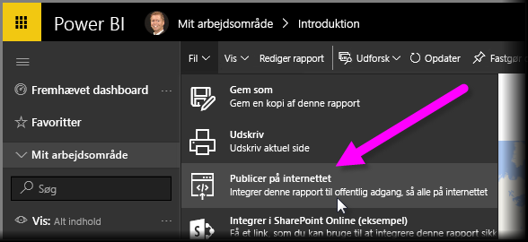
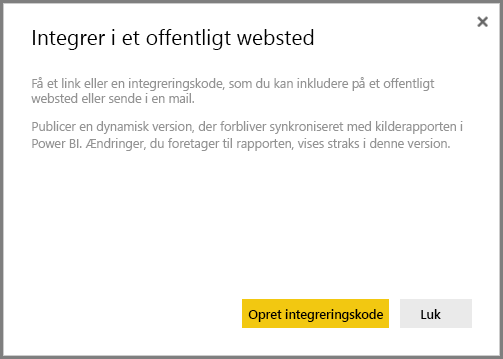
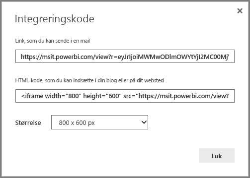
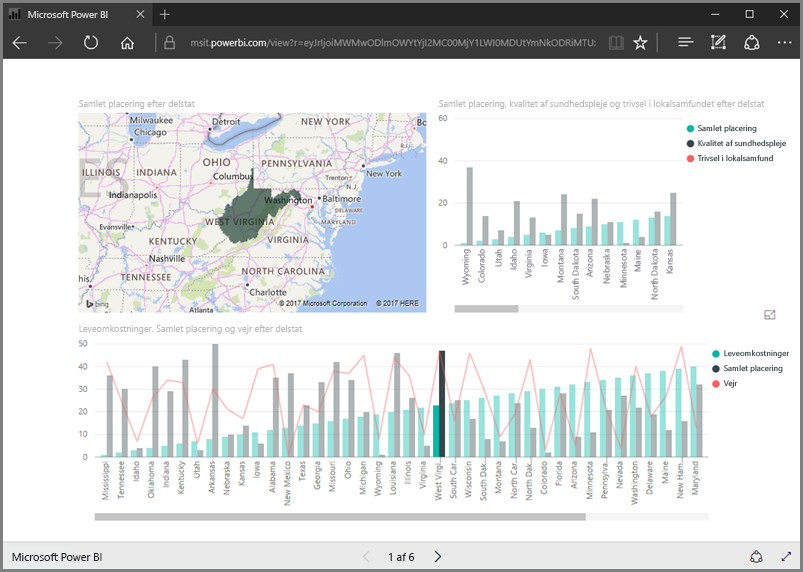
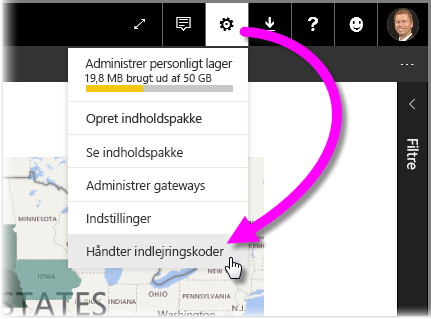
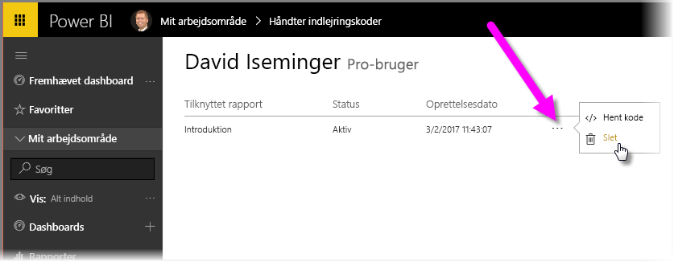

I denne lektion får vi lært, hvordan vi deler en Power BI-rapport på en webside – eller deler den via mail – med nogle ganske få trin. Denne funktion i Power BI kaldes ofte **Publicer på internettet** og er let at bruge og administrere.

Vælg den rapport i Power BI, du vil dele, så den vises på lærredet. Vælg derefter **Filer > Publicer på internettet** på menuen.

Herfra kan du se en dialogboks, der forklarer, hvordan du får en *indlejringskode*, som du skal bruge til at indsætte rapporten på et websted eller i en mail.

Når du vælger **Opret indlejringskode**, viser Power BI en anden dialogboks, som igen angiver, at du er ved at dele dine data med alle på internettet. Kontrollér, at det er i orden!

Power BI viser en dialogboks med to links:

* Et link du kan dele i en mail, som viser rapporten som en internetside
* HTML-kode (et link-plus i en iframe), så du kan indlejre rapporten direkte i en webside

For HTML-linket kan du vælge mellem foruddefinerede størrelser på den indlejrede rapport, eller du kan selv ændre iframe-koden og tilpasse dens størrelse.

Du kan blot indsætte maillinket i en browser og få vist din rapport som en webside. Du kan interagere med websiden, præcis som om du får vist rapporten i Power BI. Følgende billeder viser en **Publicer til internettet**-side, hvor linket er blevet kopieret direkte fra den pågældende dialogboks og til en browser:

Du kan også indlejre iframe-linket i et blogindlæg, et websted eller i Sway.

Vil du slette en integreringskode, du har oprettet? Intet problem. I Power BI skal du vælge **tandhjulet** i øverste højre hjørne og derefter vælge **Håndter indlejringskoder**.

Power BI-arbejdsområdet viser de indlejringskoder, du har oprettet (på billedet nedenfor er der kun én). Når du klikker på ellipsen, kan du derefter vælge at få koden til indlejringskoden eller helt slette indlejringskoden.

Det er alt, der skal til for at publicere Power BI-rapporten på internettet, og dele den med verden. Det er nemt!

