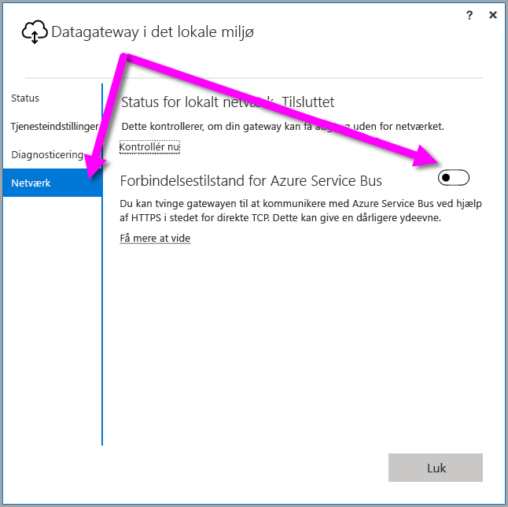
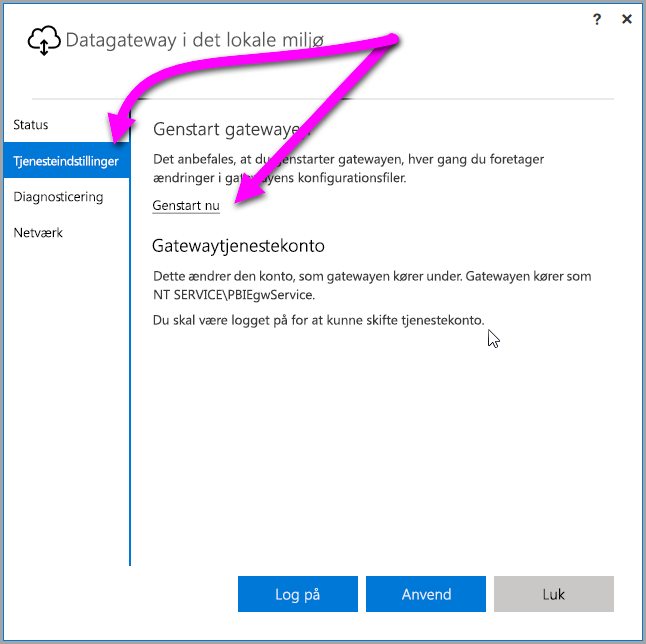

## <a name="sign-in-account"></a>Logonkonto

Brugere logger på med enten en arbejds- eller skolekonto. Denne konto er din **organisationskonto**. Hvis du har tilmeldt dig et tilbud på Office 365 og ikke angav din rigtige arbejdsmailadresse, kan den se ud som nancy@contoso.onmicrosoft.com. Din konto gemmes i en lejer i Azure Active Directory (AAD). I de fleste tilfælde vil AAD-kontoens UPN svare til mailadressen.

## <a name="windows-service-account"></a>Windows-tjenestekonto

Datagatewayen i det lokale miljø er konfigureret til at bruge *NT SERVICE\PBIEgwService* som legitimationsoplysninger til logon på Windows tjenesten. Som standard har den rettigheden Log på som en tjeneste i forbindelse med den maskine, som du installerer gatewayen på. Kontoen er ikke den samme som den konto, der bruges til at oprette forbindelse til datakilder i det lokale miljø. Kontoen er heller ikke den arbejds- eller skolekonto, som du bruger til at logge på cloudtjenester med.

> [!NOTE]
> Hvis du har valgt personlig tilstand, skal du konfigurere kontoen til Windows-tjenesten separat.

Hvis du oplever godkendelsesproblemer med din proxyserver, kan du prøve at ændre Windows-tjenestekontoen til en domænebruger- eller administreret tjenestekonto. Du kan finde flere oplysninger under [proxykonfiguration](../service-gateway-proxy.md#changing-the-gateway-service-account-to-a-domain-user).

## <a name="ports"></a>Porte

Gatewayen opretter en udgående forbindelse til Azure Service Bus. Den kommunikerer via udgående porte: TCP 443 (standard), 5671, 5672, 9350 via 9354.  Gatewayen kræver ikke indgående porte.

Det anbefales, at du føjer IP-adresserne til en liste over tilladte adresser for dataområdet i din firewall. Du kan downloade [listen over IP-adresser til Microsoft Azure Datacenter](https://www.microsoft.com/download/details.aspx?id=41653). Listen opdateres ugentligt. Du kan også få listen over påkrævede porte ved at udføre [netværksporttesten](../service-gateway-onprem-tshoot.md#network-ports-test) i datagatewayprogrammet i det lokale miljø. Gatewayen kommunikerer med Azure Service Bus ved hjælp af IP-adressen foruden det fuldt kvalificerede domænenavn (FQDN). Hvis du tvinger gatewayen til at kommunikere ved hjælp af HTTPS, vil det gennemtvinge kun at bruge FQDN, og der sker ingen kommunikation via IP-adressen.


> [!NOTE]
> På listen over IP-adresser til Azure Datacenter er adresserne angivet i CIDR-notation. 10.0.0.0/24 er f.eks. ikke det samme som 10.0.0.0 til og med 10.0.0.24. Få mere at vide om [CIDR-notation](http://whatismyipaddress.com/cidr).

Her er en liste over de fuldt kvalificerede domænenavne, der anvendes af gatewayen.

| Domænenavne | Udgående porte | Beskrivelse |  |
|-----------------------------|----------------|--------------------------------------------------------------------------------------------------------------------|---|
| *.download.microsoft.com | 80 | Bruges til at downloade installationsprogrammet. Det bruges også af datagatewayappen til at kontrollere version og gatewayområde. |  |
| *.powerbi.com | 443 | Bruges til at identificere den relevante Power BI-klynge. |  |
| *.analysis.windows.net | 443 | Bruges til at identificere den relevante Power BI-klynge. |  |
| *.login.windows.net | 443 | Bruges til at godkende datagatewayappen med Azure Active Directory/OAuth2. |  |
| *.servicebus.windows.net | 5671-5672 | Bruges til Advanced Message Queuing Protocol (AMQP). |  |
| *.servicebus.windows.net | 443, 9350-9354 | Bruges af lyttefunktioner i Service Bus Relay over TCP (kræver 443 for at få et adgangskontroltoken). |  |
| *.frontend.clouddatahub.net | 443 | Frarådet – ikke længere nødvendig. Fjernes fra dokumentationen fremover. |  |
| *.core.windows.net | 443 | Bruges af dataflows i Power BI til at skrive data til Azure Data Lake. |  |
| login.microsoftonline.com | 443 | Bruges til at godkende datagatewayappen med Azure Active Directory/OAuth2. |  |
| *.msftncsi.com | 443 | Bruges til at teste internetforbindelsen, og om gatewayen er tilgængelig for Power BI-tjenesten. |  |
| *.microsoftonline-p.com | 443 | Bruges til at godkende datagatewayappen med Azure Active Directory/OAuth2. |  |
| | |

> [!NOTE]
> Når gatewayen er installeret og registreret, er de eneste påkrævede porte/IP-adresser dem, der skal bruges af Azure Service Bus (servicebus.windows.net ovenfor). Du kan få listen over påkrævede porte ved at udføre [netværksporttesten](../service-gateway-onprem-tshoot.md#network-ports-test) i datagatewayprogrammet i det lokale miljø.

## <a name="forcing-https-communication-with-azure-service-bus"></a>Gennemtving HTTPS-kommunikation med Azure Service Bus

Du kan tvinge gatewayen til at kommunikere med Azure Service Bus ved hjælp af HTTPS i stedet for direkte TCP.

> [!NOTE]
> Fra og med udgivelsen i juni 2019 bruges HTTPS som standard for nye installationer (ikke opdateringer) i stedet for TCP baseret på anbefalinger fra Azure Service Bus.

Hvis du vil gennemtvinge kommunikation via HTTPS, skal du redigere filen *Microsoft.PowerBI.DataMovement.Pipeline.GatewayCore.dll.config* ved at ændre værdien fra `AutoDetect` til `Https` som vist i kodestykket efter dette afsnit. Filen er som standard placeret under *C:\Programmer\On-premises data gateway*.

```xml
<setting name="ServiceBusSystemConnectivityModeString" serializeAs="String">
    <value>Https</value>
</setting>
```

Der skelnes mellem store og små bogstaver i parameteren *ServiceBusSystemConnectivityModeString*. Gyldige værdier er *AutoDetect* og *Https*.

Du kan også tvinge gatewayen til at fungere på denne måde ved hjælp af gatewaybrugergrænsefladen. I gatewaybrugergrænsefladen skal du vælge **Netværk** og derefter angive **Azure Service Bus-forbindelsestilstand**  til **Til**.



Når indstillingen er ændret, kan du vælge **Anvend** (en knap, der kun vises, når du har ændret noget), og *Windows-gatewaytjenesten* bliver automatisk genstartet, så ændringen kan træde i kraft.

Til fremtidig reference kan du genstarte *Windows-gatewaytjenesten* fra dialogboksen ved at vælge **Tjenesteindstillinger** og derefter vælge *Genstart nu*.



## <a name="support-for-tls-12"></a>Understøttelse af TLS 1.2

Datagatewayen i det lokale miljø bruger som standard TLS 1.2 (Transport Layer Security) til at kommunikere med Power BI-tjenesten. Hvis du vil sikre, at al gatewaytrafik bruger TLS 1.2, skal du muligvis tilføje eller redigere følgende registreringsdatabasenøgler på den computer, hvor gatewaytjenesten kører:

```
[HKEY_LOCAL_MACHINE\SOFTWARE\Microsoft\.NETFramework\v4.0.30319]"SchUseStrongCrypto"=dword:00000001
[HKEY_LOCAL_MACHINE\SOFTWARE\Wow6432Node\Microsoft\.NETFramework\v4.0.30319]"SchUseStrongCrypto"=dword:00000001
```

> [!NOTE]
> Når du tilføjer eller ændrer disse registreringsdatabasenøgler, anvendes ændringerne for alle .NET-programmer. Hvis du vil vide mere om, hvilke ændringer i registreringsdatabasen der påvirker TLS for andre programmer, skal du se [Indstillinger for TLS (Transport Layer Security) i registreringsdatabasen](https://docs.microsoft.com/windows-server/security/tls/tls-registry-settings).

## <a name="how-to-restart-the-gateway"></a>Sådan genstarter du gatewayen

Gatewayen kører som en Windows-tjeneste. Du kan starte og stoppe den som enhver anden Windows-tjeneste. Her kan du se, hvordan du kan gøre det fra kommandoprompten.

1. Start en kommandoprompt som administrator på den computer, hvor gatewayen kører.
2. Brug følgende kommando for at stoppe tjenesten.
   
   net stop PBIEgwService
3. Brug følgende kommando for at starte tjenesten.
   
   net start PBIEgwService

