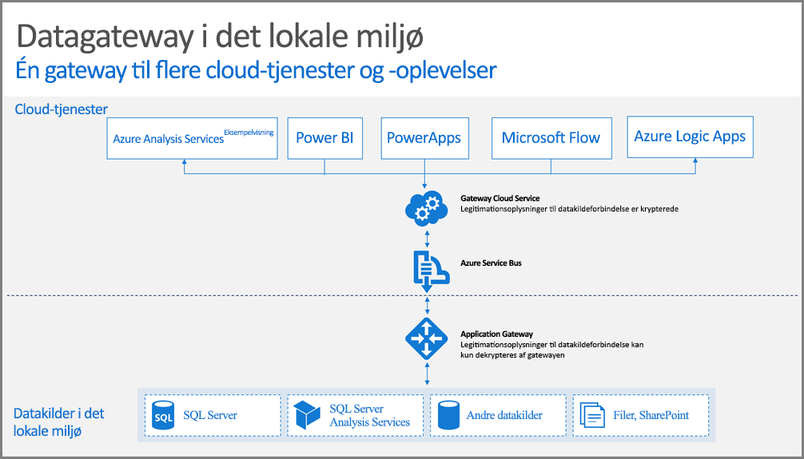

## Sådan virker gatewayen

Lad os starte med at se på, hvad der sker, når en bruger interagerer med et element, der har oprettet forbindelse til en datakilde i det lokale miljø. 

> [!NOTE]
> For Power BI skal du konfigurere en datakilde for gatewayen.
> 
> 

1. Der oprettes en forespørgsel af cloudtjenesten sammen med de krypterede legitimationsoplysninger for datakilden i det lokale miljø, hvorefter den sendes til køen til behandling i gatewayen.
2. Gatewaycloudtjenesten analyserer forespørgslen og sender forespørgslen til [Azure Service Bus](https://azure.microsoft.com/documentation/services/service-bus/).
3. Datagatewayen i det lokale miljø søger efter ventende anmodninger på [Azure Service Bus](https://azure.microsoft.com/documentation/services/service-bus/).
4. Gatewayen henter forespørgslen, dekrypterer legitimationsoplysningerne og opretter forbindelse til datakilderne med disse legitimationsoplysninger.
5. Gatewayen sender forespørgslen til datakilden til eksekvering.
6. Resultaterne sendes fra datakilden tilbage til gatewayen og derefter til cloudtjenesten. Derefter kan tjenesten bruge resultaterne.

