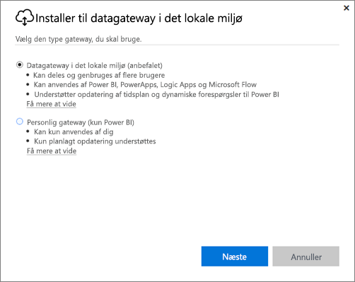
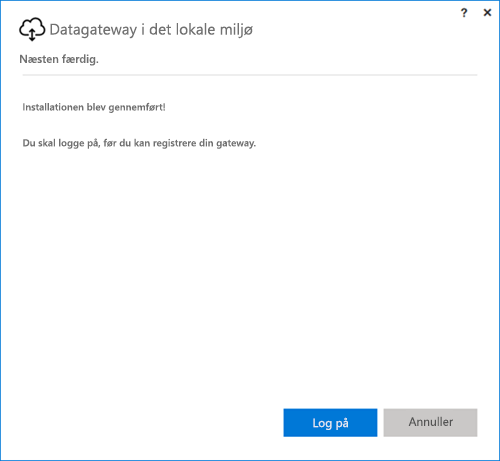
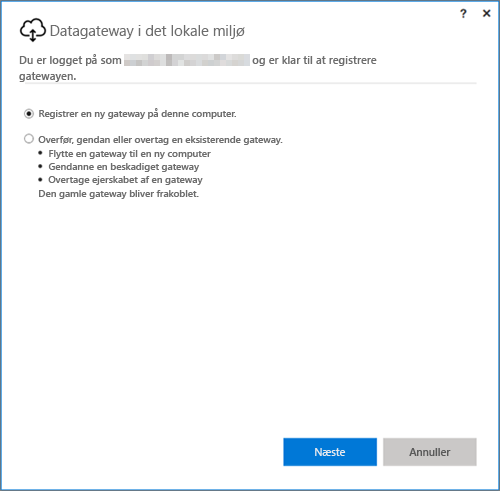
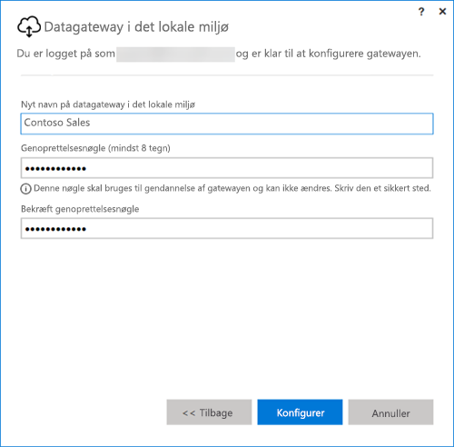

## Installér datagatewayen i det lokale miljø
Datagatewayen installeres og kører på computeren. Det er bedst at installere gatewayen på en computer, der kan køre hele tiden.

> [!NOTE]
> Gatewayen understøttes kun på 64-bit Windows-operativsystemer.
> 
> 

For Power BI skal du starte med at vælge tilstand for gatewayen.

* **Datagateway i det lokale miljø:** flere brugere kan dele og genbruge en gateway i denne tilstand. Denne gateway kan bruges af Power BI, PowerApps, Flow eller Logic Apps. For Power BI omfatter dette understøttelse af både planlægning af opdatering og DirectQuery
* **Personlig:** Dette er kun til Power BI og kan bruges af en enkeltbruger uden administratorkonfiguration. Kan kun bruges til planlægning af opdatering og opdatering efter behov. Dette valg starter installationen af den personlige gateway.

Der er nogle få ting, du skal være opmærksom på, uanset hvilken tiltand af gatewayen du installerer:

* Begge gateways kræver et 64-bit Windows-operativsystem.
* Gateways kan ikke installeres på en domænecontroller.
* Du kan installere op til to datagateways i det lokale miljø på den samme computer; en i hver tilstand (personlig og standard). 
* Du kan ikke have mere end én gateway, der kører i den samme tilstand på samme computer.
* Du kan installere flere datagateways i det lokale miljø på forskellige computere og administrere dem alle fra den samme grænseflade i Power BI til administration af gateways (undtagen personlig, se følgende punktopstilling).
* Du kan kun have én gateway i tilstanden Personlig for hver Power BI-bruger. Hvis du installerer endnu en gateway i personlig tilstand for den samme bruger, selv på en anden computer, erstatter den nyeste installation den tidligere eksisterende installation.

Her er nogle ting, du skal overveje, før du installerer gatewayen.

* Hvis du installerer på en bærbar computer, og din bærbare computer er slukket, ikke har forbindelse til internettet eller er i dvaletilstand, virker gatewayen ikke, og dataene i cloudtjenesten synkroniseres med dine data i det lokale miljø.
* Hvis din computer har forbindelse til et trådløst netværk, kan gatewayen blive langsommere, og det vil dermed tage længere tid at synkronisere dataene i cloudtjenesten med dataene i dit lokale miljø.

Når gatewayen er installeret, skal du logge på med din arbejds- eller skolekonto.

Når du er logget på, kan du konfigurere en ny gateway, eller du kan overføre, gendanne eller overtage en eksisterende gateway.

## Konfigurer en ny gateway
1. Angiv et **navn** til gatewayen
2. Angiv en **genoprettelsesnøgle**. Denne skal være på mindst 8 tegn.
3. Vælg **Konfigurer**.

> [!NOTE]
> Du skal bruge genoprettelsesnøglen, hvis du får brug for at overføre, gendanne eller overtage en gateway. Sørg for at gemme denne nøgle på et sikkert sted.
> 
> 

### Overfør, gendan eller overtag en eksisterende gateway
Du skal vælge den gateway, du vil gendanne, og angive den genoprettelsesnøgle, der blev brugt ved oprettelse af gatewayen.

### Der er oprettet forbindelse til datagatewayen i det lokale miljø
Når gatewayen er konfigureret, kan du bruge den til at oprette forbindelse til datakilder i det lokale miljø.

Hvis gatewayen skal bruges med Power BI, skal du føje dine datakilder til gatewayen i Power BI-tjenesten. Det kan du gøre i området **Administrer gateways**. Du kan finde flere oplysninger i artiklerne om at administrere datakilder.

For PowerApps skal du vælge en gateway for en defineret forbindelse for understøttede datakilder. For Flow og Logic Apps er gatewayen klar til brug med forbindelser i det lokale miljø.

