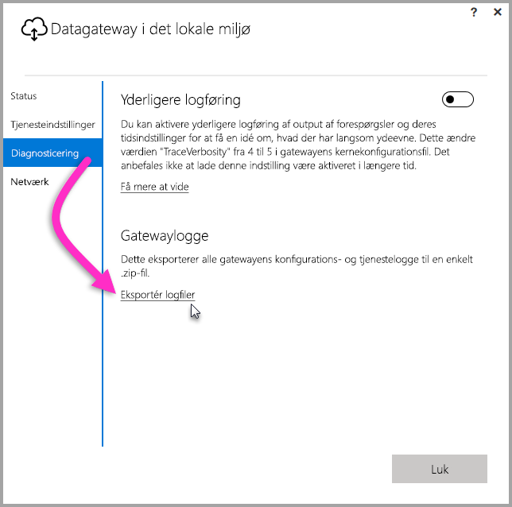
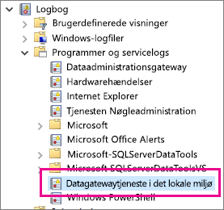

## Værktøjer til fejlfinding
<a name="logs" />

### Indsamling af logge fra gatewaykonfiguratoren
Du kan indsamle flere forskellige logge for gatewayen, og du bør altid starte med loggene. Den nemmeste måde at indsamle logge på, efter at gatewayen er installeret, er via brugergrænsefladen. I brugergrænsefladen til **Datagateway i det lokale miljø** skal du vælge **Diagnosticering** og derefter vælge linket **Eksportér logge** næsten nederst på siden som vist i følgende billede.

**Logge for installationen**

    %localappdata%\Temp\On-premises_data_gateway_*.log

**Logge for konfigurationen**

    %localappdata%\Microsoft\On-premises Data Gateway\GatewayConfigurator*.log

**Logge for datagatewaytjenesten i det lokale miljø**

    C:\Users\PBIEgwService\AppData\Local\Microsoft\On-premises Data Gateway\Gateway*.log

### Hændelseslogge
Hændelseslogge for **datagatewaytjenesten i det lokale miljø** findes under **Logge for programmer og tjenester**.

<a name="fiddler" />

### Fiddler-sporing
[Fiddler](http://www.telerik.com/fiddler) er et gratis værktøj fra Telerik, der overvåger HTTP-trafik.  Du kan se det, der sendes frem og tilbage vha. Power BI-tjenesten fra klientcomputeren. Dette kan vise fejl og andre relaterede oplysninger.

