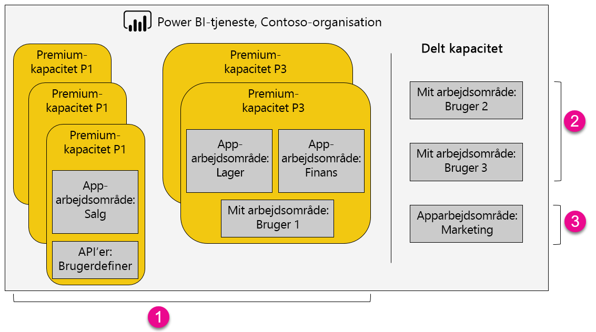

1. Elementer i en Premium-kapacitet
   
   * Adgang til apparbejdsområder (som medlemmer eller administratorer) og publicering af apps kræver en Power BI Pro-licens.
   * Applæsere kan være Power BI Pro- eller gratisbrugere.
   * Deling kræver en Power BI Pro-licens, men modtagere kan være Power BI Pro- eller gratisbrugere.
   * REST-API'er til integration anvender en tjenestekonto med en Power BI Pro-licens i stedet for en bruger.
2. Mit arbejdsområde i Delt-kapacitet
   
   * Deling kræver en Pro-licens. Modtagere skal også have Pro licenser.
3. Apparbejdsområder i Delt-kapacitet
   
   * Enhver brug af app kræver Pro-licens.

