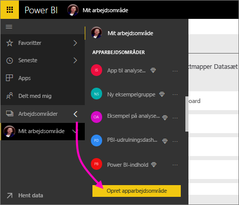
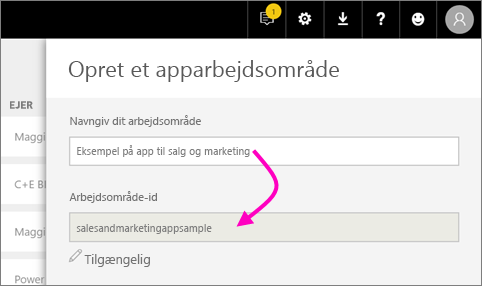
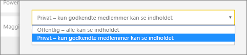
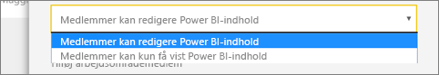
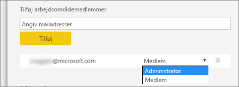
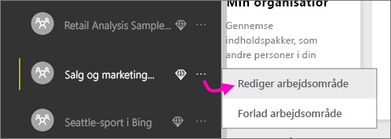

1. Start med at oprette arbejdsområdet. Vælg **Arbejdsområder** > **Opret apparbejdsområde**.
   
     
   
    Det er her, du kan placere det indhold, som du og dine kolleger skal samarbejde om.

2. Giv arbejdsområdet et navn. Hvis det tilsvarende **Arbejdsområde-id** ikke er tilgængeligt, skal du redigere det og angive et entydigt id.
   
     Dette vil også være navnet på appen.
   
     

3. Du kan angive nogle forskellige indstillinger. Hvis du vælger **Offentligt** kan alle i din organisation se, hvad arbejdsområdet indeholder. **Privat** betyder, at det kun er medlemmerne af arbejdsområdet, der kan se indholdet.
   
     
   
    Du kan ikke ændre indstillingen Offentligt/Privat, efter at du har oprettet gruppen.

4. Du kan også vælge, om medlemmer har adgang til at **redigere** eller har **skrivebeskyttet** adgang.
   
     
   
     Du skal kun tilføje personer til apparbejdsområdet for at give dem adgang til at redigere indholdet. Hvis de kun skal kunne se indholdet, skal du ikke føje dem til arbejdsområdet. I stedet kan du inkludere dem, når du udgiver appen.

5. Tilføj mailadresser på de personer, du vil give adgang til arbejdsområdet, og vælg **Tilføj**. Du kan ikke tilføje gruppealiasser. Kun enkeltpersoner.

6. Beslut, om hver person skal være medlem eller administrator.
   
     
   
    Administratorer kan redigere selve arbejdsområdet, herunder tilføje andre medlemmer. Medlemmer kan redigere indholdet i arbejdsområdet, medmindre de har skrivebeskyttet adgang. Både administratorer og medlemmer kan udgive appen.

7. Vælg **Gem**.

Power BI opretter arbejdsområdet og åbner det. Det vises på listen over de arbejdsområder, du er medlem af. Da du er administrator, kan du vælge de tre prikker (…) for at gå tilbage og ændre arbejdsområdet, tilføje nye medlemmer eller ændre deres tilladelser.

