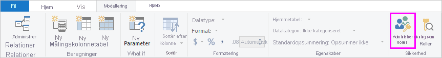
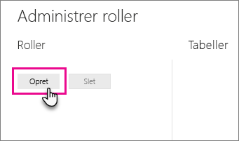
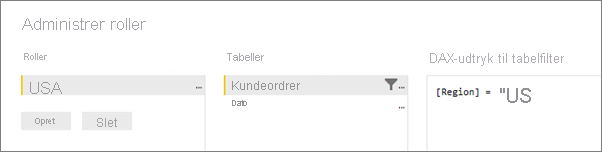
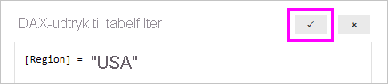

## Definer roller og regler i Power BI Desktop
Du kan definere roller og regler i Power BI Desktop. Når du publicerer til Power BI, publiceres rolledefinitionerne også.

Følg disse trin for at definere sikkerhedsroller.

1. Importér data til din Power BI Desktop-rapport, eller konfigurer en DirectQuery-forbindelse.
   
   > [!NOTE]
   > Du kan ikke definere roller i Power BI Desktop for direkte forbindelser til Analysis Services. Det skal du gøre i Analysis Services-modellen.
   > 
   > 
1. Vælg fanen **Modellering**.
2. Vælg **Administrer roller**.
   
   
4. Vælg **Opret**.
   
   
5. Angiv et navn for rollen. 
6. Vælg den tabel, hvor du vil anvende en DAX-regel.
7. Angiv DAX-udtrykkene. Dette udtryk skal returnere true eller false. Eksempel: [Entity ID] = “Value”.
   
   > [!NOTE]
   > Du kan bruger *username()* i udtrykket. Vær opmærksom på, at *username()* har formatet *DOMÆNE\brugernavn* i Power BI Desktop. I Power BI-tjenesten og Power BI-rapportserver har det format som brugerens eget hovednavn. Du kan også bruge *userprincipalname()* , som altid returnerer brugeren i samme format som brugerens hovednavn *brugernavn\@contoso.com*.
   > 
   > 
   
   
8. Når du har oprettet DAX-udtrykket, kan du vælge at markere afkrydsningsfeltet over udtryksfeltet for at validere udtrykket.
   
   
9. Vælg **Gem**.

Du kan ikke tildele brugere til en rolle i Power BI Desktop. Dem tildeler du i Power BI-tjenesten. Du kan aktivere dynamisk sikkerhed i Power BI Desktop ved at bruge DAX-funktionen *username()* eller *userprincipalname()* og have konfigureret de relevante relationer. 

