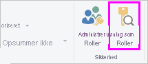
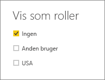
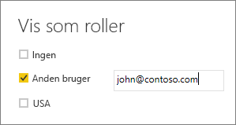

## Valider rollerne i Power BI Desktop
Når du har oprettet dine roller, kan du teste resultaterne af rollerne i Power BI Desktop.

1. Vælg **Vis som roller** på fanen **Udformning**. 

    

    Vinduet **Vis som roller** vises, hvor du kan få vist de roller, som du har oprettet.

    

3. Vælg en rolle, du har oprettet, og vælg derefter **OK** for at anvende rollen. 

   Rapporterne gengiver de data, der er relevante for rollen.

4. Du kan også vælge **Anden bruger** og angive en specifik bruger. 

    

   Det er bedst at angive brugerens hovednavn, da det er det navn, som Power BI-tjenesten og Power BI-rapportserver bruger.

   I Power BI Desktop viser **Anden bruger** kun forskellige resultater, hvis du bruger dynamisk sikkerhed baseret på dine DAX-udtryk. 

5. Vælg **OK**. 

   Rapporten gengives baseret på det, som brugeren kan se.

