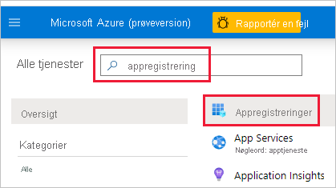
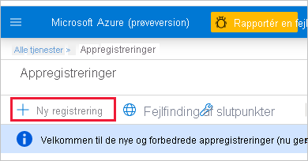

1. Log på [Microsoft Azure](https://ms.portal.azure.com/#allservices).

2. Søg efter **appregistreringer**, og klik på linket **Appregistreringer**.

    

3. Klik på **Ny registrering**.

    

4. Udfyld de påkrævede oplysninger:
    * **Navn** – Angiv et navn til programmet
    * **Understøttede kontotyper** – Vælg understøttede kontotyper
    * (Valgfrit) **URI til omdirigering** – Angiv en URI, hvis det er nødvendigt

5. Klik på **Registrer**.

6. Efter registrering er *program-id'et* tilgængeligt via fanen **Oversigt**. Kopiér og gem *program-id'et* til senere brug.

    