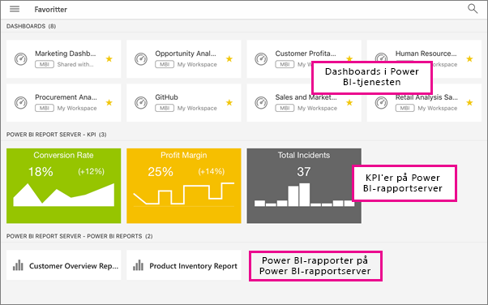

# Vis rapporter og KPI'er fra rapportserveren i det lokale miljø i Power BI-mobilapps
Gælder for:

|  |  |  |  |
|:--- |:--- |:--- |:--- |
| iPhones |iPads |Android-telefoner |Android-tablets |

Power BI-mobilapps leverer live, touchaktiveret mobiladgang til dine firmaoplysninger i det lokale miljø via Power BI-rapportserver og SQL Server 2016 Reporting Services (SSRS). 

 

## Det vigtigste først
**Mobilappsene er der, hvor du ser Power BI-indhold, ikke hvor du opretter det.**

* Du og andre personer, der opretter rapporter i din organisation, [opretter Power BI-rapporter med Power BI Desktop, og publicerer dem derefter på webportalen Power BI-rapportserver](report-server/quickstart-create-powerbi-report.md). 
* Du opretter [KPI'er direkte i webportalen](https://docs.microsoft.com/sql/reporting-services/working-with-kpis-in-reporting-services), organiserer dem i mapper og markerer dine favoritter, så du nemt kan finde dem. 
* Du [opretter Reporting Services-mobilrapporter](https://docs.microsoft.com/sql/reporting-services/mobile-reports/create-mobile-reports-with-sql-server-mobile-report-publisher) med SQL Server 2016 Enterprise Edition Mobile Report Publisher, og publicerer dem på [Reporting Services-webportalen](https://docs.microsoft.com/sql/reporting-services/web-portal-ssrs-native-mode).  

Derefter opretter du forbindelse til op til fem rapportservere i Power BI-mobilappsene for at se Power BI-rapporter og -KPI'er, organiseret i mapper eller samlet som favoritter. 

## Se nærmere på eksemplerne i mobilappsene uden serverforbindelse
Selvom du ikke har adgang til en Reporting Services-webportal, kan du stadig udforske funktionerne i Reporting Services-mobilrapporter og -KPI'er. 

1. Tryk på knappen til global navigation  i øverste venstre hjørne, og tryk derefter på tandhjulsikonet øverst til højre .
2. Tryk på **Reporting Services-eksempler**, og gennemse for at interagere med eksemplerne på KPI'er og mobilrapporter.
   
   

## Opret forbindelse til en lokal server
Du kan se Power BI-rapporter, Reporting Services-mobilrapporter og KPI'er i Power BI-mobilapps. 

1. Åbn Power BI-appen på din mobilenhed.
2. Hvis du ikke er logget på Power BI endnu, skal du trykke på **Rapportserver**.
   
   
   
   Hvis du allerede er logget på Power BI-appen, skal du trykke på knappen til global navigation og derefter trykke på tandhjulsikonet  øverst til højre.
3. Tryk på **Opret forbindelse til server**.
   
    
4. Udfyld serveradressen og dit brugernavn og din adgangskode. Brug dette format til serveradressen:
   
     `http://<servername>/reports`
   
     ELLER
   
     `https://<servername>/reports`
   
   > [!NOTE]
   > Inkluder **http** eller **https** foran forbindelsesstrengen.
   > 
   > 
   
    
5. (Valgfrit) Under **Avancerede indstillinger** kan du give serveren et brugervenligt, hvis du vil.
6. Nu kan du se serveren på den venstre navigationsbjælke – i dette eksempel hedder den "power bi-rapportserver".
   
   

## Se Power BI-rapporter og -KPI'er i Power BI-appen
Power BI-rapporter, Reporting Services-mobilrapporter og KPI'er vises i de samme mapper, som de er placeret i på Reporting Services-webportalen. 

* Tryk på en Power BI-rapport . Den åbnes i vandret tilstand, og du kan interagere med den i Power BI-appen.
  
    
* I Power BI Desktop kan ejere [optimere en rapport](desktop-create-phone-report.md) til Power BI-mobilapps. På din mobiltelefon har optimerede rapporter et særligt ikon, , og layout.
  
    
* Tryk på en KPI for at få den vist i fokuseret tilstand.
  
    

## Se dine foretrukne KPI'er og rapporter
Du kan markere KPI'er og rapporter som favoritter på webportalen og derefter se dem i en enkelt praktisk mappe på din mobilenhed sammen med din foretrukne Power BI-dashboards.

* Tryk på **Favoritter**.
  
   
  
   Dine foretrukne KPI'er og rapporter fra webportalen findes alle på denne side sammen med Power BI-dashboards i Power BI-tjenesten:
  
   

## Fjern en forbindelse til en rapportserver
1. Nederst på navigationslinjen til venstre skal du trykke på **Indstillinger**.
2. Tryk på det servernavn, som du ikke vil have forbindelse til.
3. Tryk på **Fjern server**.

## Næste trin
* [Introduktion til Power BI](service-get-started.md)  
* Har du spørgsmål? [Prøv at spørge Power BI-community'et](http://community.powerbi.com/)

