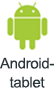
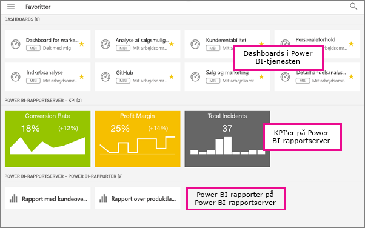

# Føj til Favoritter, og få dem vist i Power BI-mobilapps
Gælder for:

|  |  |  |  |  |
|:--- |:--- |:--- |:--- |:--- |
| iPhones |iPad-tablets |Android-telefoner |Android-tablets |Windows 10-enheder |

Læs, hvordan du føjer dine Power BI-dashboards, -rapporter og -apps samt dine rapporter og KPI'er i Power BI-rapportserver og Reporting Services i det lokale miljø til Favoritter og får dem vist i mobilapps.

Når du føjer noget til Favoritter i Power BI-mobilapps, kan du se det på siden Favoritter i Power BI-tjenesten ([https://powerbi.com](https://powerbi.com)) og på alle dine mobilenheder. 

Du kan også [gøre Power BI-dashboards og -apps til favoritter i Power BI-tjenesten](service-dashboard-favorite.md). Derefter vises de på siden Favoritter i mobilappen.

Du kan markere KPI'er og rapporter som favoritter på en Power BI-rapportserver eller Reporting Services-webportal og derefter se dem i en praktisk mappe på din mobilenhed sammen med dine foretrukne Power BI-dashboards.

## Få vist dine Power BI-favoritter
* Tryk på den øverste navigationsmenu , og tryk derefter på **Favoritter**.
  
  
  
  Du kan se alle dine favoritter på denne side:
  
  

## Gør en app til favorit
1. Tryk på ellipsen (...) ud for appen > **Favorit** på listen over apps i mobilappen.
   
    
   
    Den findes nu sammen med dine andre foretrukne dashboards og apps.
   
    

## Føj et dashboard eller en rapport til Favoritter i iOS- og Windows 10-mobilapps
Du kan føje et Power BI-dashboard eller en Power BI-rapport til Favoritter fra listen over dashboards eller rapporter eller fra selve dashboardet eller rapporten.

* På listen over dashboards eller rapporter skal du trykke på den tomme stjerne ud for navnet . Stjernen bliver derefter gul .
  
    
* På dashboardet eller i rapporten skal du trykke på den tomme stjerne på båndet . Stjernen bliver derefter gul .
  
    

## Føj et dashboard eller en rapport til Favoritter i Android-mobilapps
Du kan føje et dashboard eller en rapport til Favoritter fra listen over dashboards eller rapporter eller fra selve dashboardet eller rapporten.

* Tryk på den lodrette ellipse (...) ud for navnet på listen over dashboards eller rapporter i mobilappen, og tryk derefter på **Føj til Favoritter**. Du vil derefter se en gul stjerne ud for navnet .
  
    
* På dashboardet eller i rapporten skal du trykke på den tomme stjerne på båndet . Stjernen bliver mørkegrå .
  
    

## Gør Power BI-rapportserver- og Reporting Services-rapporter og -KPI'er til favoritter
Du kan se dine foretrukne Power BI-rapportserver- og Reporting Services-rapporter og -KPI'er i Power BI-mobilapps, men du kan ikke gøre dem til favoritter i mobilapps. Du kan [angive dem som favoritter på webportalen](report-server/tutorial-explore-report-server-web-portal.md#tag-your-favorites). 

## Næste trin
* [Foretrukne dashboards i Power BI-tjenesten](service-dashboard-favorite.md) 
* Har du spørgsmål? [Prøv at spørge Power BI-community'et](http://community.powerbi.com/)

