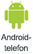
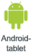
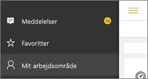

# Modtag meddelelser i Power BI-mobilapps
Gælder for:

|  |  |  |  |  |
|:--- |:--- |:--- |:--- |:--- |
| iPhones |iPads |Android-telefoner |Android-tablets |Windows 10-enheder |

I meddelelserne modtager du oplysninger omkring din Power BI-oplevelse direkte i Power BI-tjenesten eller på din mobilenhed. Når du åbner Meddelelser, vil du se en sekventiel feed med meddelelser om [beskeder, du har indstillet](mobile-set-data-alerts-in-the-mobile-apps.md), nye dashboards, der er blevet delt med dig, ændringer i din gruppes arbejdsområde, oplysninger om Power BI-hændelser og -møder og meget mere.

> [!NOTE]
> Den første gang, du logger på den [opdaterede version af Power BI-mobilappsene](https://powerbi.microsoft.com/mobile/) på en iOS-enhed, vil du blive spurgt, om du vil give Power BI tilladelse til at sende meddelelser. Du kan også konfigurere, hvordan Power BI underretter dig under **Indstillinger** på din enhed. 
> 
> 

## Se meddelelser på din mobilenhed
1. Når du modtager meddelelser på din mobilenhed, giver Power BI som standard en lyd og viser et meddelelsesbanner.
   
   
   
   Eller på en iPad:
   
   
   
   Du kan [ændre, hvordan Power BI underretter dig](mobile-apps-notification-center.md#change-or-turn-off-notifications-on-your-mobile-device).
2. Hvis du har modtaget meddelelser, vil du se en gul prik på knappen til global navigation  (Android) eller på ikonet **Meddelelser**, når du logger på Power BI på din mobilenhed. 
   
   
3. Vælg ikonet Meddelelser  (Windows 10).
   
    Meddelelser vises med de nyeste øverst, og ulæste meddelelser er markerede. Meddelelser gemmes i 90 dage, medmindre du sletter dem, eller du når den maksimale grænse på 100.
   
   
4. Hvis du vil afvise en meddelelse, skal du trykke på den, holde den nede og vælge **Afvis**.

## Rediger eller deaktiver meddelelser på din mobilenhed
Du kan ændre, hvordan Power BI underretter dig.

1. På en iOS-enhed skal du gå til **Indstillinger** > **Meddelelser**. 
   
    På en Android-telefon skal du åbne **Meddelelsesindstillinger**.
   
    På en Windows-enhed skal du i **Indstillinger** gå til **System** > **Meddelelser og handlinger**.
2. Vælg **Power BI** på listen over apps. 
3. Her kan du slå meddelelser helt fra eller vælge, hvilke meddelelser du vil have.
   
    **På en iPhone**
   
    
   
    **På en Android-telefon**
   
    

    **På en Windows 10-enhed**

    

## Næste trin
* [Databeskeder i Power BI-tjenesten](service-set-data-alerts.md)
* [Indstil databeskeder i iPhone-appen (Power BI til iOS)](mobile-set-data-alerts-in-the-mobile-apps.md)
* [Indstil databeskeder i Power BI-mobilappen til Windows 10](mobile-set-data-alerts-in-the-mobile-apps.md)
* [Download den nyeste version af Power BI-mobilapps](https://powerbi.microsoft.com/mobile/) til mobilenheder

