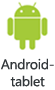

# Vis dashboards og rapporter i Power BI-mobilappsene
Gælder for:

|  |  |  |  |  |
|:--- |:--- |:--- |:--- |:--- |
| [iPhone-telefoner](mobile-apps-view-dashboard.md#view-dashboards-on-your-iphone) |[iPad-tablets](mobile-apps-view-dashboard.md#view-dashboards-on-your-ipad) |[Android-telefoner](mobile-apps-view-dashboard.md#view-dashboards-on-your-android-phone) |[Android-tablets](mobile-apps-view-dashboard.md#view-dashboards-on-your-android-tablet) |[Windows 10-enheder](mobile-apps-view-dashboard.md#view-dashboards-on-your-windows-10-device) |

Dashboards er en portal til din virksomhed og jeres processer. Et dashboard er en oversigt – et samlet sted, hvor du kan se de aktuelle resultater for virksomheden.

## Opret dashboards i Power BI-tjenesten (https://powerbi.com)
**Du kan ikke oprette dashboards i mobilappen.** 

Hvis du vil have vist dashboards og rapporter på din mobilenhed, skal du oprette dashboards eller oprette forbindelse til dashboards i en webbrowser. 

1. Gå til Power BI-tjenesten ([https://www.powerbi.com](https://www.powerbi.com)), og [opret en konto](service-self-service-signup-for-power-bi.md).
2. [Opret dine egne Power BI-dashboards og -rapporter](service-get-started.md), eller opret forbindelse til eksisterende [Power BI-apps](service-connect-to-services.md) for at få et stort udvalg af tjenester, f.eks [Microsoft Dynamics CRM](service-connect-to-microsoft-dynamics-crm.md) og [Adobe Analytics](service-connect-to-adobe-analytics.md).

Her er et Power BI-dashboard i Power BI-tjenesten:

## Få vist dashboards på din iPhone
1. Åbn Power BI-appen på din iPhone, og log på.
   
   Skal du først [downloade iPhone-appen](http://go.microsoft.com/fwlink/?LinkId=522062) fra Apple App Store?
2. Tryk på et dashboard for at åbne det.  
   
    
   
   * De gule stjerner  viser, hvilke dashboards der er favoritter. 
   * Notationen under hvert dashboardnavn (i dette tilfælde "MBI")  viser, hvordan dataene i hvert dashboard klassificeres. Læs mere om [dataklassifikation i Power BI](service-data-classification.md).
   
   Som standard ser Power BI-dashboards en smule anderledes ud på din iPhone. Alle felterne vises med samme størrelse, og de er arrangeret fra top til bund.
   
    
   
   > [!TIP]
   > Hvis du ejer dashboardet, kan du i Power BI-tjenesten [oprette en visning af dashboardet specifikt til telefoner](service-create-dashboard-mobile-phone-view.md) i stående format. 
   > 
   > 
   
    Eller du kan dreje telefonen til liggende format for at se dashboardet i liggende format på din telefon.
   
    
3. Stryg op og ned for at se alle felterne i dashboardet. Du kan:
   
   * [Trykke på et felt](mobile-tiles-in-the-mobile-apps.md) for at åbne det i Fokustilstand og interagere med det.
   * Trykke på stjernen  for at [angive den som favorit](mobile-apps-favorites.md).
   * Trykke på **Inviter**  for at [invitere en kollega](mobile-share-dashboard-from-the-mobile-apps.md) til at se dit dashboard.
   * [Synkronisere dashboardet med dit Apple Watch](mobile-apple-watch.md).
4. Hvis du vil tilbage til listen over dashboards, skal du trykke på pilen ud for dashboardfeltet og derefter trykke på **Mit arbejdsområde**.
   
   

### Få vist dashboards i liggende format på din iPhone
Du kan blot vende din telefon til liggende format for at få vist dashboards i liggende format. Dashboardlayoutet ændres fra en række felter til at vise hele dashboardet &#150; du kan se alle felterne på dashboardet på samme måde som i Power BI-tjenesten.

Du kan også "klemme sammen" med fingrene for at zoome ind og ud på forskellige områder af dit dashboard, og du kan panorere for at navigere i det. Du kan også [trykke på et felt](mobile-tiles-in-the-mobile-apps.md) for at åbne feltet i Fokustilstand og interagere med dine data.

## Få vist dashboards på din iPad
1. Åbn Power BI-appen.
   
   Skal du først [downloade iPad-appen](http://go.microsoft.com/fwlink/?LinkId=522062) fra Apple App Store?
2. Tryk på **Dashboards** øverst i appen.  
   
   
   
   * De gule stjerner  viser, hvilke dashboards der er favoritter. 
   * Notationen under hvert dashboardnavn (i dette tilfælde "MBI")  viser, hvordan dataene i hvert dashboard klassificeres. Læs mere om [dataklassifikation i Power BI](service-data-classification.md).
3. Du kan dele et dashboard fra dit arbejdsområde. Tryk på de tre prikker (**...**) i nederste højre hjørne af dashboardfeltet, og tryk på **Inviter andre**.
   
   
4. Du kan også trykke på et dashboard for at åbne det og få vist felterne i dashboardet. Du kan interagere med felterne på et dashboard:
   
   * [Tryk på et felt for at interagere](mobile-tiles-in-the-mobile-apps.md) med feltet.
   * [Åbn rapporterne](mobile-reports-in-the-mobile-apps.md) bag felterne.
   * [Inviter andre til at få vist dashboardet](mobile-share-dashboard-from-the-mobile-apps.md).
   * [Indsæt anmærkninger i og del et øjebliksbillede](mobile-annotate-and-share-a-tile-from-the-mobile-apps.md) af et felt.
5. Hvis du vil tilbage til Mit arbejdsområde, skal du trykke på navnet på dashboardet i øverste venstre hjørne og derefter trykke på **Mit arbejdsområde**.
   
   

## Få vist dashboards på din Android-telefon
1. Åbn Power BI-appen på din Android-telefon, og log på.
   
   Skal du først [downloade Android-appen](http://go.microsoft.com/fwlink/?LinkID=544867)?
2. Tryk på et dashboard for at åbne det.   
   
   

    De gule stjerner  viser, hvilke dashboards der er favoritter. 

    Notationen under hvert dashboardnavn (i dette tilfælde "MBI")  viser, hvordan dataene i hvert dashboard klassificeres. Læs mere om [dataklassifikation i Power BI](service-data-classification.md).

    Power BI-dashboards ser en smule anderledes ud på din Android-telefon. Alle felterne vises med samme bredde, og de er arrangeret fra top til bund.

    

    Hvis du ejer dashboardet, kan du i Power BI-tjenesten [oprette en visning af dashboardet specifikt til telefoner](service-create-dashboard-mobile-phone-view.md) i stående format. 

1. Når du er på dashboardet, kan du trykke på de tre lodrette prikker (...) ud for navnet for at invitere en kollega, opdatere eller se oplysninger om dashboardet:
   
   
2. Stryg op og ned for at se alle [felterne i dashboardet](mobile-tiles-in-the-mobile-apps.md). 
3. Hvis du vil tilbage til startsiden for dine dashboards, skal du trykke på dashboardnavnet for at åbne brødkrummesporet og derefter trykke på **Mit arbejdsområde**.   

## Få vist dashboards på din Android-tablet
1. Åbn Power BI-appen på din Android-tablet, og log på.
   
   Skal du først [downloade Android-appen](http://go.microsoft.com/fwlink/?LinkID=544867)?
2. Tryk på et dashboard for at åbne det.   
   
   
   
   * De gule stjerner  viser, hvilke dashboards der er favoritter. 
   * Notationen under hvert dashboardnavn (i dette tilfælde "MBI")  viser, hvordan dataene i hvert dashboard klassificeres. Læs mere om [dataklassifikation i Power BI](service-data-classification.md).
3. Når du er på dashboardet, kan du trykke på de tre lodrette prikker (...) ud for navnet for at invitere en kollega, opdatere eller se oplysninger om dashboardet:
   
   
4. Stryg op og ned for at se alle [felterne i dashboardet](mobile-tiles-in-the-mobile-apps.md). 
   
   Du kan også "klemme sammen" med fingrene for at zoome ind og ud på forskellige områder af dit dashboard, og du kan panorere for at navigere i det. Du kan også [trykke på et felt](mobile-tiles-in-the-mobile-apps.md) for at åbne feltet i Fokustilstand og interagere med dine data.
5. Hvis du vil tilbage til startsiden for dine dashboards, skal du trykke på dashboardnavnet for at åbne brødkrummesporet og derefter trykke på **Mit arbejdsområde**:
   
    

    Du kan også "klemme sammen" med fingrene for at zoome ind og ud på forskellige områder af dit dashboard, og du kan panorere for at navigere i det. Du kan også [trykke på et felt](mobile-tiles-in-the-mobile-apps.md) for at åbne feltet i Fokustilstand og interagere med dine data.

## Få vist dashboards på din Windows 10-enhed
1. Åbn Power BI-appen på din Windows 10-enhed, og log på.
   
   Skal du først [downloade appen](http://go.microsoft.com/fwlink/?LinkID=526478)?
2. Tryk på et dashboard for at åbne det.   
   
   
   
   * De sorte stjerner viser, hvilke dashboards der er favoritter. 
   * Notationen under hvert dashboardnavn (i dette tilfælde **MBI**) viser, hvordan dataene i hvert dashboard klassificeres. Læs mere om [dataklassifikation i Power BI](service-data-classification.md).
   
   Power BI-dashboards ser en smule anderledes ud på din Windows 10-telefon. Alle felterne vises med samme bredde, og de er arrangeret fra top til bund.
   
   
   
    Eller du kan dreje telefonen til liggende format for at se dashboardet i liggende format på din telefon.
   
   > [!TIP]
   > Hvis du ejer dashboardet, kan du i Power BI-tjenesten [oprette en visning af dashboardet specifikt til telefoner](service-create-dashboard-mobile-phone-view.md) i stående format. 
   > 
   > 
3. I dashboardet kan du:
   
   * [Trykke på et felt](mobile-tiles-in-the-mobile-apps.md) for at åbne det og interagere med det.
   * Trykke på ikonet **Fuld skærm**  for at få vist dit Power BI-dashboard uden kanter eller menuer, for eksempel som visningen **Slideshow** i PowerPoint.
   * Trykke på ikonet **Inviter**  for at [dele dit dashboard](mobile-share-dashboard-from-the-mobile-apps.md) med en kollega.
   * Trykke på stjernen  for at [markere dashboardet som en favorit](mobile-apps-favorites.md).
   * Trykke på ikonet **Fastgør til Start** for at [fastgøre dashboardet til Start-skærmen i Windows](mobile-pin-dashboard-start-screen-windows-10-phone-app.md). 
4. Hvis du vil tilbage til startsiden for dine dashboards, skal du trykke på dashboardnavnet for at åbne brødkrummesporet og derefter trykke på **Mit arbejdsområde**:
   
    

### Få vist dashboards i liggende format på din Windows 10-telefon
Du kan også få vist dashboards i liggende format ved at dreje telefonen. Dashboardlayoutet ændres fra en række felter til at vise hele dashboardet &#150; du kan se alle felterne på dashboardet på samme måde som i Power BI-tjenesten.

Du kan også "klemme sammen" med fingrene for at zoome ind og ud på forskellige områder af dit dashboard, og du kan panorere for at navigere i det. Du kan også [trykke på et felt](mobile-tiles-in-the-mobile-apps.md) for at åbne feltet i Fokustilstand og interagere med dine data.

## Opret en telefonvisning af et dashboard i Power BI-tjenesten
Hvis du ejer dashboardet, kan du *i Power BI-tjenesten* oprette en visning af dashboardet specifikt til telefoner i stående format. 

Læs mere om at [oprette en telefonvisning af et dashboard](service-create-dashboard-mobile-phone-view.md).

## Næste trin
* [Download Android-appen](http://go.microsoft.com/fwlink/?LinkID=544867) fra Google Play  
* [Introduktion til Android-appen til Power BI](mobile-android-app-get-started.md)  
* [Introduktion til Power BI](service-get-started.md)
* Har du spørgsmål? [Prøv at spørge Power BI-community'et](http://community.powerbi.com/)

