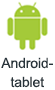

# Del et dashboard via Power BI-mobilapps
Gælder for:

|  |  |  |  |  |
|:--- |:--- |:--- |:--- |:--- |
| iPhones |iPad-tablets |Android-telefoner |Android-tablets |Windows 10-enheder |

Med en [Power BI Pro-licens](service-free-vs-pro.md) kan du invitere kollegaer til at se dine dashboards ved at dele links fra Power BI-mobilapps. De personer, du deler dashboards med, skal også være på samme maildomæne som dig og have en Power BI Pro-licens, ellers skal indholdet være i [Premium-kapacitet](service-premium.md).

Ved hjælp af Power BI-mobilapps til iOS og Android kan du også [anmærke og dele et snapshot af et felt, en rapport eller en visualisering](mobile-annotate-and-share-a-tile-from-the-mobile-apps.md) med andre. 

## Del et dashboard vha. din iPhone
1. Tryk på delingsikonet på handlingslinjen nederst på dashboardet .
   
   
2. Tryk på **Inviter en kollega**.
3. Angiv navne, adskilt af kommaer, og en meddelelse, der skal ledsage dashboardinvitationen.
4. Hvis du vil tillade videredeling, skal indstillingen **Tillad, at modtagerne må dele dette dashboard** være markeret.
   
   Videredeling gør det muligt for dine kollegaer at sende invitationen via mail til andre i organisationen, enten via internettet eller mobilapps.
5. Tryk på **Send** i øverste højre hjørne.
   
   Dine kollegaer får en invitation via mail med et direkte link til dashboardet. Invitationen udløber efter en måned. Når de åbner invitationen i en browser eller i Power BI-mobilappen, føjes den til sektionen **Delt med mig** under deres Power BI-konto.
   
   
   
   Læs flere [noter om deling af dashboards med kollegaer](service-share-dashboards.md).

### Stop med at dele et dashboard via din iPhone
Du kan kun stoppe med at dele et dashboard, hvis du ejer dashboardet.

1. Tryk på delingsikonet på handlingslinjen nederst på dashboardet .
2. Tryk på **Inviter en kollega**.
   
   Du kan se en liste over kollegaer, som du har delt dette dashboard med, vha. disse udtryk:
   
   * **Kan få vist**: De kan få vist dashboardet, men kan ikke dele det.
   * **Kan få vist & invitere**: De kan få vist dashboardet og dele det med andre kollegaer.
3. Tryk på **Rediger**.
   
    
4. Hvis du vil annullere deling, skal du trykke på den røde cirkel ud for et navn og trykke på **Slet**.

## Del et dashboard vha. din iPad
1. Tryk på delingsikonet  ikonet i øverste højre hjørne af dit dashboard.
2. Tryk på **Inviter en kollega**, skriv derefter mailadresser og en meddelelse, der skal ledsage dashboardinvitationen.
3. Hvis du vil tillade videredeling, skal indstillingen **Tillad, at modtagerne må dele dette dashboard** være markeret.
   
   > [!NOTE]
   > Videredeling gør det muligt for dine kollegaer at sende invitationen via mail til andre i organisationen, enten via internettet eller mobilapps.
   > 
   > 
4. Tryk på **Send** i øverste højre hjørne.
   
   Dine kollegaer får en invitation via mail med et direkte link til dashboardet. Invitationen udløber efter en måned. Når de åbner invitationen i en browser eller i Power BI-mobilappen, føjes den til sektionen **Delt med mig** under deres Power BI-konto
   
   
   
   Læs flere [noter om deling af dashboards med kollegaer](service-share-dashboards.md).

### Stop med at dele et dashboard via din iPad
Du kan kun stoppe med at dele et dashboard, hvis du ejer dashboardet.

1. Tryk på delingsikonet  i øverste højre hjørne af dit dashboard.
   
   Du kan se en liste over kollegaer, som du har delt dette dashboard med. Du kan se disse ord under deres navne:
   
   * **Afventer**: De har ikke fået vist dashboardet endnu.
   * **Kan få vist**: De kan få vist dashboardet, men kan ikke dele det.
   * **Kan få vist & invitere**: De kan få vist dashboardet og dele det med andre kollegaer.
2. Tryk på **Rediger**.
3. Hvis du vil annullere deling, skal du trykke på den røde cirkel ud for et navn og trykke på **Slet**.

## Del et dashboard vha. din Android-enhed
1. Tryk på ellipsen (...) på startsiden for dashboardet, og tryk på **Inviter en kollega**.
   
   
2. Du kan også trykke på invitationsikonet i øverste højre hjørne .

    Hvis du ejer dashboardet, kan du se en liste over kollegaer, som du har delt dette dashboard med, vha. disse noter:

    -   **Kan få vist**: De har fået vist dashboardet, men kan ikke dele det.

    -   **Kan få vist & invitere**: De kan få vist dashboardet og kan dele det med andre kollegaer.

1. Skriv mailadresser og en meddelelse, der skal ledsage dashboardinvitationen. Ellers sendes en standardmeddelelse i Power BI.
2. Hvis du vil tillade videredeling, skal indstillingen **Tillad, at modtagerne må dele dette dashboard** være markeret.
   
   > [!NOTE]
   > Videredeling gør det muligt for dine kollegaer at sende invitationen via mail til andre i organisationen, enten via browseren eller mobilappsene.
   > 
   > 
3. Tryk på ikonet for afsendelse  i øverste højre hjørne for at sende mailen.
   
   Dine kollegaer får en invitation via mail med et direkte link til dashboardet. Invitationen udløber efter en måned. Når de åbner invitationen i en browser eller i Power BI-mobilappen, føjes den til sektionen **Delt med mig** under deres Power BI-konto
   
   
   
   Læs flere [noter om deling af dashboards med kollegaer](service-share-dashboards.md).

### Annuller delingen af et dashboard vha. din Android-enhed
Det er kun ejeren af dashboardet, der kan annullere delingen af et dashboard.

1. Tryk på invitationsikonet i øverste højre hjørne på dashboardet . 
   
   Du kan se en liste over kollegaer, som du har delt dette dashboard med.
2. Hvis du vil stoppe med at dele dashboardet med en kollega, skal du trykke på **X** ud for et navn \> **Fjern**.

## Del et dashboard vha. din Windows 10-enhed
1. Tryk på invitationsikonet på et dashboard .
   
   Du kan også højreklikke eller trykke og holde nede, mens du trykker på **Inviter** på startsiden for dashboardet.
   
   
   
   Hvis du ejer dashboardet, kan du se en liste over kollegaer, som du har delt dette dashboard med, vha. disse noter:
   
   **Skrivebeskyttet**: De har fået vist dashboardet, men kan ikke dele det.
   
   **Læs og videredel**: De kan få vist dashboardet og kan dele det med andre kollegaer.
2. Skriv mailadresser og en meddelelse, der skal ledsage dashboardinvitationen. Ellers sendes en standardmeddelelse i Power BI.
   
   
3. Hvis du vil tillade videredeling, skal indstillingen **Tillad, at modtagerne må dele dette dashboard** være markeret.
   
   > [!NOTE]
   > Videredeling gør det muligt for dine kollegaer at dele dette dashboard med andre i organisationen, enten via browseren eller mobilappsene.
   > 
   > 
4. Tryk på ikonet for afsendelse .
   
   Dine kollegaer får en invitation via mail med et direkte link til dashboardet. Invitationen udløber efter en måned. Når de åbner invitationen i en browser eller i Power BI-mobilappen, føjes den til sektionen **Delt med mig** under deres Power BI-konto
   
   
   
   Læs flere [noter om deling af dashboards med kollegaer](service-share-dashboards.md).

## Næste trin
* [Anmærk og del et snapshot af et felt, en rapport eller en visualisering i mobilapps](mobile-annotate-and-share-a-tile-from-the-mobile-apps.md)
* [Del et dashboard i Power BI](service-share-dashboards.md)
* Har du spørgsmål? [Prøv at spørge Power BI-community'et](http://community.powerbi.com/)

