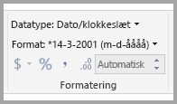
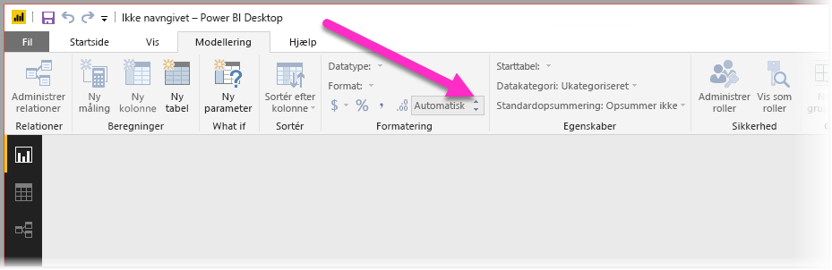
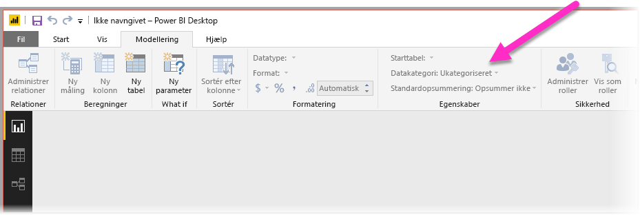

# Bedste praksis for optimering af Spørgsmål og svar i Power BI
Det er effektivt, når du bruger almindelige udtryk og naturligt sprog til dataforespørgsler. Det er endnu mere effektivt, når dine data svarer, hvilket er, hvad der sker i Spørgsmål og svar i Power BI.

For at aktivere Spørgsmål og svar med henblik på at kunne fortolke den store samling af spørgsmål, som funktionen er i stand til at svare på, så skal Spørgsmål og svar opstille forudsætninger for modellen. Hvis strukturen af din model ikke opfylder en eller flere af disse forudsætninger, er du nødt til at tilpasse din model. De pågældende justeringer for Spørgsmål og svar er de samme bedste praksis-optimeringer for enhver model i Power BI, uanset om du bruger Spørgsmål og svar.

I afsnittene nedenfor beskriver vi, hvordan du justerer din model, så den fungerer godt med Spørgsmål og svar i Power BI.

## Automatiske tilpasninger foretaget af Spørgsmål og svar

### Målingstabeller

I tidligere versioner af Spørgsmål og svar ville målingstabeller forvirre Spørgsmål og svar, da den underliggende tabel ville være afbrudt. Spørgsmål og svar fungerer fint med målingstabeller nu.

### Tabelnavne i konflikt med kolonnenavne

Hvis en tabel og en kolonne havde det samme navn i tidligere versioner af Spørgsmål og svar, så ville tabellen have forrang. Dette problem er blevet håndteret, så du behøver ikke længere at løse det i dine modeller.

## Manuelle trin til forbedring af Spørgsmål og svar

### Brug de nye værktøjer til Spørgsmål og svar til at besvare spørgsmål

Med værktøjer til Spørgsmål og svar kan du lære Spørgsmål og svar virksomhedens kernebegreber og svare på spørgsmål, som dine slutbrugere stiller. Nogle gange kan nogle spørgsmål stadig ikke besvares, fordi dataene er formet forkert, eller fordi der mangler data. I dette tilfælde skal du læse de øvrige afsnit nedenfor for at få hjælp til optimering. Læs mere om [værktøjer til Spørgsmål og svar](q-and-a-tooling-intro.md).

## Tilføj manglende relationer

Hvis der mangler relationer mellem tabeller i modellen, kan hverken Power BI-rapporter eller Spørgsmål og svar fortolke, hvordan disse tabeller skal forbindes. Relationerne er hjørnestenen i en god model. Du kan f.eks. ikke spørge efter "det samlede salg for kunder i Seattle", hvis relationen mellem tabellen *Ordrer* og tabellen *Kunder* mangler. Følgende billeder viser en model, der skal forbedres, og en model, der er klar til Spørgsmål og svar. 

**Skal forbedres**

På det første billede er der ingen relationer mellem tabellerne Kunder, Salg og Produkter.

**Klar til Spørgsmål og svar**

På det første billede er relationerne defineret mellem tabellerne.

## Omdøb tabeller og kolonner

Valget af tabeller og kolonner er vigtigt for Spørgsmål og svar. Lad os f.eks. sige, at du har en tabel med navnet *Kundeoversigt*, som indeholder en liste over dine kunder. Du skal stille spørgsmål som "Angiv kundeoversigterne i Chicago på en liste" i stedet for "Angiv kunderne i Chicago på en liste". 

Selvom Spørgsmål og svar kan udføre basal orddeling og registrering af flertalsformer, så forudsætter Spørgsmål og svar, at dine tabel- og kolonnenavne afspejler deres indhold præcist.

Tænk over et andet eksempel. Forestil dig, at du har en tabel med navnet *Antallet af medarbejdere*, som indeholder for- og efternavne samt medarbejdernumre. Du har en anden tabel med navnet *Medarbejdere*, som indeholder medarbejdernumre, jobnumre og startdatoer. Personer, der er bekendt med modellen, vil sandsynligvis forstå denne struktur. Andre, som stiller spørgsmålet "Tæl medarbejdere", vil få vist antallet af rækker fra tabellen "Medarbejdere". Dette resultat er sandsynligvis ikke det, de havde tænkt sig, da det er en optælling af hvert eneste job, hver medarbejder nogensinde har haft. Det vil være meget bedre at omdøbe disse tabeller, så de afspejler det, de indeholder, nøjagtigt.

**Skal forbedres**

Tabelnavne såsom *StoreInfo* og *Product List* skal forbedres.

**Klar til Spørgsmål og svar**

Tabeller med navnene *Butik* og *Produkter* fungerer bedre.

## Ret forkerte datatyper

Importerede data kan have forkerte datatyper. Særligt kolonner med *dato* og *tal*, der importeres som *strenge*, vil ikke fortolkes som datoer og tal af Spørgsmål og svar. Sørg for at vælge den korrekte datatype i din Power BI-model.

## Angiv år- og id-kolonner som Opsummer ikke

Power BI aggregerer numeriske kolonner aggressivt som standard, så forespørgsler som "samlede salg pr. år" somme tider kan resultere i et samlet tal for salg sammen med et samlet tal for år. Hvis du har specifikke kolonner, hvor du ikke vil benytte denne funktionsmåde i Power BI, skal du angive egenskaben **Standardopsummering** for kolonnen til **Opsummer ikke**. Vær opmærksom på kolonnerne **år**, **måned**, **dag** og **id**, idet disse kolonner hyppigst er problematiske. Andre kolonner, der ikke er praktiske at opsummere, f.eks. *alder*, kan også drage fordel af, at indstillingen **Standardopsummering** angives til **Opsummer ikke** eller **Gennemsnit**. Du kan finde denne indstilling under fanen **Udformning**.

## Vælg en datakategori for hver dato- og geografikolonne

**Datakategori** giver yderligere semantisk viden om indholdet af en kolonne, der ligger ud over dens datatype. Du kan f.eks. markere en heltalskolonne som et postnummer, en strengkolonne som by, land/område osv. Disse oplysninger bruges af Spørgsmål og svar på to vigtige måder: Til valg af visualisering og til sprogforskelle.

For det første bruger Spørgsmål og svar **Datakategori**-oplysninger til at hjælpe med at foretage valg af, hvilken type visuel visning, der skal bruges. Funktionen genkender for eksempel, at kolonner med **Datakategorierne** dato eller klokkeslæt typisk er et godt valg til den vandrette akse i et kurvediagram eller afspilningsaksen i et boblediagram. Og den forudsætter, at resultater med kolonner med geografiske **Datakategorier** kan se flotte ud på et kort.

For det andet kan Spørgsmål og svar give nogle kvalificerede gæt med hensyn til, hvordan brugere sandsynligvis taler om dato- og geografi-kolonner, for at hjælpe funktionen med at forstå visse typer af spørgsmål. For eksempel "hvornår" i "Hvornår blev John Smith ansat?" vil næsten med sikkerhed blive knyttet til en datokolonne, og "Brown" i "Antal kunder i Brown" er sandsynligvis en by og ikke en hårfarve.

## Vælg en "Sortér efter kolonne" for de relevante kolonner

Egenskaben **Sortér efter kolonne** tillader, at sortering i én kolonne automatisk sorterer en anden kolonne i stedet. Når du f.eks. benytter forespørgslen "sortér kunder efter skjortestørrelse", vil du sandsynligvis have, at din kolonne med Skjortestørrelser sorterer efter det underliggende størrelsesnummer (XS, S, M, L, XL) i stedet for alfabetisk (L, M, S, XL, XS).

## Normaliser din model

Bare rolig, vi foreslår ikke, at du skal redefinere hele din model. Visse strukturer er dog så svære, at Spørgsmål og svar ikke kan håndtere dem særligt godt. Hvis du udfører noget grundlæggende normalisering af din models struktur, øges Power BI-rapporternes brugbarhed væsentligt sammen med nøjagtigheden af resultaterne fra Spørgsmål og svar.

Følg denne generelle regel: Hver unikke "ting", som brugeren taler om, bør være repræsenteret af nøjagtigt ét modelobjekt (tabel eller kolonne). Så hvis dine brugere taler om kunder, bør der være ét *kunde*-objekt. Og hvis dine brugere taler om salg, bør der være ét *salg*-objekt. Det lyder enkelt, ikke? Det kan det også være, afhængigt af hvilken formatering dataene, du starter med, har. Der er rig mulighed for dataformatering i **Forespørgselseditoren**, hvis du får brug for det, mens mange af de mere enkle transformationer kan udføres ved blot at bruge beregninger i Power BI-modellen.

De følgende sektioner indeholder nogle gængse transformationer, som du kan få brug for at udføre.

### Opret nye tabeller for flerkolonneenheder

Hvis du har flere kolonner, der fungerer som en enkelt særskilt enhed i en større tabel, skal disse kolonner opdeles i deres egen tabel. Lad os f.eks. sige, at du har kolonnerne Navn på kontakt, Titel på kontakt og Telefonnummer i tabellen *Firmaer*. Et bedre design vil være at have en særskilt tabel med *Kontakter*, som indeholder Navn, Titel og Telefonnummer samt et link tilbage til tabellen *Firmaer*. Det gør det væsentligt lettere at stille spørgsmål om kontakter uafhængigt af spørgsmål om firmaer, som de fungerer som kontakt for, og det forbedrer fleksibiliteten af visningen.

**Skal forbedres**

**Klar til Spørgsmål og svar**

### Pivotér for at eliminere egenskabsbeholdere

Hvis du har *egenskabsbeholdere* i modellen, skal de omstruktureres for at få en enkelt kolonne for hver egenskab. Egenskabsbeholdere kan være praktiske til administrering af et stort antal egenskaber, men har en række indlejrede begrænsninger, som hverken Power BI-rapporter eller Spørgsmål og svar er designet til at kunne omgå.

Lad os f.eks. antage, at vi har tabellen *Kundedemografi* med kolonnerne Kunde-id, Egenskab og Værdi, hvor hver række repræsenterer en særskilt egenskab hos kunden (f.eks. alder, civilstand, by osv.). Ved at overbelaste betydningen af kolonnen Værdi baseret på indholdet i kolonnen Egenskab bliver det umuligt for Spørgsmål og svar at fortolke de fleste forespørgsler, der refererer til den. En simpel forespørgsel som f.eks. "vis alderen for en kunde" vil muligvis fungere, siden den kan fortolkes som "vis kunderne og kundedemografier, hvor egenskaben er alder". Dog understøtter strukturen i modellen ikke lidt mere komplekse forespørgsler, som f.eks. "gennemsnitlig alder for kunder i Chicago." Mens brugere, som direkte udvikler Power BI-rapporter, somme tider kan finde smarte måder at hente de ønskede data på, så fungerer Spørgsmål og svar kun, når hver kolonne kun har én enkelt betydning.

**Skal forbedres**

**Klar til Spørgsmål og svar**

### Benyt samling for at fjerne partitionering

Hvis du har partitioneret dine data på tværs af flere tabeller, eller du har pivoteret værdier på tværs af flere kolonner, er det svært eller umuligt for brugerne at benytte visse almindelige handlinger. Overvej først en typisk tabelpartitionering: en tabel med *Salg 2000-2010* og en tabel med *Salg 2011-2020*. Hvis alle dine vigtige rapporter er begrænset til et specifikt årti, så kan du nok lade det være på denne måde for Power BI-rapporter. Fleksibiliteten i Spørgsmål og svar medfører dog, at brugerne forventer svar på spørgsmål som "samlet salg pr. år". Hvis denne forespørgsel skal fungere, skal du samle dataene i en enkelt Power BI-modeltabel.

Overvej desuden en typisk pivoteret værdikolonne: en tabel over en *Bogturné*, der indeholder kolonnerne Forfatter, Bog, By 1, By 2 og By 3. Denne struktur gør, at selv simple forespørgsler som f.eks. "antal bøger efter by", ikke kan fortolkes korrekt. Hvis denne forespørgsel skal fungere, skal du oprette en separat tabel med navnet *BogturnéByer*, som samler værdierne for by i en enkelt kolonne.

**Skal forbedres**

**Klar til Spørgsmål og svar**

### Opdel formaterede kolonner

Hvis kilden, hvorfra du importerer dine data, indeholder formaterede kolonner, vil Power BI-rapporter (og Spørgsmål og svar) ikke række ind i kolonnen for at opdele dens indhold. Hvis du f.eks. har en kolonne med **Fuld adresse**, der indeholder adresse, by og land, bør du opdele den i kolonnerne Adresse, By og Land, så brugerne kan oprette forespørgsler til dem hver for sig.

**Skal forbedres**

**Klar til Spørgsmål og svar**

Hvis du på samme måde har en kolonne med det fulde navn på en person, skal du tilføje kolonnerne **Fornavn** og **Efternavn**, i tilfælde af at nogen vil stille spørgsmål ved hjælp af delvise navne. 

### Opret nye tabeller for flerværdikolonner

En lignende situation forekommer, hvis kilden, hvorfra du importerer dataene, indeholder flerværdikolonner, så kan Power BI-rapporter (og Spørgsmål og svar) ikke række ind i kolonnen for at opdele dens indhold. Så hvis du f.eks. har en Komponist-kolonne, der indeholder navnene på flere komponister til en sang, bør du opdele den i flere rækker i en særskilt tabel over *Komponister*.

**Skal forbedres**

**Klar til Spørgsmål og svar**

### Benyt denormalisering for at fjerne inaktive relationer

Den eneste undtagelse for reglen "normalisering er bedre" opstår, når der er flere stier til og fra én tabel til en anden. Lad os f.eks. sige, at du har en tabel med *Flyafgange* med kolonnerne KildeById og DestinationsById, som hver især er relateret til tabellen *Byer*. En af disse relationer skal markeres som inaktiv. Idet Spørgsmål og svar kun kan bruge aktive relationer, kan du ikke stille spørgsmål om enten kilde eller destination, afhængigt af hvilken kolonne du vælger. Hvis du i stedet benytter denormalisering af kolonnerne med bynavn i tabellen *Flyafgange*, kan du stille spørgsmål som: "Angiv flyafgange i morgen med Seattle som kildeby og San Francisco som destinationsby på en liste".

**Skal forbedres**

**Klar til Spørgsmål og svar**

### Føj synonymer til tabeller og kolonner

Dette trin gælder specielt for Spørgsmål og svar (og ikke for Power BI-rapporter generelt). Brugere har ofte en række ord, som de bruger til at henvise til det samme, som f.eks. samlet salg, nettosalg, samlet nettosalg. Du kan føje disse synonymer til tabeller og kolonner i Power BI-modellen. 

Dette trin kan være vigtigt. Selv med helt enkle tabel- og kolonnenavne stiller brugere af Spørgsmål og svar spørgsmål med ord, der lige falder dem ind. De vælger ikke fra en foruddefineret liste over kolonner. Jo mere fornuftige synonymer, du tilføjer, jo bedre er brugernes oplevelse med din rapport. Du tilføjer synonymer ved at gå til Modelvisning i Power BI Desktop, vælge fanen Udformning og vælge et felt eller en tabel. I ruden Egenskaber kan du se feltet **Synonymer**, hvor du kan tilføje synonymer.

 Vær forsigtig, når du tilføjer synonymer. Hvis du føjer det samme synonym til mere end én kolonne eller tabel, indfører du en flertydighed. Spørgsmål og svar benytter kontekst, hvor det er muligt, til at vælge mellem flertydige synonymer, men ikke alle forespørgsler har tilstrækkelig kontekst. Når en bruger f.eks. spørger "tæl kunderne", og du har tre ting med synonymet "kunde" i din model, så får vedkommende nok ikke det ønskede svar. I disse tilfælde skal du sørge for, at det primære synonym er entydigt, for det er det, der bruges i gentagelsen. Det kan gøre brugeren opmærksom på flertydigheden (f.eks. en tilpasning af "vis antallet af arkiverede kundejournaler") og give vedkommende et praj om, at forespørgslen måske bør ændres.
