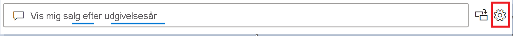

# Introduktion til værktøjer til Spørgsmål og svar for at oplære Spørgsmål og svar i Power BI (prøveversion)

Med *værktøjer* til Spørgsmål og svar i Power BI kan du forbedre oplevelsen med naturligt sprog for dine brugere. Som designer eller administrator interagerer du med programmet til naturligt sprog og foretager forbedringer på tre områder: 

- Repetitionsspørgsmål, som dine brugere har stillet.
- Træn Spørgsmål og svar til at forstå spørgsmål.
- Administrer begreber, du har lært Spørgsmål og svar.

Foruden disse dedikerede værktøjer indeholder fanen **Udformning** i Power BI Desktop flere muligheder:  

- Synonymer
- Rækkemærkater
- Skjul fra Spørgsmål og svar
- Konfiguration af det sproglige skema (avanceret)

## Kom i gang med værktøjer til Spørgsmål og svar

Værktøjer til Spørgsmål og svar er kun tilgængelige i Power BI Desktop og understøttes i øjeblikket kun i importtilstand.

1. Åbn Power BI Desktop, og brug Spørgsmål og svar til at oprette en visualisering. 
2. Vælg tandhjulsikonet i hjørnet af visualiseringen. 

    

    Siden Introduktion åbnes.  

    

### Feltsynonymer

Vælg **Feltsynonymer** for at se alle de tabeller og kolonner, der hører til modellen. I denne visning kan du tilføje andre navne, der passer til kolonnerne, for at hjælpe brugerne. Du kan også vælge, om en kolonne eller en tabel skal skjules i Spørgsmål og svar.

Klik på en af tabellerne for at udvide den. Så får du vist en dialogboks, der ligner den nedenfor.

Dialogboksen viser alle kolonner og tabeller og deres respektive begreber/synonymer, som brugerne kan anvende, når de stiller spørgsmål til datasættet. Du kan hurtigt se alle begreberne samlet ét sted og tilføje eller fjerne begreber for flere kolonner. 

- Tilføj begreber – Hvis du har et felt, der hedder Salg, kan du f.eks. tilføje begrebet Indtægt, så en bruger kan anvende dette ord i stedet for nødvendigvis at skulle bruge ordet Salg. Klik på tilføjelsesmærket for hurtigt at tilføje et nyt begreb

- Medtag i Spørgsmål og svar – Denne indstilling gør det muligt at udelade en kolonne eller en tabel fra Spørgsmål og svar, hvilket vil sige, at den ikke vises, og at der ikke vises et resultat sammen med denne kolonne. En situation, hvor du f.eks. kan beslutte ikke at medtage en kolonne, er, når du arbejder med datoer. Hvis der er mange datofelter eller fremmede nøgler, kan du vælge at fjerne alle datofelterne undtagen et, så den rette datokolonne vælges, når en bruger stiller et datorelateret spørgsmål.

- Foreslåede begreber – Spørgsmål og svar vil også anbefale foreslåede begreber, der er hentet fra vores forslagsprogram, så du hurtigt kan tilføje begreber/synonymer. Hvis forslagene ikke er tilføjet, fungerer de stadig, men de vises for brugeren med en orange stiplet linje, der indikerer, at Spørgsmål og svar mener at have et svar, men er ikke sikker. Hvis det foreslåede synonym er korrekt, skal du klikke på plusikonet (+), så det kan bruges som synonym. Hvis forslaget er forkert, skal du klikke på krydset (x). Derefter fjernes begrebet, og det sikres, at det ikke bruges som et begreb/synonym, og at det ikke anvendes i Spørgsmål og svar. Forslagene er baseret på ordbogen i Office og stammer også fra nye navne, der er fundet i en rapport

### Gennemse spørgsmål

Vælg **Repetitionsspørgsmål** for at se en liste over datasæt, der bruges i Power BI-tjenesten for din lejer. På siden **Repetitionsspørgsmål** kan du også se ejeren af datasættet, arbejdsområdet og datoen for seneste opdatering. Herfra kan du vælge et datasæt og se, hvilke spørgsmål brugerne har stillet. Dataene viser også ord, der ikke blev genkendt. Alle de data, der vises her, er for de seneste 28 dage.

### Oplær Spørgsmål og svar

I afsnittet **Træn Spørgsmål og svar** kan du oplære Spørgsmål og svar, så det kan genkende ord. Du begynder ved at skrive et spørgsmål, der indeholder et eller flere ord, som Spørgsmål og svar ikke kan genkende. Spørgsmål og svar beder dig om en definition af begrebet. Angiv enten et filter eller et feltnavn, der svarer til det, som ordet repræsenterer. Spørgsmål og svar genfortolker derefter det oprindelige spørgsmål. Hvis du er tilfreds med resultaterne, kan du gemme dit input. Du kan finde flere oplysninger under [Træn Spørgsmål og svar](q-and-a-tooling-teach-q-and-a.md)

### Administrer begreber

Alt, hvad du har gemt i afsnittet Træn Spørgsmål og svar, vises her, så du kan gennemse eller slette begreber, du har defineret. Du kan i øjeblikket ikke redigere en eksisterende definition, så hvis du vil omdefinere et begreb, skal du slette det og genoprette det.

### Foreslå spørgsmål

> [!NOTE]
> De foreslåede spørgsmål vises for alle forekomster af visualiseringen Spørgsmål og svar. Det er ikke muligt at oprette et separat sæt med forslag til alle visualiseringer af Spørgsmål og svar.
> 
> 

Uden at foretage nogen form for konfiguration foreslår visualiseringen Spørgsmål og svar adskillige spørgsmål, så du kan komme i gang. Disse spørgsmål genereres automatisk ud fra din datamodel. I **Foreslå spørgsmål** kan du overskrive de automatisk genererede spørgsmål med dine egne spørgsmål.

Du starter ved at skrive det spørgsmål, du vil tilføje i tekstfeltet. I afsnittet med forhåndsvisningen kan du se, hvordan resultatet vil se ud i visualiseringen Spørgsmål og svar. 

:::image type="content" source="media/q-and-a-tooling-intro/power-bi-qna-suggest-questions.png" alt-text="Forslå spørgsmål i Spørgsmål og svar":::
 
Vælg knappen **Tilføj** for at føje dette spørgsmål til **Dine foreslåede spørgsmål**. Hvert yderligere spørgsmål føjes til slutningen af listen. Spørgsmålene vises i visualiseringen Spørgsmål og svar i samme rækkefølge, som de gør på denne liste. 

:::image type="content" source="media/q-and-a-tooling-intro/power-bi-qna-save-suggest-questions.png" alt-text="Gem foreslåede spørgsmål":::
 
Sørg for at vælge **Gem** for at få vist en liste over foreslåede spørgsmål i visualiseringen Spørgsmål og svar. 

## Andre indstillinger for Spørgsmål og svar

### Angiv en rækkemærkat

En rækkemærkat giver dig mulighed for at definere, hvilken kolonne (eller hvilket *felt*) der bedst identificerer en enkelt række i en tabel. For en tabel med navnet "Kunde" er rækkemærkaten f.eks. normalt "Vist navn". Hvis du angiver disse ekstra metadata, giver du Spørgsmål og svar mulighed for at afbilde en mere nyttig visualisering, når brugerne skriver i "Vis mig salg efter kunde". I stedet for at behandle "kunde" som en tabel kan den i stedet bruge "Vist navn" og vise et liggende søjlediagram, der viser hver kundes salg. Du kan kun angive visningen Udformning for rækkemærkaten. 

1. Brug visningen Udformning i Power BI Desktop.

2. Vælg en tabel for at få vist ruden **Egenskaber**.

3. Vælg et felt i boksen **Rækkemærkat**.

## Konfigurer det sproglige skema (avanceret)

I Power BI kan du helt oplære og forbedre programmet til naturligt sprog inden i Spørgsmål og svar, herunder ændring af scoren og vægtningen af de underliggende resultater i naturligt sprog. Du kan se hvordan under [Rediger det sproglige skema i Spørgsmål og svar, og tilføj sætninger](q-and-a-tooling-advanced.md).

## Næste trin

Der er en række bedste praksisser for forbedring af programmet til naturligt sprog. Du kan finde flere oplysninger under [Bedste praksis for Spørgsmål og svar](q-and-a-best-practices.md).
