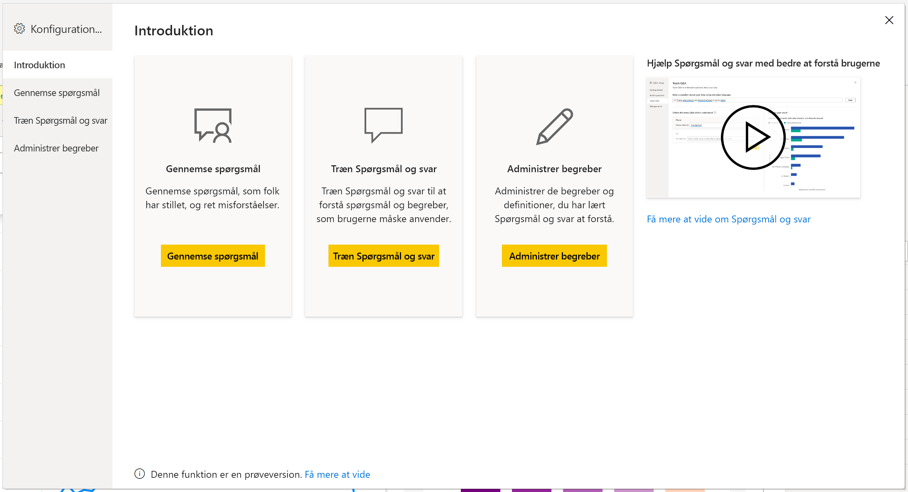
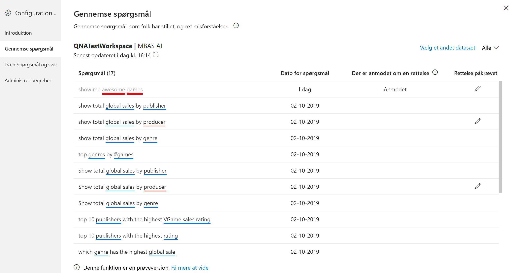
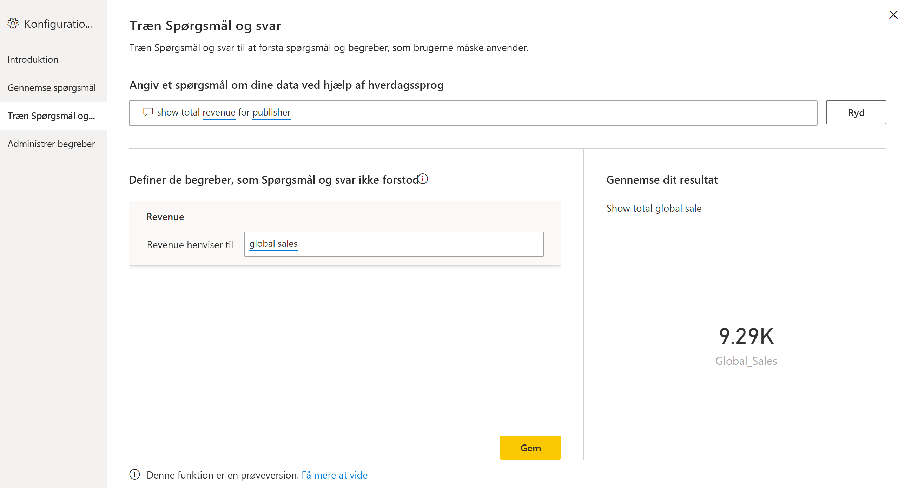
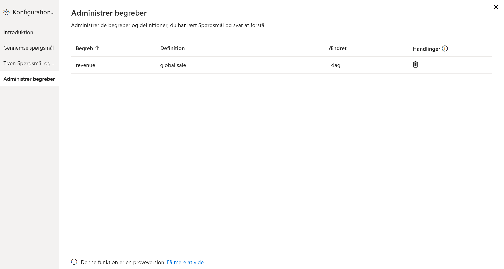
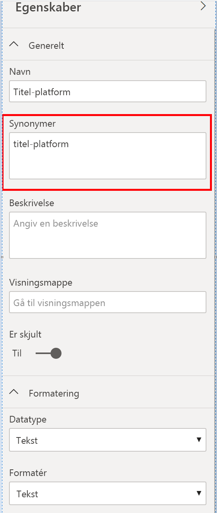

# Introduktion til værktøjer til Spørgsmål og svar for at oplære Spørgsmål og svar i Power BI (prøveversion)

Med *værktøjer* til Spørgsmål og svar i Power BI kan du forbedre oplevelsen med naturligt sprog for dine brugere. Som designer eller administrator interagerer du med programmet til naturligt sprog og foretager forbedringer på tre områder: 

- Repetitionsspørgsmål, som dine brugere har stillet.
- Træn Spørgsmål og svar til at forstå spørgsmål.
- Administrer begreber, du har lært Spørgsmål og svar.

Foruden disse dedikerede værktøjer indeholder fanen **Udformning** i Power BI Desktop flere muligheder:  

- Synonymer
- Rækkemærkater
- Skjul fra Spørgsmål og svar
- Konfiguration af det sproglige skema (avanceret)

## Kom i gang med værktøjer til Spørgsmål og svar

Værktøjer til Spørgsmål og svar er kun tilgængelige i Power BI Desktop og understøttes i øjeblikket kun i importtilstand.

1. Åbn Power BI Desktop, og brug Spørgsmål og svar til at oprette en visualisering. 
2. Vælg tandhjulsikonet i hjørnet af visualiseringen. 

    

    Siden Introduktion åbnes.  

    

### Gennemse spørgsmål

Vælg **Repetitionsspørgsmål** for at se en liste over datasæt, der bruges i Power BI-tjenesten for din lejer. På siden **Repetitionsspørgsmål** kan du også se ejeren af datasættet, arbejdsområdet og datoen for seneste opdatering. Herfra kan du vælge et datasæt og se, hvilke spørgsmål brugerne har stillet. Dataene viser også ord, der ikke blev genkendt. Alle de data, der vises her, er for de seneste 28 dage.

### Oplær Spørgsmål og svar

I afsnittet **Træn Spørgsmål og svar** kan du oplære Spørgsmål og svar, så det kan genkende ord. Du begynder ved at skrive et spørgsmål, der indeholder et eller flere ord, som Spørgsmål og svar ikke kan genkende. Spørgsmål og svar beder dig om en definition af begrebet. Angiv enten et filter eller et feltnavn, der svarer til det, som ordet repræsenterer. Spørgsmål og svar genfortolker derefter det oprindelige spørgsmål. Hvis du er tilfreds med resultaterne, kan du gemme dit input. Du kan finde flere oplysninger under [Træn Spørgsmål og svar](q-and-a-tooling-teach-q-and-a.md)

### Administrer begreber

Alt, hvad du har gemt i afsnittet Træn Spørgsmål og svar, vises her, så du kan gennemse eller slette begreber, du har defineret. Du kan i øjeblikket ikke redigere en eksisterende definition, så hvis du vil omdefinere et begreb, skal du slette det og genoprette det.

## Andre indstillinger for Spørgsmål og svar

### Massesynonymer

Fanen **Udformning** i Power BI Desktop indeholder flere indstillinger til forbedring af oplevelsen med Spørgsmål og svar. 

1. Brug visningen Udformning i Power BI Desktop.

2. Vælg et felt eller en tabel for at få vist ruden **Egenskaber**.  Denne rude vises i højre side af lærredet og indeholder en række handlinger i Spørgsmål og svar. Én indstilling er **Synonymer**. I feltet **Synonymer** kan du hurtigt definere alternativer for den tabel eller det felt, du vælger. Du kan også definere synonymer i afsnittet **Træn Spørgsmål og svar** i dialogboksen Værktøjer, men det er ofte hurtigere at definere synonymer her for mange felter i en tabel.

    

3. Hvis du vil definere flere synonymer for et enkelt felt, skal du bruge kommaer til at angive det næste synonym.

### Skjul fra Spørgsmål og svar

Du kan også skjule felter og tabeller, så de ikke vises i resultaterne i Spørgsmål og svar. 

1. Brug visningen Udformning i Power BI Desktop.

2. Vælg et felt eller en tabel for at få vist ruden **Egenskaber**, og slå **Er skjult** **Til**.

    Spørgsmål og svar respekterer denne indstilling og sikrer, at feltet ikke genkendes af Spørgsmål og svar. Det kan f.eks. være, at du vil skjule id-felter og fremmede nøgler for at undgå unødvendige dubletfelter med det samme navn. Selvom du skjuler feltet, kan du stadig bruge det i Power BI Desktop i visualiseringer uden for Spørgsmål og svar.

### Angiv en rækkemærkat

En rækkemærkat giver dig mulighed for at definere, hvilken kolonne (eller hvilket *felt*) der bedst identificerer en enkelt række i en tabel. For en tabel med navnet "Kunde" er rækkemærkaten f.eks. normalt "Vist navn". Hvis du angiver disse ekstra metadata, giver du Spørgsmål og svar mulighed for at afbilde en mere nyttig visualisering, når brugerne skriver i "Vis mig salg efter kunde". I stedet for at behandle "kunde" som en tabel kan den i stedet bruge "Vist navn" og vise et liggende søjlediagram, der viser hver kundes salg. Du kan kun angive visningen Udformning for rækkemærkaten. 

1. Brug visningen Udformning i Power BI Desktop.

2. Vælg en tabel for at få vist ruden **Egenskaber**.

3. Vælg et felt i boksen **Rækkemærkat**.

## Konfigurer det sproglige skema (avanceret)

I Power BI kan du helt oplære og forbedre programmet til naturligt sprog inden i Spørgsmål og svar, herunder ændring af scoren og vægtningen af de underliggende resultater i naturligt sprog. Du kan se hvordan under [Rediger det sproglige skema i Spørgsmål og svar, og tilføj sætninger](q-and-a-tooling-advanced.md).

## Næste trin

Der er en række bedste praksisser for forbedring af programmet til naturligt sprog. Du kan få flere oplysninger i følgende artikel:

* [Bedste praksis for Spørgsmål og svar](q-and-a-best-practices.md)
