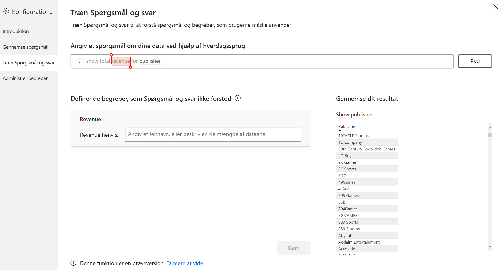
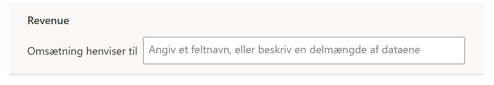
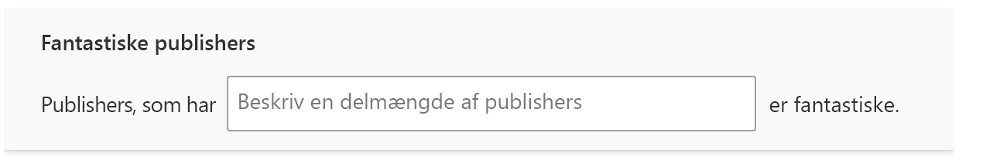

# Træn Spørgsmål og svar til at forstå spørgsmål og udtryk i Spørgsmål og svar i Power BI

I afsnittet **Træn Spørgsmål og svar** i konfigurationen af Spørgsmål og svar kan du oplære Spørgsmål og svar til at forstå spørgsmål på naturligt sprog og begreber, der ikke genkendes. Du begynder ved at indsende et spørgsmål, der indeholder et eller flere ord, som Spørgsmål og svar ikke genkendte. Du bliver derefter bedt om at definere det pågældende begreb i Spørgsmål og svar. Du angiver enten et filter eller et feltnavn, der svarer til det, som ordet repræsenterer. Spørgsmål og svar genfortolker derefter det oprindelige spørgsmål. Hvis du er tilfreds med resultaterne, kan du gemme dem.

> [!NOTE]
> Funktionaliteten Træn Spørgsmål og svar understøtter kun importtilstand. Den understøtter endnu ikke, at der oprettes forbindelse til en datakilde i det lokale miljø eller en Azure Analysis Services-datakilde. Denne begrænsning bør blive fjernet i efterfølgende udgaver af Power BI.

## Begynd at oplære Spørgsmål og svar

1. På båndet **Udformning** i Power BI Desktop skal du vælge **Konfiguration af Spørgsmål og svar** > **Træn Spørgsmål og svar**.

    

2. Skriv en sætning med et begreb, som ikke genkendes i Spørgsmål og svar, og vælg **Send**.

3. Vælg ordet med den røde understregning. 

    Du får vist forslag i Spørgsmål og svar, og du bliver bedt om at angive den korrekte definition for begrebet. 
    
3. Under **Definer de begreber, som ikke blev forstået i Spørgsmål og svar** skal du angive en definition.

    

4. Vælg **Gem** for at se en forhåndsvisning af den opdaterede visualisering.

5. Angiv det næste spørgsmål, eller vælg **X** for at lukke.

Forbrugerne af din rapport kan ikke se denne ændring, før du publicerer rapporten i tjenesten igen.

## Definer substantiver og adjektiver

Du kan lære Spørgsmål og svar to typer begreber:

- Substantiver
- Adjektiver

### Definer et synonym for et substantiv

Når du arbejder med data, kan du ofte have navne på felter, der kan henvises til med alternative navne. Et eksempel kan være "Salg". Adskillige ord eller sætninger kan henvise til salg, f.eks. "omsætning". Hvis en kolonne er navngivet "Salg", og forbrugerne af rapporten skriver "omsætning", vil Spørgsmål og svar muligvis ikke vælge den korrekte kolonne til at besvare spørgsmålet korrekt. Hvis det er tilfældet, vil du gerne fortælle Spørgsmål og svar, at "Salg" og "Omsætning" henviser til det samme.

Spørgsmål og svar registrerer automatisk, når et ukendt ord er et substantiv ved hjælp af viden fra Microsoft Office. Hvis Spørgsmål og svar registrerer et substantiv, bliver du spurgt på følgende måde:

- <your term> **henviser til** 

Du udfylder feltet med begrebet fra dine data.

Hvis du angiver noget andet end et felt fra datamodellen, kan du få uønskede resultater.

### Definer en betingelse for et adjektiv

Nogle gange vil du måske definere begreber, der fungerer som en betingelse for de underliggende data. Et eksempel kan være "fantastiske udgivere". "Fantastisk" kan være en betingelse, der kun vælger udgivere, som har publiceret X antal produkter. Spørgsmål og svar forsøger at registrere adjektiver, og der vises en anden prompt:

- <field name> **der har**  

Du udfylder feltet med betingelsen.

Nogle eksempler på betingelser, som du kan definere, er:

- "Land" som er "USA"
- "Land" som ikke er "USA"
- "Vægt" > 2000
- "Vægt" = 2000
- "Vægt" < 2000

Du kan kun definere en enkelt betingelse i værktøjet. Hvis du vil definere mere komplekse betingelser, skal du bruge DAX til at oprette en beregnet kolonne og derefter bruge afsnittet med værktøjer til at oprette en enkelt betingelse for den beregnede kolonne. Målinger understøttes ikke. Brug i stedet beregnede kolonner.

## Administrer begreber

Når du har angivet definitioner, kan du gå tilbage for at se alle de rettelser, du har foretaget, og redigere eller slette dem. 

1. I **konfigurationen af Spørgsmål og svar** skal du gå til afsnittet **Administrer begreber**.

2. Slet de begreber, du ikke længere har brug for. Du kan i øjeblikket ikke redigere begreber. Hvis du vil omdefinere et begreb, skal du slette begrebet og definere det.

    

## Næste trin

Der er en række bedste praksisser for forbedring af programmet til naturligt sprog. Du kan få flere oplysninger i følgende artikel:

* [Bedste praksis for Spørgsmål og svar](q-and-a-best-practices.md)
