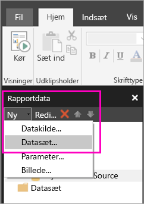
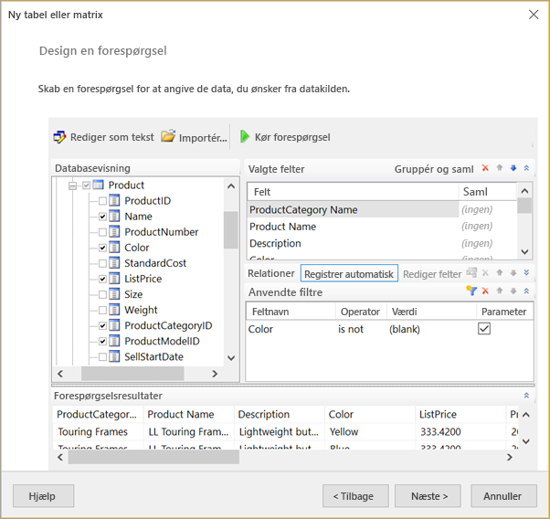
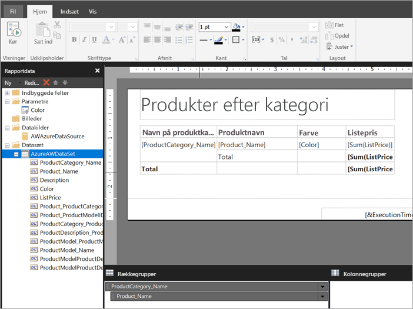

# Opret et integreret datasæt til en sideinddelt rapport i Power BI-tjenesten

I denne artikel lærer du, hvordan du opretter et integreret datasæt, der er baseret på en integreret datakilde, til en sideinddelt rapport i Power BI-tjenesten. Integrerede datasæt er indeholdt i en enkelt sideinddelt rapport til brug i den pågældende rapport. I øjeblikket skal sideinddelte rapporter, der er publiceret i Power BI-tjenesten, bruge integrerede datasæt og datakilder. Du opretter den integrerede datakilde og det integrerede datasæt i Power BI Report Builder, mens du opretter din rapport. 

Du skal oprette en datakilde, før du kan oprette datasættet. Du kan få mere at vide under [Integrerede datakilder for sideinddelte rapporter](paginated-reports-embedded-data-source.md) i Power BI-tjenesten.
  
## Opret et integreret datasæt
  
1. Vælg **Nyt** > **Datasæt** i ruden Rapportdata i Power BI Report Builder.

1. På fanen **Forespørgsel** i dialogboksen **Egenskaber for datasæt** skal du give et navn for datasættet. Den integrerede datakilde er allerede angivet i feltet **Datakilde**, eller du kan vælge **Ny**, hvis du vil oprette en anden integreret datakilde.
 
     

3. Under **Forespørgselstype** skal du vælge den kommandotype eller forespørgsel, der skal bruges til datasættet. 
    - **Tekst** kører en forespørgsel for at hente data fra databasen. Det er standard, og denne fremgangsmåde bruges til de fleste forespørgsler. Skriv en forespørgsel, eller importér en eksisterende forespørgsel ved at vælge **Importér**. Hvis du vil oprette forespørgslen grafisk, skal du vælge **Forespørgselsdesigner**. Hvis du bruger forespørgselsdesigneren til at bygge en forespørgsel, vises forespørgselsteksten i dette felt. Vælg knappen **Udtryk** (**fx**) for at bruge et udtryk til at generere forespørgslen dynamisk. 
    - Når du vælger **Tabel** markeres alle felterne i en tabel. Angiv navnet på den tabel, du vil bruge som et datasæt.
    - **Lagret procedure** kører en lagret procedure efter navn.

4. I Forespørgselsdesigner kan du se og interagere med tabellerne og felterne i datasættet, importere en forespørgsel eller redigere som tekst. Du kan også tilføje filtre og parametre her. 

    

5. I Forespørgselsdesigner skal du vælge **Kør forespørgsel** for at teste den og derefter vælge **OK**.

1. Tilbage i dialogboksen Egenskaber for datasæt skal du i feltet **Timeout (i sekunder)** skrive antallet af sekunder, der går, før der opstår timeout for forespørgslen. Standarden er 30 sekunder. Værdien for **Timeout** skal være tom eller større end nul. Hvis feltet er tomt, opstår der ikke timeout for forespørgslen.

7.  Du kan angive andre egenskaber for datasættet på de andre faner:
    - Opret beregnede felter på fanen **Felter**.
    - Angiv avancerede indstillinger på fanen **Indstillinger**.
    - Tilføj eller opdater **Filtre** og **Parametre** på deres respektive faner.

8. Vælg **OK**
 
   Rapporten åbnes i visningen Rapportdesign. Datakilde-, datasæt- og datasætfeltsamlingen vises i ruden Rapportdata, og du kan fortsætte med at designe din sideinddelte rapport.  

     
 
## Næste trin 

- [Hvad er sideinddelte rapporter i Power BI Premium?](paginated-reports-report-builder-power-bi.md)  
- [Selvstudium: Opret en sideinddelt rapport, og upload den i Power BI-tjenesten](paginated-reports-quickstart-aw.md)
- [Publicer en sideinddelt rapport i Power BI-tjenesten](paginated-reports-save-to-power-bi-service.md)

