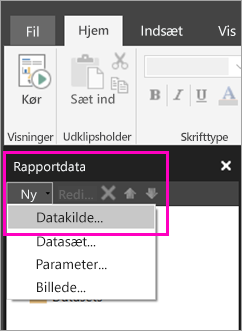

# Opret en integreret datakilde for sideinddelte rapporter i Power BI-tjenesten
I denne artikel kan du læse om, hvordan du opretter og redigerer en integreret datakilde for en sideinddelt rapport i Power BI-tjenesten. Du definerer en integreret datakilde i en enkelt rapport og bruger den kun i denne rapport. I øjeblikket skal sideinddelte rapporter, der er publiceret i Power BI-tjenesten, bruge integrerede datasæt og datakilder, og de kan oprette forbindelse til følgende datakilder:

- Azure SQL Database og Data Warehouse
- SQL Server
- SQL Server Analysis Services 

Sideinddelte rapporter opretter forbindelse til lokale datakilder via en gateway. Du kan konfigurere gatewayen, når du har publiceret rapporten til Power BI-tjenesten. Få mere at vide om [Power BI-gateways](service-gateway-getting-started.md). 

## Opret en integreret datakilde
  
1. Åbn Report Builder.

1. På værktøjslinjen i ruden Rapportdata skal du vælge **Ny** > **Datakilde**. Dialogboksen **Egenskaber for datakilde** åbnes.

    
  
2.  I tekstfeltet **Navn** skal du skrive et navn til datakilden eller acceptere standardværdien.  
  
3.  Vælg **Brug en forbindelse, som er integreret i min rapport**.  
  
1.  På listen **Vælg forbindelsestype** skal du vælge en datakildetype. 

1.  Angiv en forbindelsesstreng ved hjælp af en af disse metoder:  
  
    -   Skriv forbindelsesstrengen direkte i tekstfeltet **Forbindelsesstreng**. 
  
    -   Vælg udtryksknappen (**fx)** for at oprette et udtryk, der evalueres som en forbindelsesstreng. I dialogboksen **Udtryk** skal du skrive udtrykket i ruden Udtryk. Vælg **OK**. 
  
    -   Vælg **Byg** for at åbne dialogboksen **Forbindelsesegenskaber** for den datakilde, du har valgt i trin 2.  
  
        Udfyld felterne i dialogboksen **Forbindelsesegenskaber**, så de passer til datakilden. Forbindelsesegenskaber omfatter typen af datakilde, navnet på datakilden og de legitimationsoplysninger, du bruger. Når du har angivet værdier i denne dialogboks, skal du vælge **Test forbindelse** for at bekræfte, at datakilden er tilgængelig, og at de legitimationsoplysninger, du har angivet, er korrekte.  
  
4.  Vælg **Legitimationsoplysninger**.  
  
     Angiv de legitimationsoplysninger, der skal bruges til denne datakilde. Ejeren af datakilden vælger typen af legitimationsoplysninger, der understøttes. Du kan finde flere oplysninger i [Angiv legitimationsoplysninger og forbindelsesoplysninger til rapportdatakilder](https://docs.microsoft.com/sql/reporting-services/report-data/specify-credential-and-connection-information-for-report-data-sources).
  
5.  Vælg **OK**.  
  
     Datakilden vises i ruden Rapportdata.  

## Næste trin

- [Opret et integreret datasæt til en sideinddelt rapport i Power BI-tjenesten](paginated-reports-create-embedded-dataset.md)
- [Hvad er sideinddelte rapporter i Power BI Premium? (prøveversion)](paginated-reports-report-builder-power-bi.md)